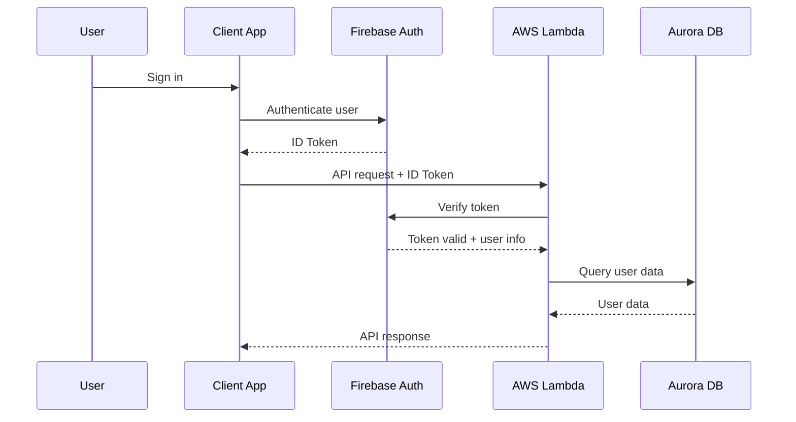

# Authentication & Authorization Guide

## Overview
Distro Nation implements multiple authentication patterns across its API infrastructure, ranging from open endpoints to AWS IAM-secured services. This guide documents all authentication mechanisms and provides implementation guidance.

## Authentication Methods Summary

| API/Service | Authentication Type | Implementation | Security Level |
|-------------|-------------------|----------------|----------------|
| dn-api | API Key Authentication | Custom Lambda Authorizer + x-api-key header | High |
| distronationfmGeneralAccess | AWS IAM | Signature Version 4 | High |
| Lambda Functions | IAM Roles | AWS service authentication | High |
| External APIs | Various | OAuth 2.0, API Keys | Medium-High |
| Firebase Services | Firebase Auth | Custom tokens, OAuth | High |

## dn-api Authentication

### Current Implementation
- **Authentication**: API Key required via x-api-key header
- **Authorization**: Three-tier API key system with rate limiting
- **CORS**: Enabled with wildcard (*) origin (maintained for compatibility)
- **Security Headers**: CORS headers plus authentication validation

### Example Request
```bash
curl -X GET "https://cjed05n28l.execute-api.us-east-1.amazonaws.com/staging/dn_users_list" \
  -H "Content-Type: application/json" \
  -H "x-api-key: your-api-key-here"
```

### API Key Tiers and Usage Plans
```yaml
Development Key:
  Rate Limit: 100 requests/minute
  Burst Limit: 200 requests
  Usage: Development and testing

Production Key:
  Rate Limit: 1000 requests/minute  
  Burst Limit: 2000 requests
  Usage: Production applications

Enterprise Key:
  Rate Limit: 10000 requests/minute
  Burst Limit: 20000 requests
  Usage: High-volume enterprise clients
```

### Security Risks & Recommendations

#### Previous Risks (RESOLVED)
1. ~~**Open Access**: Anyone can call administrative functions~~ - ✅ **FIXED**: API key authentication required
2. ~~**No Rate Limiting**: Vulnerable to abuse and DoS attacks~~ - ✅ **FIXED**: Tiered rate limiting implemented  
3. ~~**No Audit Trail**: Cannot track who makes what requests~~ - ✅ **FIXED**: Lambda authorizer logs all requests
4. ~~**Data Exposure**: Sensitive data accessible without authentication~~ - ✅ **FIXED**: Authentication required for all endpoints

#### Current Implementation (COMPLETED)
```javascript
// ✅ IMPLEMENTED: API Key Authentication
const validateApiKey = async (event) => {
  const apiKey = event.headers['x-api-key'] || event.headers['X-API-Key'];
  if (!apiKey) {
    throw new Error('Unauthorized - API key required');
  }
  
  const isValid = await validateApiKeyWithAWS(apiKey);
  if (!isValid) {
    throw new Error('Forbidden - Invalid API key');
  }
  
  return generatePolicy('Allow', event.methodArn);
};

// Phase 2: Implement JWT Authentication
const validateJWT = async (token) => {
  try {
    const decoded = jwt.verify(token, process.env.JWT_SECRET);
    return { userId: decoded.sub, permissions: decoded.permissions };
  } catch (error) {
    throw new Error('Invalid token');
  }
};

// Phase 3: Role-Based Access Control
const checkPermission = (userPermissions, requiredPermission) => {
  return userPermissions.includes(requiredPermission) || 
         userPermissions.includes('admin');
};
```

#### Implementation Timeline
1. **✅ COMPLETED**: API key authentication implemented for all endpoints
2. **Next Phase**: JWT authentication for user-specific operations (planned)
3. **Future**: Role-based access control enhancement
4. **Future**: Advanced monitoring and alerting systems

## distronationfmGeneralAccess Authentication

### AWS IAM Authentication
- **Method**: AWS Signature Version 4
- **Headers**: Authorization header with calculated signature
- **Scope**: All endpoints require valid AWS credentials
- **Implementation**: AWS SDK handles signature calculation

### Signature Process
```javascript
// AWS SDK automatically handles this, but the process involves:
const createSignature = (request) => {
  // 1. Create canonical request
  const canonicalRequest = `
    ${httpMethod}
    ${canonicalUri}
    ${canonicalQueryString}
    ${canonicalHeaders}
    ${signedHeaders}
    ${hashedPayload}
  `;
  
  // 2. Create string to sign
  const stringToSign = `
    AWS4-HMAC-SHA256
    ${timestamp}
    ${credentialScope}
    ${hash(canonicalRequest)}
  `;
  
  // 3. Calculate signature
  const signature = calculateSignature(stringToSign, secretKey);
  
  return `AWS4-HMAC-SHA256 Credential=${accessKey}/${credentialScope}, SignedHeaders=${signedHeaders}, Signature=${signature}`;
};
```

### Client Implementation Examples

#### JavaScript (Browser/Node.js)
```javascript
import AWS from 'aws-sdk';

// Configure AWS credentials
AWS.config.update({
  accessKeyId: 'YOUR_ACCESS_KEY',
  secretAccessKey: 'YOUR_SECRET_KEY',
  region: 'us-east-1'
});

// Create signed request
const apiCall = async (path, method = 'GET', body = null) => {
  const endpoint = new AWS.Endpoint('hmuujzief2.execute-api.us-east-1.amazonaws.com');
  const request = new AWS.HttpRequest(endpoint, 'us-east-1');
  
  request.method = method;
  request.path = `/main${path}`;
  request.headers['Host'] = endpoint.host;
  request.headers['Content-Type'] = 'application/json';
  
  if (body) {
    request.body = JSON.stringify(body);
  }
  
  // Sign the request
  const signer = new AWS.Signers.V4(request, 'execute-api');
  signer.addAuthorization(AWS.config.credentials, new Date());
  
  // Make the request
  const response = await fetch(`https://${request.headers.Host}${request.path}`, {
    method: request.method,
    headers: request.headers,
    body: request.body
  });
  
  return response.json();
};

// Usage
const artistInfo = await apiCall('/artist-info/12345');
```

#### Python
```python
import boto3
import requests
from botocore.auth import SigV4Auth
from botocore.awsrequest import AWSRequest

def make_signed_request(path, method='GET', data=None):
    # AWS credentials
    session = boto3.Session()
    credentials = session.get_credentials()
    
    # Create request
    url = f'https://hmuujzief2.execute-api.us-east-1.amazonaws.com/main{path}'
    request = AWSRequest(method=method, url=url, data=data)
    
    # Sign request
    SigV4Auth(credentials, 'execute-api', 'us-east-1').add_auth(request)
    
    # Make request
    response = requests.request(
        method=request.method,
        url=request.url,
        headers=dict(request.headers),
        data=request.body
    )
    
    return response.json()

# Usage
artist_info = make_signed_request('/artist-info/12345')
```

#### cURL with AWS CLI
```bash
# Using AWS CLI to generate signed request
aws apigatewayv2 invoke \
  --api-id hmuujzief2 \
  --stage main \
  --route-key "GET /artist-info/12345" \
  --region us-east-1 \
  response.json

cat response.json
```

### IAM Policy Requirements
```json
{
  "Version": "2012-10-17",
  "Statement": [
    {
      "Effect": "Allow",
      "Action": [
        "execute-api:Invoke"
      ],
      "Resource": [
        "arn:aws:execute-api:us-east-1:867653852961:hmuujzief2/main/*/*"
      ]
    }
  ]
}
```

## Firebase Authentication Integration

### Service Integration
- **User Authentication**: Firebase Auth handles user sign-in/sign-up
- **Custom Claims**: Additional user metadata and permissions
- **Token Validation**: AWS Lambda validates Firebase tokens
- **Cross-Platform**: Works across web and mobile applications

### Authentication Flow


### Firebase Token Validation in Lambda
```javascript
const admin = require('firebase-admin');

// Initialize Firebase Admin SDK
admin.initializeApp({
  credential: admin.credential.cert({
    projectId: process.env.FIREBASE_PROJECT_ID,
    clientEmail: process.env.FIREBASE_CLIENT_EMAIL,
    privateKey: process.env.FIREBASE_PRIVATE_KEY.replace(/\\n/g, '\n')
  })
});

const validateFirebaseToken = async (idToken) => {
  try {
    const decodedToken = await admin.auth().verifyIdToken(idToken);
    return {
      uid: decodedToken.uid,
      email: decodedToken.email,
      customClaims: decodedToken.customClaims || {},
      emailVerified: decodedToken.email_verified
    };
  } catch (error) {
    throw new Error('Invalid Firebase token');
  }
};

// Lambda authorizer function
exports.handler = async (event) => {
  try {
    const token = event.authorizationToken?.replace('Bearer ', '');
    if (!token) {
      throw new Error('No token provided');
    }
    
    const user = await validateFirebaseToken(token);
    
    return {
      principalId: user.uid,
      policyDocument: {
        Version: '2012-10-17',
        Statement: [
          {
            Action: 'execute-api:Invoke',
            Effect: 'Allow',
            Resource: event.methodArn
          }
        ]
      },
      context: {
        userId: user.uid,
        email: user.email,
        customClaims: JSON.stringify(user.customClaims)
      }
    };
  } catch (error) {
    throw new Error('Unauthorized');
  }
};
```

### Custom Claims Management
```javascript
// Set custom claims for a user
const setUserClaims = async (uid, claims) => {
  await admin.auth().setCustomUserClaims(uid, claims);
};

// Example: Set user role
await setUserClaims('user123', {
  role: 'artist',
  permissions: ['upload', 'analytics'],
  tier: 'premium'
});

// Verify claims in Lambda
const checkPermission = (userClaims, requiredPermission) => {
  const permissions = userClaims.permissions || [];
  return permissions.includes(requiredPermission) || userClaims.role === 'admin';
};
```

## Lambda Function Authentication

### IAM Execution Roles
Each Lambda function has an IAM execution role that defines its permissions:

```json
{
  "Version": "2012-10-17",
  "Statement": [
    {
      "Effect": "Allow",
      "Action": [
        "logs:CreateLogGroup",
        "logs:CreateLogStream",
        "logs:PutLogEvents"
      ],
      "Resource": "arn:aws:logs:*:*:*"
    },
    {
      "Effect": "Allow",
      "Action": [
        "rds:DescribeDBInstances",
        "rds-data:BatchExecuteStatement",
        "rds-data:BeginTransaction",
        "rds-data:CommitTransaction",
        "rds-data:ExecuteStatement",
        "rds-data:RollbackTransaction"
      ],
      "Resource": "arn:aws:rds:us-east-1:867653852961:cluster:database-2-cluster"
    },
    {
      "Effect": "Allow",
      "Action": [
        "secretsmanager:GetSecretValue"
      ],
      "Resource": [
        "arn:aws:secretsmanager:us-east-1:867653852961:secret:prod/distronation/*"
      ]
    }
  ]
}
```

### Service-to-Service Authentication
```javascript
// Example: Lambda calling another AWS service
const AWS = require('aws-sdk');
const secretsManager = new AWS.SecretsManager();

const getSecret = async (secretName) => {
  try {
    const result = await secretsManager.getSecretValue({
      SecretId: secretName
    }).promise();
    
    return JSON.parse(result.SecretString);
  } catch (error) {
    console.error('Error fetching secret:', error);
    throw error;
  }
};

// Database connection with IAM authentication
const connectToDatabase = async () => {
  const credentials = await getSecret('database-credentials');
  
  return new Pool({
    host: credentials.host,
    port: credentials.port,
    database: credentials.database,
    user: credentials.username,
    password: credentials.password,
    ssl: { rejectUnauthorized: false }
  });
};
```

## External API Authentication

### YouTube API
```javascript
const { google } = require('googleapis');

// OAuth 2.0 for user-specific data
const oauth2Client = new google.auth.OAuth2(
  process.env.YOUTUBE_CLIENT_ID,
  process.env.YOUTUBE_CLIENT_SECRET,
  process.env.YOUTUBE_REDIRECT_URI
);

oauth2Client.setCredentials({
  refresh_token: process.env.YOUTUBE_REFRESH_TOKEN
});

const youtube = google.youtube({
  version: 'v3',
  auth: oauth2Client
});

// API Key for public data
const youtube_public = google.youtube({
  version: 'v3',
  auth: process.env.YOUTUBE_API_KEY
});
```

### Spotify API
```javascript
const SpotifyWebApi = require('spotify-web-api-node');

const spotifyApi = new SpotifyWebApi({
  clientId: process.env.SPOTIFY_CLIENT_ID,
  clientSecret: process.env.SPOTIFY_CLIENT_SECRET
});

// Client Credentials Flow
const authenticateSpotify = async () => {
  try {
    const data = await spotifyApi.clientCredentialsGrant();
    spotifyApi.setAccessToken(data.body['access_token']);
    
    // Refresh token before expiry
    setTimeout(authenticateSpotify, (data.body['expires_in'] - 60) * 1000);
  } catch (error) {
    console.error('Spotify authentication failed:', error);
  }
};
```

## Security Best Practices

### Credential Management
```javascript
// Use AWS Secrets Manager for sensitive data
const getCredentials = async (service) => {
  const secretName = `prod/distronation/${service}`;
  
  try {
    const secret = await secretsManager.getSecretValue({
      SecretId: secretName
    }).promise();
    
    return JSON.parse(secret.SecretString);
  } catch (error) {
    console.error(`Failed to get credentials for ${service}:`, error);
    throw new Error('Authentication failed');
  }
};

// Rotate credentials regularly
const rotateApiKey = async (service) => {
  const newKey = await generateNewApiKey(service);
  
  await secretsManager.updateSecret({
    SecretId: `prod/distronation/${service}`,
    SecretString: JSON.stringify({ apiKey: newKey })
  }).promise();
  
  // Update service configuration
  await updateServiceConfiguration(service, newKey);
};
```

### Token Lifecycle Management
```javascript
class TokenManager {
  constructor(service) {
    this.service = service;
    this.token = null;
    this.expires = null;
  }
  
  async getValidToken() {
    if (!this.token || this.isExpired()) {
      await this.refreshToken();
    }
    return this.token;
  }
  
  isExpired() {
    return !this.expires || Date.now() >= this.expires;
  }
  
  async refreshToken() {
    const credentials = await getCredentials(this.service);
    
    switch (this.service) {
      case 'spotify':
        return this.refreshSpotifyToken(credentials);
      case 'youtube':
        return this.refreshYouTubeToken(credentials);
      default:
        throw new Error(`Unknown service: ${this.service}`);
    }
  }
  
  async refreshSpotifyToken({ clientId, clientSecret }) {
    const response = await fetch('https://accounts.spotify.com/api/token', {
      method: 'POST',
      headers: {
        'Content-Type': 'application/x-www-form-urlencoded',
        'Authorization': `Basic ${Buffer.from(`${clientId}:${clientSecret}`).toString('base64')}`
      },
      body: 'grant_type=client_credentials'
    });
    
    const data = await response.json();
    this.token = data.access_token;
    this.expires = Date.now() + (data.expires_in * 1000);
  }
}
```

### Rate Limiting & Retry Logic
```javascript
class ApiClient {
  constructor(baseUrl, rateLimitPerSecond = 10) {
    this.baseUrl = baseUrl;
    this.rateLimitPerSecond = rateLimitPerSecond;
    this.lastRequestTime = 0;
    this.requestQueue = [];
  }
  
  async makeRequest(endpoint, options = {}) {
    return new Promise((resolve, reject) => {
      this.requestQueue.push({ endpoint, options, resolve, reject });
      this.processQueue();
    });
  }
  
  async processQueue() {
    if (this.requestQueue.length === 0) return;
    
    const now = Date.now();
    const timeSinceLastRequest = now - this.lastRequestTime;
    const minInterval = 1000 / this.rateLimitPerSecond;
    
    if (timeSinceLastRequest < minInterval) {
      setTimeout(() => this.processQueue(), minInterval - timeSinceLastRequest);
      return;
    }
    
    const { endpoint, options, resolve, reject } = this.requestQueue.shift();
    this.lastRequestTime = Date.now();
    
    try {
      const result = await this.executeRequest(endpoint, options);
      resolve(result);
    } catch (error) {
      if (error.status === 429) {
        // Rate limited - retry after delay
        const retryAfter = error.headers['retry-after'] || 60;
        setTimeout(() => {
          this.requestQueue.unshift({ endpoint, options, resolve, reject });
          this.processQueue();
        }, retryAfter * 1000);
      } else {
        reject(error);
      }
    }
    
    // Process next request
    if (this.requestQueue.length > 0) {
      setTimeout(() => this.processQueue(), minInterval);
    }
  }
  
  async executeRequest(endpoint, options) {
    const url = `${this.baseUrl}${endpoint}`;
    const response = await fetch(url, {
      ...options,
      headers: {
        'User-Agent': 'DistroNation/1.0',
        ...options.headers
      }
    });
    
    if (!response.ok) {
      throw {
        status: response.status,
        headers: response.headers,
        message: await response.text()
      };
    }
    
    return response.json();
  }
}
```

## Monitoring & Auditing

### Authentication Monitoring
```javascript
const logAuthEvent = async (event, userId, success, details = {}) => {
  const logEntry = {
    timestamp: new Date().toISOString(),
    event: event, // 'login', 'logout', 'token_refresh', 'permission_check'
    userId: userId,
    success: success,
    ip: details.ip,
    userAgent: details.userAgent,
    service: details.service,
    details: details
  };
  
  // Log to CloudWatch
  console.log('AUTH_EVENT', JSON.stringify(logEntry));
  
  // Store in database for auditing
  await storeAuditLog(logEntry);
  
  // Alert on suspicious activity
  if (!success && event === 'login') {
    await checkForBruteForce(userId, details.ip);
  }
};

const checkForBruteForce = async (userId, ip) => {
  const recentFailures = await getRecentFailedLogins(userId, ip, 15); // 15 minutes
  
  if (recentFailures.length >= 5) {
    await sendSecurityAlert({
      type: 'BRUTE_FORCE_ATTEMPT',
      userId: userId,
      ip: ip,
      attempts: recentFailures.length
    });
    
    // Temporarily block IP
    await addToBlacklist(ip, 3600); // 1 hour
  }
};
```

### CloudWatch Dashboards
```json
{
  "widgets": [
    {
      "type": "metric",
      "properties": {
        "metrics": [
          ["CWLogs", "AuthenticationEvents", "EventType", "login_success"],
          ["CWLogs", "AuthenticationEvents", "EventType", "login_failure"],
          ["CWLogs", "AuthenticationEvents", "EventType", "token_expired"]
        ],
        "period": 300,
        "stat": "Sum",
        "region": "us-east-1",
        "title": "Authentication Events"
      }
    },
    {
      "type": "log",
      "properties": {
        "query": "SOURCE '/aws/lambda/authentication-functions'\n| fields @timestamp, event, userId, success\n| filter event = \"login_failure\"\n| stats count() by userId\n| sort count desc\n| limit 10",
        "region": "us-east-1",
        "title": "Top Failed Login Attempts"
      }
    }
  ]
}
```

## Migration Recommendations for Empire

### Phase 1: Security Assessment (Week 1-2)
1. **Audit Current Access**: Review all API keys and access patterns
2. **Risk Assessment**: Identify high-risk open endpoints
3. **Compliance Check**: Ensure GDPR/CCPA compliance for user data
4. **Security Gaps**: Document authentication vulnerabilities

### Phase 2: Quick Wins (Week 3-4)
1. **API Key Authentication**: Add API keys to dn-api endpoints
2. **Rate Limiting**: Implement basic rate limiting
3. **CORS Restrictions**: Limit origins to known domains
4. **Monitoring**: Add authentication event logging

### Phase 3: Comprehensive Auth (Week 5-8)
1. **JWT Implementation**: Replace API keys with JWT tokens
2. **Role-Based Access**: Implement RBAC for different user types
3. **OAuth Integration**: Standardize on OAuth 2.0 where possible
4. **Session Management**: Implement proper session handling

### Phase 4: Advanced Security (Week 9-12)
1. **Multi-Factor Authentication**: Add MFA for admin functions
2. **Certificate-Based Auth**: Implement client certificates for high-security operations
3. **Advanced Monitoring**: ML-based anomaly detection
4. **Compliance Certification**: SOC 2 Type II compliance

### Implementation Priorities
1. **High Priority**: Secure administrative endpoints (user management, payouts)
2. **Medium Priority**: Implement consistent authentication across all APIs
3. **Low Priority**: Advanced features like MFA and certificate auth

### Cost Considerations
- **AWS Cognito**: ~$0.0055 per MAU for authentication
- **API Gateway**: Additional cost for custom authorizers
- **Lambda**: Increased execution time for auth validation
- **CloudWatch**: Additional logging and monitoring costs

**Estimated Additional Monthly Cost**: $200-500 depending on user volume and features implemented.