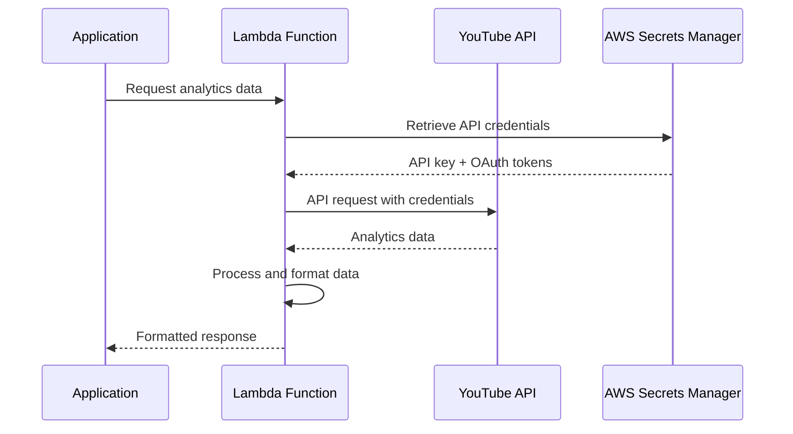

# External API Integrations

## Overview
Distro Nation integrates with multiple external APIs to provide comprehensive music analytics, social media metrics, and content management capabilities. This document details all external API dependencies and their integration patterns.

## API Integration Summary

| Service | Primary Functions | Rate Limits | Authentication | Status |
|---------|------------------|-------------|----------------|--------|
| YouTube Data API v3 | Video analytics, channel data, metadata | 10,000 units/day | API Key + OAuth | Active |
| Spotify Web API | Artist analytics, track data, playlists | 1,000 requests/min | Client Credentials | Active |
| TikTok API | Video analytics, user metrics | Custom limits | App authentication | Active |
| Instagram Basic Display | Media fetching, user data | 200 requests/hour | OAuth 2.0 | Active |
| Airtable API | Content management, reporting | 5 requests/second | Personal Access Token | Active |

## YouTube API Integration

### Service Details
- **API Version**: YouTube Data API v3
- **Base URL**: `https://www.googleapis.com/youtube/v3/`
- **Documentation**: https://developers.google.com/youtube/v3

### Lambda Functions
| Function | Purpose | Endpoints Used |
|----------|---------|----------------|
| `YouTube_API_Token` | Token management and refresh | `/oauth2/v4/token` |
| `dn-youtube-token` | Legacy token handling | `/oauth2/v4/token` |
| `dn_yt_analytics_update` | Analytics data collection | `/analytics/v2/reports` |
| `dn_lnvn_youtube_analytics_topvids` | Top videos analysis | `/videos`, `/search` |
| `distrofmFetchYoutubeInfo-main` | Video metadata | `/videos` |
| `distrofmFetchYTVideoInfo-main` | Detailed video data | `/videos`, `/channels` |
| `amplifyDistroFMYoutubeChannelParse-main` | Channel parsing | `/channels`, `/playlists` |

### Authentication Flow


### API Usage Patterns

#### Video Analytics Collection
```javascript
// Example Lambda function pattern
const getVideoAnalytics = async (videoId) => {
  const apiKey = await getSecretValue('youtube-api-key');
  const response = await fetch(
    `https://www.googleapis.com/youtube/v3/videos?` +
    `part=statistics,snippet&id=${videoId}&key=${apiKey}`
  );
  return response.json();
};
```

#### Channel Data Retrieval
```javascript
const getChannelData = async (channelId) => {
  const response = await youtubeClient.channels.list({
    part: ['statistics', 'snippet', 'brandingSettings'],
    id: [channelId]
  });
  return response.data.items[0];
};
```

### Rate Limiting & Quotas
- **Daily Quota**: 10,000 units
- **Query Cost**: 1-100 units per request (varies by endpoint)
- **Peak Usage**: ~2,000 units/day (estimated)
- **Quota Management**: Implemented in `YouTube_API_Token` function

### Error Handling
```javascript
const handleYouTubeError = (error) => {
  switch (error.response?.status) {
    case 400:
      return { error: 'Invalid request parameters' };
    case 403:
      if (error.response.data.error.reason === 'quotaExceeded') {
        return { error: 'Daily quota exceeded', retryAfter: '24h' };
      }
      return { error: 'Access denied' };
    case 404:
      return { error: 'Video or channel not found' };
    default:
      return { error: 'YouTube API error', details: error.message };
  }
};
```

## Spotify Web API Integration

### Service Details
- **API Version**: Spotify Web API v1
- **Base URL**: `https://api.spotify.com/v1/`
- **Documentation**: https://developer.spotify.com/documentation/web-api

### Lambda Functions
| Function | Purpose | Endpoints Used |
|----------|---------|----------------|
| `dn_spotify_analytics` | Artist and track analytics | `/artists`, `/albums`, `/tracks` |
| `distrofmFetchArtistInfo-main` | Artist information | `/artists/{id}`, `/artists/{id}/albums` |

### Authentication
- **Method**: Client Credentials Flow (OAuth 2.0)
- **Token Endpoint**: `https://accounts.spotify.com/api/token`
- **Scope**: Read-only access to public data

### Data Collection Patterns

#### Artist Analytics
```javascript
const getArtistAnalytics = async (artistId) => {
  const token = await getSpotifyToken();
  
  // Get artist info
  const artist = await spotifyAPI.get(`/artists/${artistId}`, {
    headers: { Authorization: `Bearer ${token}` }
  });
  
  // Get top tracks
  const topTracks = await spotifyAPI.get(`/artists/${artistId}/top-tracks`, {
    params: { market: 'US' },
    headers: { Authorization: `Bearer ${token}` }
  });
  
  // Get albums
  const albums = await spotifyAPI.get(`/artists/${artistId}/albums`, {
    params: { limit: 50, market: 'US' },
    headers: { Authorization: `Bearer ${token}` }
  });
  
  return {
    artist: artist.data,
    topTracks: topTracks.data.tracks,
    albums: albums.data.items
  };
};
```

### Rate Limiting
- **Rate Limit**: 1,000 requests per minute per application
- **Retry Strategy**: Exponential backoff with jitter
- **Headers Monitored**: `X-RateLimit-Remaining`, `Retry-After`

### Data Processing
```javascript
const processSpotifyData = (rawData) => {
  return {
    artistId: rawData.id,
    name: rawData.name,
    genres: rawData.genres,
    popularity: rawData.popularity,
    followers: rawData.followers.total,
    externalUrls: rawData.external_urls,
    images: rawData.images,
    analytics: {
      monthlyListeners: extractMonthlyListeners(rawData),
      topTracks: rawData.topTracks?.map(track => ({
        id: track.id,
        name: track.name,
        popularity: track.popularity,
        previewUrl: track.preview_url
      }))
    }
  };
};
```

## TikTok API Integration

### Service Details
- **API Version**: TikTok API v1
- **Base URL**: `https://open-api.tiktok.com/`
- **Documentation**: https://developers.tiktok.com/doc

### Lambda Functions
| Function | Purpose | Endpoints Used |
|----------|---------|----------------|
| `dn_tiktok_analytics` | Video and user analytics | `/research/video/query/`, `/research/user/info/` |

### Authentication
- **Method**: App authentication with access token
- **Token Management**: Stored in AWS Secrets Manager
- **Refresh Pattern**: Automated token refresh in Lambda

### Analytics Collection
```javascript
const getTikTokAnalytics = async (userId) => {
  const accessToken = await getSecretValue('tiktok-access-token');
  
  const userInfo = await fetch('https://open-api.tiktok.com/research/user/info/', {
    method: 'POST',
    headers: {
      'Authorization': `Bearer ${accessToken}`,
      'Content-Type': 'application/json'
    },
    body: JSON.stringify({
      username: userId,
      fields: ['display_name', 'follower_count', 'following_count', 'likes_count']
    })
  });
  
  return userInfo.json();
};
```

### Rate Limiting
- **Limits**: Custom per application (not publicly documented)
- **Monitoring**: Request tracking in CloudWatch
- **Error Handling**: Retry logic with exponential backoff

## Instagram Basic Display API

### Service Details
- **API Version**: Instagram Basic Display API
- **Base URL**: `https://graph.instagram.com/`
- **Documentation**: https://developers.facebook.com/docs/instagram-basic-display-api

### Lambda Functions
| Function | Purpose | Endpoints Used |
|----------|---------|----------------|
| `dn_ig_fetch` | Media and user data | `/me`, `/me/media` |

### Authentication Flow
- **Method**: OAuth 2.0 Authorization Code Flow
- **User Consent**: Required for each Instagram account
- **Token Storage**: Encrypted in database with refresh capability

### Data Fetching Pattern
```javascript
const getInstagramData = async (accessToken) => {
  try {
    // Get user info
    const userResponse = await fetch(
      `https://graph.instagram.com/me?fields=id,username,media_count&access_token=${accessToken}`
    );
    const user = await userResponse.json();
    
    // Get recent media
    const mediaResponse = await fetch(
      `https://graph.instagram.com/me/media?fields=id,caption,media_type,media_url,permalink,timestamp&access_token=${accessToken}`
    );
    const media = await mediaResponse.json();
    
    return { user, media: media.data };
  } catch (error) {
    throw new Error(`Instagram API error: ${error.message}`);
  }
};
```

### Rate Limiting
- **Rate Limit**: 200 requests per hour per access token
- **Monitoring**: Usage tracked per user token
- **Quota Management**: Request throttling in Lambda

## Airtable API Integration

### Service Details
- **API Version**: Airtable API v0
- **Base URL**: `https://api.airtable.com/v0/`
- **Documentation**: https://airtable.com/developers/web/api/introduction

### Lambda Functions
| Function | Purpose | Operations |
|----------|---------|------------|
| `dnbackendCatalogToolAirtableUpdate-dev` | Catalog synchronization | CREATE, UPDATE records |
| `distrofmAppendVideoAirtable-main` | Video record creation | CREATE records |

### Integration Pattern
```javascript
const updateAirtableRecord = async (baseId, tableId, recordId, fields) => {
  const apiKey = await getSecretValue('airtable-api-key');
  
  const response = await fetch(
    `https://api.airtable.com/v0/${baseId}/${tableId}/${recordId}`,
    {
      method: 'PATCH',
      headers: {
        'Authorization': `Bearer ${apiKey}`,
        'Content-Type': 'application/json'
      },
      body: JSON.stringify({ fields })
    }
  );
  
  return response.json();
};
```

### Rate Limiting
- **Rate Limit**: 5 requests per second per base
- **Batch Operations**: Up to 10 records per request
- **Error Handling**: 429 status code handling with retry

## Cross-Platform Data Aggregation

### Data Harmonization
```javascript
const aggregateSocialMetrics = async (artistId) => {
  const [youtubeData, spotifyData, tiktokData, instagramData] = await Promise.allSettled([
    getYouTubeAnalytics(artistId),
    getSpotifyAnalytics(artistId),
    getTikTokAnalytics(artistId),
    getInstagramData(artistId)
  ]);
  
  return {
    totalFollowers: calculateTotalFollowers([
      youtubeData.value?.subscriberCount || 0,
      spotifyData.value?.followers || 0,
      tiktokData.value?.followerCount || 0,
      instagramData.value?.mediaCount || 0
    ]),
    platforms: {
      youtube: youtubeData.status === 'fulfilled' ? youtubeData.value : null,
      spotify: spotifyData.status === 'fulfilled' ? spotifyData.value : null,
      tiktok: tiktokData.status === 'fulfilled' ? tiktokData.value : null,
      instagram: instagramData.status === 'fulfilled' ? instagramData.value : null
    },
    lastUpdated: new Date().toISOString()
  };
};
```

### Data Synchronization
- **Frequency**: Hourly for active artists, daily for others
- **Storage**: Aurora PostgreSQL with JSON fields for platform-specific data
- **Caching**: Redis cache for frequently accessed metrics
- **Backup**: S3 storage for historical data

## Security & Compliance

### API Key Management
- **Storage**: AWS Secrets Manager with automatic rotation
- **Access Control**: IAM roles with least privilege principle
- **Encryption**: Keys encrypted at rest and in transit
- **Monitoring**: CloudTrail logging for key access

### Data Privacy
- **User Consent**: OAuth flows for user-specific data
- **Data Retention**: Automated cleanup of expired tokens
- **GDPR Compliance**: Data deletion capabilities
- **Anonymization**: PII scrubbing in analytics data

### Error Handling & Monitoring
```javascript
const withApiErrorHandling = (apiCall) => {
  return async (...args) => {
    try {
      const result = await apiCall(...args);
      
      // Log successful API call
      console.log(`API call successful: ${apiCall.name}`, {
        timestamp: new Date().toISOString(),
        function: apiCall.name,
        args: args.length
      });
      
      return result;
    } catch (error) {
      // Log error with context
      console.error(`API call failed: ${apiCall.name}`, {
        error: error.message,
        stack: error.stack,
        timestamp: new Date().toISOString(),
        function: apiCall.name
      });
      
      // Send error to monitoring
      await sendErrorToCloudWatch(error, apiCall.name);
      
      throw error;
    }
  };
};
```

## Performance Optimization

### Caching Strategy
- **L1 Cache**: In-memory Lambda caching (15-minute TTL)
- **L2 Cache**: ElastiCache Redis (1-hour TTL)
- **L3 Cache**: S3 with CloudFront (24-hour TTL)

### Batch Processing
```javascript
const batchApiRequests = async (requests, batchSize = 10) => {
  const results = [];
  
  for (let i = 0; i < requests.length; i += batchSize) {
    const batch = requests.slice(i, i + batchSize);
    const batchResults = await Promise.allSettled(
      batch.map(request => request())
    );
    results.push(...batchResults);
    
    // Rate limiting delay between batches
    if (i + batchSize < requests.length) {
      await sleep(1000); // 1 second delay
    }
  }
  
  return results;
};
```

### Connection Pooling
- **HTTP Clients**: Reuse connections across Lambda invocations
- **Keep-Alive**: Enabled for all external API calls
- **Timeout Configuration**: Appropriate timeouts per API

## Monitoring & Alerting

### CloudWatch Metrics
- **API Call Volume**: Requests per minute/hour/day per service
- **Error Rates**: 4xx/5xx response rates
- **Latency**: Response time percentiles (p50, p95, p99)
- **Quota Usage**: Remaining quota for rate-limited APIs

### Custom Dashboards
```json
{
  "widgets": [
    {
      "type": "metric",
      "properties": {
        "metrics": [
          ["AWS/Lambda", "Duration", "FunctionName", "dn_spotify_analytics"],
          ["AWS/Lambda", "Errors", "FunctionName", "dn_spotify_analytics"],
          ["AWS/Lambda", "Invocations", "FunctionName", "dn_spotify_analytics"]
        ],
        "period": 300,
        "stat": "Average",
        "region": "us-east-1",
        "title": "Spotify API Integration Metrics"
      }
    }
  ]
}
```

### Alerting Rules
- **High Error Rate**: >5% error rate over 15 minutes
- **Quota Exhaustion**: <10% quota remaining
- **Response Time**: >5 seconds average response time
- **Failed Authentication**: Authentication failures

## Cost Analysis

### API Usage Costs (Monthly Estimates)
| Service | Free Tier | Usage | Estimated Cost |
|---------|-----------|--------|----------------|
| YouTube Data API | 10,000 units/day | ~60,000 units/month | $0 (within quota) |
| Spotify Web API | 1,000 req/min | ~100,000 req/month | $0 (free) |
| TikTok API | Custom limits | ~50,000 req/month | $0 (current tier) |
| Instagram API | 200 req/hour | ~144,000 req/month | $0 (free) |
| Airtable API | 1,000 req/month | ~10,000 req/month | $120/month |

**Total Estimated Monthly Cost**: ~$120

### Cost Optimization Opportunities
1. **Request Caching**: Reduce redundant API calls by 30-40%
2. **Batch Processing**: Combine multiple operations where possible
3. **Smart Refresh**: Update only changed data
4. **Archive Strategy**: Move historical data to cheaper storage

## Recommendations for Empire Integration

### Immediate Actions
1. **API Audit**: Review all API keys and access patterns
2. **Rate Limit Monitoring**: Implement comprehensive quota tracking
3. **Error Handling**: Standardize error handling across all integrations
4. **Documentation**: Create API integration runbooks

### Security Enhancements
1. **Key Rotation**: Implement automated key rotation
2. **Access Logging**: Enhanced audit logging for API calls
3. **Network Security**: VPC endpoints where available
4. **Compliance**: Ensure GDPR/CCPA compliance for user data

### Performance Improvements
1. **Connection Pooling**: Optimize HTTP connection reuse
2. **Async Processing**: Move batch operations to background jobs
3. **Regional APIs**: Use regional endpoints where available
4. **CDN Integration**: Cache static data via CloudFront

### Business Continuity
1. **Fallback Strategies**: Implement graceful degradation
2. **Data Backup**: Regular backups of critical API data
3. **Vendor Diversification**: Reduce single points of failure
4. **SLA Monitoring**: Track external API service levels