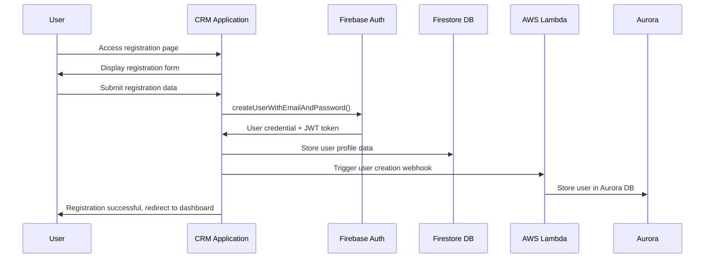
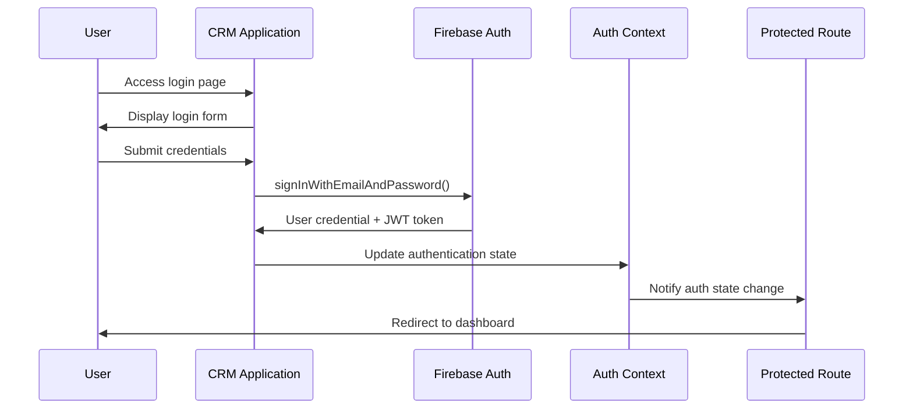
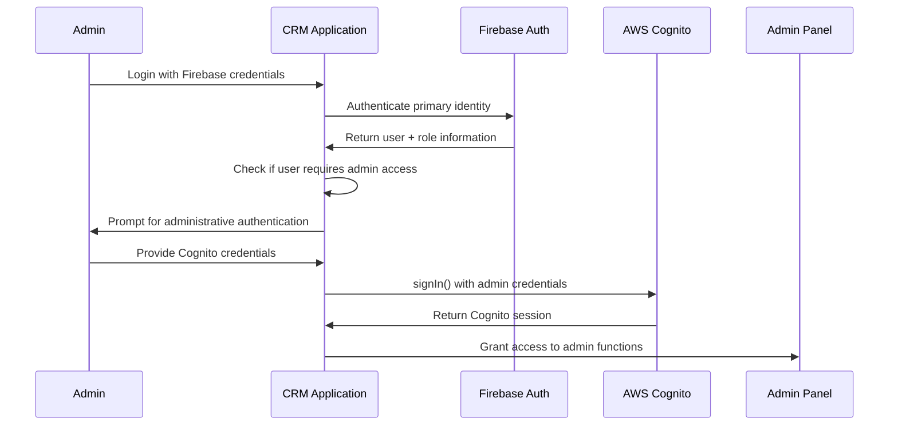

# Distro Nation CRM Authentication Flows

## Overview
The Distro Nation CRM implements a multi-provider authentication strategy combining Firebase Authentication, AWS Cognito, and API key-based authentication to provide secure, role-based access to administrative functions. This document details all authentication flows, security patterns, and implementation specifics.

## Authentication Architecture

### Multi-Provider Authentication Strategy
The CRM employs a layered authentication approach:

1. **Primary Authentication**: Firebase Auth for core user identity
2. **Enhanced Authentication**: AWS Cognito for administrative privileges
3. **API Authentication**: API keys for backend service access
4. **Session Management**: JWT tokens with automatic refresh

```typescript
interface AuthenticationStack {
  firebase: {
    provider: 'Firebase Authentication';
    purpose: 'Primary user identity and session management';
    methods: ['email/password', 'Google OAuth'];
  };
  cognito: {
    provider: 'AWS Cognito';
    purpose: 'Administrative access and enhanced security';  
    methods: ['email/password', 'MFA'];
  };
  apiKeys: {
    provider: 'Custom API Key Management';
    purpose: 'Backend service authentication';
    methods: ['x-api-key header'];
  };
}
```

## Firebase Authentication Flow

### Primary Authentication Process
Firebase Authentication serves as the primary identity provider for all CRM users.

#### 1. User Registration Flow


**Implementation**: `src/components/auth/Register.tsx`
```typescript
const handleRegistration = async (formData: RegistrationData) => {
  try {
    // Create Firebase user account
    const userCredential = await createUserWithEmailAndPassword(
      auth, 
      formData.email, 
      formData.password
    );
    
    const user = userCredential.user;
    
    // Store additional profile data in Firestore
    await setDoc(doc(db, 'users', user.uid), {
      firstName: formData.firstName,
      lastName: formData.lastName,
      role: formData.role || 'user',
      createdAt: new Date(),
      emailVerified: false
    });
    
    // Send email verification
    await sendEmailVerification(user);
    
    // Trigger backend user creation
    await triggerUserCreationWebhook(user.uid, formData);
    
    toast.success('Registration successful! Please verify your email.');
    navigate('/dashboard');
    
  } catch (error) {
    handleAuthError(error);
  }
};
```

#### 2. User Login Flow


**Implementation**: `src/components/auth/Login.tsx`
```typescript
const handleLogin = async (credentials: LoginCredentials) => {
  try {
    setLoading(true);
    
    const userCredential = await signInWithEmailAndPassword(
      auth,
      credentials.email,
      credentials.password
    );
    
    const user = userCredential.user;
    
    // Check email verification
    if (!user.emailVerified) {
      toast.warning('Please verify your email before logging in.');
      await sendEmailVerification(user);
      return;
    }
    
    // Get user role and permissions
    const userProfile = await getUserProfile(user.uid);
    
    // Update authentication context
    await updateAuthContext(user, userProfile);
    
    toast.success('Login successful!');
    navigate('/dashboard');
    
  } catch (error) {
    handleAuthError(error);
  } finally {
    setLoading(false);
  }
};
```

#### 3. Token Management and Refresh
Firebase automatically handles JWT token refresh, but the CRM implements additional token management:

```typescript
// src/contexts/AuthContext.tsx
export const AuthProvider: React.FC<{ children: ReactNode }> = ({ children }) => {
  const [currentUser, setCurrentUser] = useState<User | null>(null);
  const [userProfile, setUserProfile] = useState<UserProfile | null>(null);
  const [loading, setLoading] = useState(true);

  useEffect(() => {
    const unsubscribe = onAuthStateChanged(auth, async (user) => {
      if (user) {
        // Get fresh ID token
        const idToken = await user.getIdToken(true);
        
        // Fetch user profile from Firestore
        const profile = await getUserProfile(user.uid);
        
        // Update state
        setCurrentUser(user);
        setUserProfile(profile);
        
        // Store token for API calls
        localStorage.setItem('firebase-token', idToken);
      } else {
        setCurrentUser(null);
        setUserProfile(null);
        localStorage.removeItem('firebase-token');
      }
      setLoading(false);
    });

    return unsubscribe;
  }, []);

  // Token refresh handler
  const refreshToken = useCallback(async () => {
    if (currentUser) {
      try {
        const freshToken = await currentUser.getIdToken(true);
        localStorage.setItem('firebase-token', freshToken);
        return freshToken;
      } catch (error) {
        console.error('Token refresh failed:', error);
        throw error;
      }
    }
  }, [currentUser]);

  const value = {
    currentUser,
    userProfile,
    loading,
    refreshToken,
    login: handleLogin,
    logout: handleLogout,
    register: handleRegister
  };

  return <AuthContext.Provider value={value}>{children}</AuthContext.Provider>;
};
```

## AWS Cognito Integration

### Enhanced Administrative Authentication
AWS Cognito provides additional security layers for administrative functions.

#### 1. Cognito Setup and Configuration
```typescript
// src/utils/amplify.ts
import { Amplify } from 'aws-amplify';

Amplify.configure({
  Auth: {
    Cognito: {
      userPoolId: process.env.REACT_APP_USER_POOL_ID!,
      userPoolClientId: process.env.REACT_APP_USER_POOL_CLIENT_ID!,
      region: 'us-east-1',
      signUpVerificationMethod: 'email',
      loginWith: {
        email: true,
        username: false,
      },
      passwordFormat: {
        minLength: 8,
        requireLowercase: true,
        requireUppercase: true,
        requireNumbers: true,
        requireSpecialCharacters: true,
      },
    }
  }
});
```

#### 2. Administrative Access Flow


**Implementation**: `src/components/auth/AdminPanel.tsx`
```typescript
const AdminPanel: React.FC = () => {
  const { currentUser, userProfile } = useAuth();
  const [cognitoSession, setCognitoSession] = useState<AuthSession | null>(null);
  const [adminFeatures, setAdminFeatures] = useState<AdminFeatures>({});

  // Check if user requires enhanced authentication
  const requiresEnhancedAuth = useCallback(() => {
    return userProfile?.role === 'admin' || userProfile?.permissions?.includes('admin_access');
  }, [userProfile]);

  // Cognito authentication for admin features
  const authenticateWithCognito = async (credentials: CognitoCredentials) => {
    try {
      const { isSignedIn, nextStep } = await signIn({
        username: credentials.email,
        password: credentials.password,
      });

      if (isSignedIn) {
        const session = await fetchAuthSession();
        setCognitoSession(session);
        
        // Enable admin features based on Cognito groups
        const cognitoGroups = session.tokens?.accessToken?.payload?.['cognito:groups'] || [];
        setAdminFeatures({
          userManagement: cognitoGroups.includes('UserAdmins'),
          systemConfig: cognitoGroups.includes('SystemAdmins'),
          financialData: cognitoGroups.includes('FinancialAdmins'),
        });
        
        toast.success('Administrative access granted');
      } else {
        handleCognitoAuthStep(nextStep);
      }
    } catch (error) {
      console.error('Cognito authentication failed:', error);
      toast.error('Administrative authentication failed');
    }
  };

  // Render admin panel with conditional features
  return (
    <Container>
      {!cognitoSession && requiresEnhancedAuth() ? (
        <CognitoAuthDialog onAuthenticate={authenticateWithCognito} />
      ) : (
        <AdminDashboard features={adminFeatures} />
      )}
    </Container>
  );
};
```

#### 3. Multi-Factor Authentication (MFA)
For high-privilege operations, MFA is enforced through Cognito:

```typescript
const handleMFAChallenge = async (challengeResponse: string) => {
  try {
    const { isSignedIn, nextStep } = await confirmSignIn({
      challengeResponse,
    });

    if (isSignedIn) {
      // MFA successful, proceed with admin operation
      await performAdminOperation();
    } else if (nextStep.signInStep === 'CONFIRM_SIGN_IN_WITH_TOTP_CODE') {
      // Request additional TOTP code
      setMfaStep('TOTP_CODE');
    }
  } catch (error) {
    handleMFAError(error);
  }
};
```

## API Key Authentication

### Backend Service Authentication
All CRM interactions with AWS API Gateway require API key authentication.

#### 1. API Key Configuration and Management
```typescript
// src/config/api.config.ts
export const dnApiConfig = {
  apiKey: process.env.REACT_APP_DN_API_KEY || "your-dn-api-key-here",
  baseUrl: "https://cjed05n28l.execute-api.us-east-1.amazonaws.com/staging",
};

// API key validation on application startup
const validateApiKey = async (): Promise<boolean> => {
  try {
    const response = await axios.get(`${dnApiConfig.baseUrl}/health`, {
      headers: {
        'x-api-key': dnApiConfig.apiKey,
        'Content-Type': 'application/json'
      }
    });
    return response.status === 200;
  } catch (error) {
    console.error('API key validation failed:', error);
    return false;
  }
};
```

#### 2. API Request Authentication Pattern
All API requests include the API key in headers:

```typescript
// src/services/apiService.ts
class APIService {
  private baseURL: string;
  private apiKey: string;

  constructor() {
    this.baseURL = dnApiConfig.baseUrl;
    this.apiKey = dnApiConfig.apiKey;
  }

  private getHeaders(): Record<string, string> {
    return {
      'Content-Type': 'application/json',
      'x-api-key': this.apiKey,
      'Authorization': `Bearer ${localStorage.getItem('firebase-token')}`,
    };
  }

  async makeAuthenticatedRequest<T>(
    method: 'GET' | 'POST' | 'PUT' | 'DELETE',
    endpoint: string,
    data?: any
  ): Promise<T> {
    try {
      const response = await axios({
        method,
        url: `${this.baseURL}${endpoint}`,
        headers: this.getHeaders(),
        data,
      });

      return response.data;
    } catch (error) {
      if (error.response?.status === 401) {
        // API key or Firebase token expired
        await this.handleAuthenticationError();
      }
      throw error;
    }
  }

  private async handleAuthenticationError(): Promise<void> {
    try {
      // Refresh Firebase token
      const { currentUser } = useAuth();
      if (currentUser) {
        await currentUser.getIdToken(true);
      }
    } catch (refreshError) {
      // Force user to re-authenticate
      toast.error('Session expired. Please log in again.');
      window.location.href = '/login';
    }
  }
}
```

## Protected Route Implementation

### Route-Based Authentication Guards
The CRM implements comprehensive route protection based on authentication status and user roles.

#### 1. Protected Route Component
```typescript
// src/components/auth/ProtectedRoute.tsx
const ProtectedRoute: React.FC = () => {
  const { currentUser, userProfile, loading } = useAuth();
  const location = useLocation();

  // Show loading spinner while checking authentication
  if (loading) {
    return (
      <Box display="flex" justifyContent="center" alignItems="center" minHeight="100vh">
        <CircularProgress />
      </Box>
    );
  }

  // Redirect to login if not authenticated
  if (!currentUser) {
    return <Navigate to="/login" state={{ from: location }} replace />;
  }

  // Check email verification
  if (!currentUser.emailVerified) {
    return <Navigate to="/verify-email" replace />;
  }

  // Check if user profile is loaded
  if (!userProfile) {
    return <Navigate to="/complete-profile" replace />;
  }

  // Render protected content within layout
  return <Outlet />;
};
```

#### 2. Role-Based Access Control
```typescript
// src/components/auth/RoleGuard.tsx
interface RoleGuardProps {
  requiredRoles: string[];
  children: React.ReactNode;
  fallback?: React.ReactNode;
}

const RoleGuard: React.FC<RoleGuardProps> = ({ 
  requiredRoles, 
  children, 
  fallback 
}) => {
  const { userProfile } = useAuth();

  const hasRequiredRole = requiredRoles.some(role => 
    userProfile?.roles?.includes(role) || 
    userProfile?.permissions?.includes(role)
  );

  if (!hasRequiredRole) {
    return fallback || (
      <Alert severity="error">
        You don't have permission to access this feature.
      </Alert>
    );
  }

  return <>{children}</>;
};

// Usage in components
const AdminOnlyFeature = () => (
  <RoleGuard requiredRoles={['admin', 'super_admin']}>
    <AdminPanel />
  </RoleGuard>
);
```

## Session Management

### Token Lifecycle Management
The CRM implements comprehensive session management with automatic token refresh and secure storage.

#### 1. Token Storage Strategy
```typescript
// src/utils/tokenManager.ts
class TokenManager {
  private static readonly FIREBASE_TOKEN_KEY = 'firebase-token';
  private static readonly COGNITO_TOKEN_KEY = 'cognito-session';
  private static readonly TOKEN_REFRESH_THRESHOLD = 5 * 60 * 1000; // 5 minutes

  static storeFirebaseToken(token: string): void {
    localStorage.setItem(this.FIREBASE_TOKEN_KEY, token);
    this.scheduleTokenRefresh(token);
  }

  static getFirebaseToken(): string | null {
    return localStorage.getItem(this.FIREBASE_TOKEN_KEY);
  }

  static clearAllTokens(): void {
    localStorage.removeItem(this.FIREBASE_TOKEN_KEY);
    localStorage.removeItem(this.COGNITO_TOKEN_KEY);
    sessionStorage.clear();
  }

  private static scheduleTokenRefresh(token: string): void {
    try {
      const payload = JSON.parse(atob(token.split('.')[1]));
      const expirationTime = payload.exp * 1000;
      const refreshTime = expirationTime - this.TOKEN_REFRESH_THRESHOLD;
      const timeUntilRefresh = refreshTime - Date.now();

      if (timeUntilRefresh > 0) {
        setTimeout(async () => {
          try {
            const { currentUser } = useAuth();
            if (currentUser) {
              await currentUser.getIdToken(true);
            }
          } catch (error) {
            console.error('Automatic token refresh failed:', error);
          }
        }, timeUntilRefresh);
      }
    } catch (error) {
      console.error('Token refresh scheduling failed:', error);
    }
  }
}
```

#### 2. Session Persistence and Recovery
```typescript
// src/hooks/useSessionPersistence.ts
const useSessionPersistence = () => {
  const { refreshToken } = useAuth();

  useEffect(() => {
    const handleVisibilityChange = async () => {
      if (document.visibilityState === 'visible') {
        // Check if tokens need refresh when app becomes visible
        const lastRefresh = localStorage.getItem('last-token-refresh');
        const refreshThreshold = Date.now() - (15 * 60 * 1000); // 15 minutes

        if (!lastRefresh || parseInt(lastRefresh) < refreshThreshold) {
          try {
            await refreshToken();
            localStorage.setItem('last-token-refresh', Date.now().toString());
          } catch (error) {
            console.error('Session recovery failed:', error);
          }
        }
      }
    };

    document.addEventListener('visibilitychange', handleVisibilityChange);
    return () => document.removeEventListener('visibilitychange', handleVisibilityChange);
  }, [refreshToken]);
};
```

## Security Patterns

### Authentication Security Best Practices
The CRM implements comprehensive security measures across all authentication flows.

#### 1. Input Validation and Sanitization
```typescript
// src/utils/authValidation.ts
export const validateAuthInput = {
  email: (email: string): ValidationResult => {
    const emailRegex = /^[^\s@]+@[^\s@]+\.[^\s@]+$/;
    return {
      isValid: emailRegex.test(email) && email.length <= 255,
      error: 'Please enter a valid email address'
    };
  },

  password: (password: string): ValidationResult => {
    const requirements = {
      minLength: password.length >= 8,
      hasUppercase: /[A-Z]/.test(password),
      hasLowercase: /[a-z]/.test(password),
      hasNumbers: /\d/.test(password),
      hasSpecialChars: /[!@#$%^&*(),.?":{}|<>]/.test(password),
    };

    const isValid = Object.values(requirements).every(Boolean);
    return {
      isValid,
      error: 'Password must be at least 8 characters with uppercase, lowercase, numbers, and special characters'
    };
  },

  sanitizeInput: (input: string): string => {
    return input.trim().replace(/[<>]/g, '');
  }
};
```

#### 2. Error Handling and Security Logging
```typescript
// src/utils/authErrors.ts
export const handleAuthError = (error: any): void => {
  const securityEvents = ['auth/too-many-requests', 'auth/user-disabled', 'auth/invalid-credential'];
  
  if (securityEvents.includes(error.code)) {
    // Log security event for monitoring
    logSecurityEvent({
      event: 'authentication_failure',
      errorCode: error.code,
      timestamp: new Date(),
      userAgent: navigator.userAgent,
      ipAddress: 'client-side', // Server-side logging would capture real IP
    });
  }

  const errorMessages: Record<string, string> = {
    'auth/user-not-found': 'No account found with this email address.',
    'auth/wrong-password': 'Incorrect password.',
    'auth/invalid-email': 'Please enter a valid email address.',
    'auth/user-disabled': 'This account has been disabled.',
    'auth/too-many-requests': 'Too many failed attempts. Please try again later.',
    'auth/email-already-in-use': 'An account with this email already exists.',
    'auth/weak-password': 'Password is too weak. Please choose a stronger password.',
  };

  const userMessage = errorMessages[error.code] || 'An authentication error occurred.';
  toast.error(userMessage);
};
```

#### 3. CSRF Protection and Request Signing
```typescript
// src/utils/requestSecurity.ts
class RequestSecurity {
  private static generateCSRFToken(): string {
    return crypto.getRandomValues(new Uint32Array(4)).join('');
  }

  static async signRequest(requestData: any): Promise<SignedRequest> {
    const timestamp = Date.now();
    const csrfToken = this.generateCSRFToken();
    const firebaseToken = localStorage.getItem('firebase-token');

    return {
      ...requestData,
      timestamp,
      csrfToken,
      signature: await this.createSignature(requestData, timestamp, firebaseToken),
    };
  }

  private static async createSignature(
    data: any, 
    timestamp: number, 
    token: string | null
  ): Promise<string> {
    const message = JSON.stringify({ data, timestamp, token });
    const encoder = new TextEncoder();
    const dataBuffer = encoder.encode(message);
    
    // Use Web Crypto API for client-side signing
    const hashBuffer = await crypto.subtle.digest('SHA-256', dataBuffer);
    const hashArray = Array.from(new Uint8Array(hashBuffer));
    return hashArray.map(b => b.toString(16).padStart(2, '0')).join('');
  }
}
```

## Logout and Session Termination

### Comprehensive Logout Flow
```typescript
// src/hooks/useLogout.ts
const useLogout = () => {
  const { currentUser } = useAuth();
  const navigate = useNavigate();

  const logout = useCallback(async () => {
    try {
      // Sign out from Firebase
      await signOut(auth);
      
      // Sign out from Cognito if authenticated
      try {
        await signOut();
      } catch (cognitoError) {
        // Cognito sign out not critical
        console.warn('Cognito sign out failed:', cognitoError);
      }
      
      // Clear all stored tokens and data
      TokenManager.clearAllTokens();
      
      // Clear any cached data
      localStorage.removeItem('user-preferences');
      localStorage.removeItem('campaign-drafts');
      
      // Log security event
      logSecurityEvent({
        event: 'user_logout',
        userId: currentUser?.uid,
        timestamp: new Date(),
      });
      
      toast.success('Logged out successfully');
      navigate('/login');
      
    } catch (error) {
      console.error('Logout error:', error);
      toast.error('Logout failed. Please try again.');
    }
  }, [currentUser, navigate]);

  return logout;
};
```

## Integration with Existing Infrastructure

### Authentication Data Flow
The CRM authentication system integrates seamlessly with the existing Distro Nation infrastructure:

1. **Firebase Authentication** → User identity and session management
2. **Aurora PostgreSQL** → User profile and role data storage
3. **AWS Lambda** → Authentication validation and user management
4. **AWS Cognito** → Administrative access and enhanced security
5. **API Gateway** → API key validation and request authorization

This multi-layered approach ensures robust security while maintaining seamless user experience and administrative control over the CRM application.