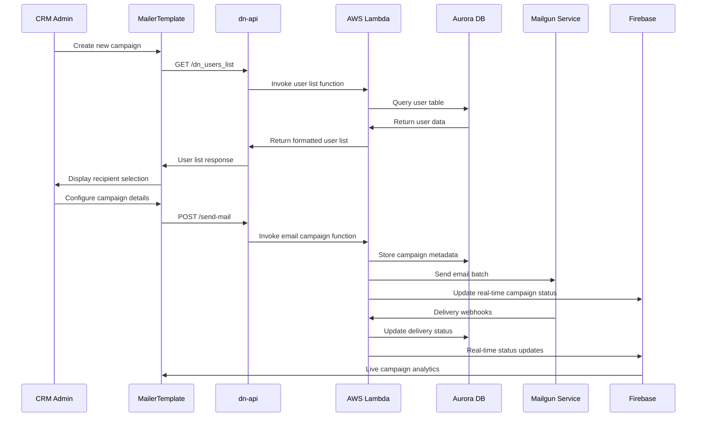
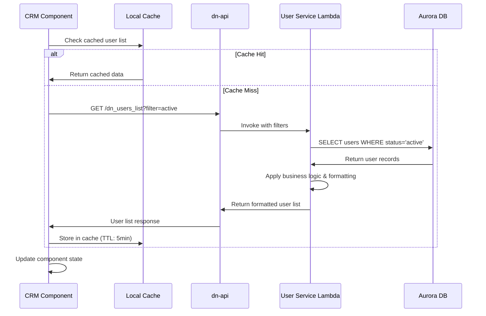
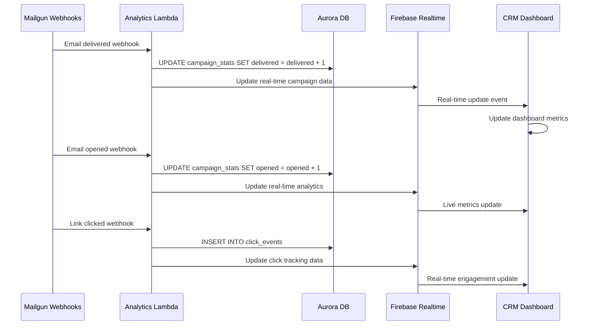
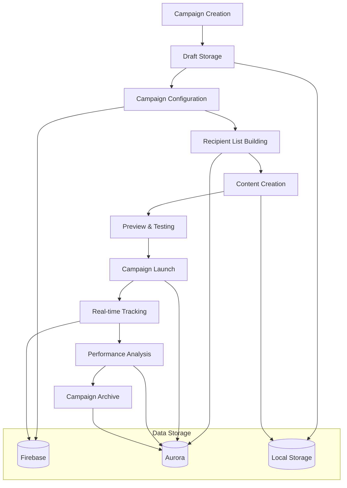
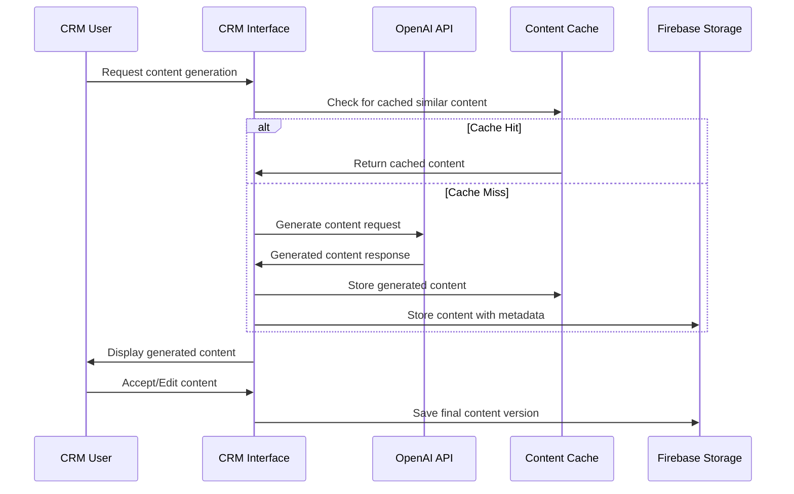
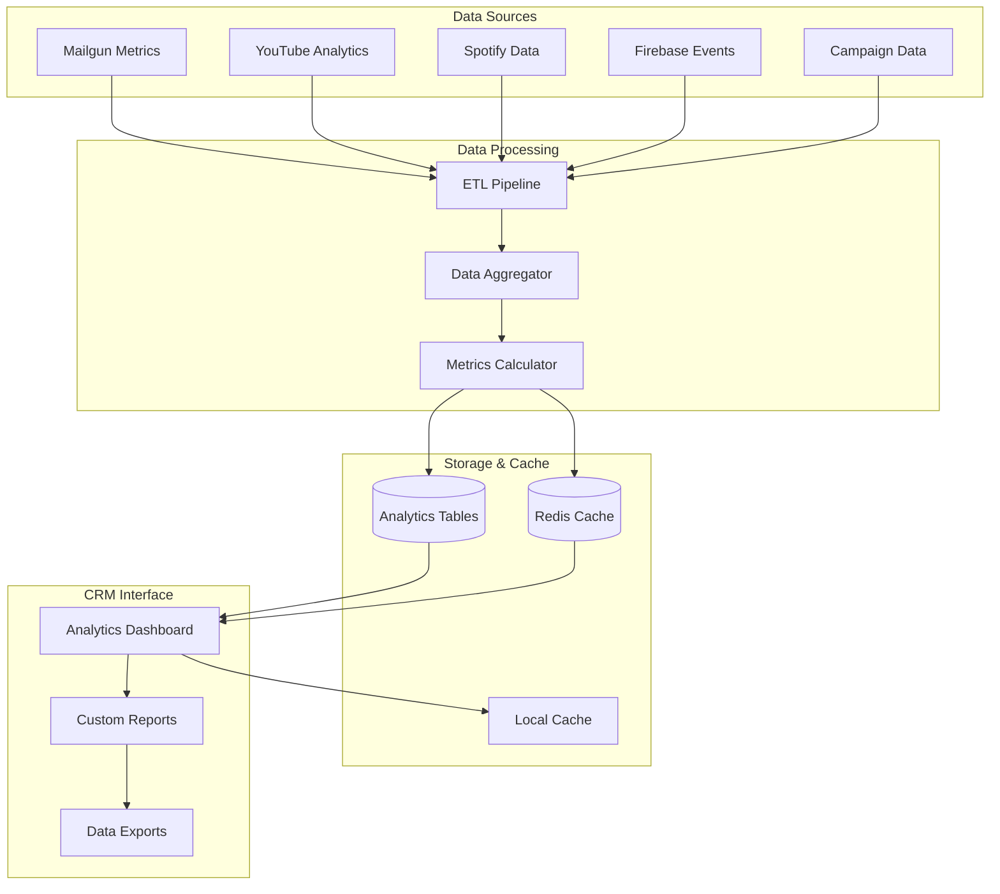
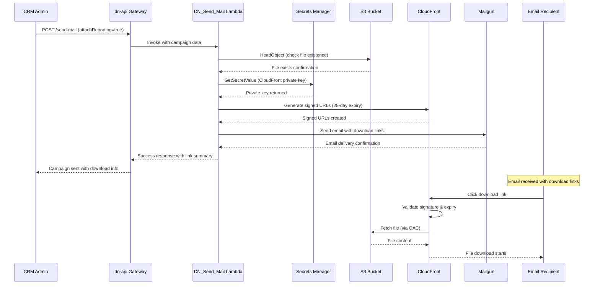
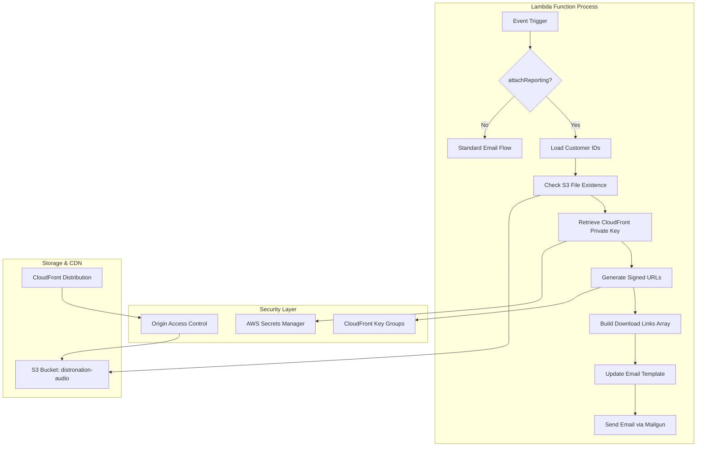

# Distro Nation CRM Data Flow Patterns

## Overview
This document details the comprehensive data flow patterns within the Distro Nation CRM application, including how data moves between components, external services, and the underlying infrastructure. Understanding these patterns is crucial for maintaining data consistency, optimizing performance, and ensuring reliable operation.

## Data Architecture Overview

### Data Sources and Destinations
The CRM application manages data flow between multiple sources:

```mermaid
graph TB
    subgraph "External APIs"
        Mailgun[Mailgun API]
        OpenAI[OpenAI API]
        YouTube[YouTube API]
        Spotify[Spotify API]
        SimilarWeb[SimilarWeb API]
    end
    
    subgraph "CRM Application"
        UI[React Components]
        State[Application State]
        Services[Service Layer]
        Cache[Local Cache]
    end
    
    subgraph "Backend Services"
        DNAPI[dn-api Gateway]
        Lambda[AWS Lambda]
        Aurora[Aurora PostgreSQL]
        Firebase[Firebase Services]
        S3[S3 Storage]
    end
    
    UI --> State
    State --> Services
    Services --> Cache
    Services --> DNAPI
    Services --> Firebase
    Services --> External APIs
    DNAPI --> Lambda
    Lambda --> Aurora
    Lambda --> S3
```

### Data Types and Categories
The CRM handles several categories of data:

1. **User Data**: Authentication, profiles, preferences, and permissions
2. **Campaign Data**: Email campaigns, templates, and performance metrics
3. **Analytics Data**: Performance metrics, user engagement, and business intelligence
4. **Configuration Data**: Application settings, feature flags, and system configuration
5. **Operational Data**: Logs, monitoring metrics, and system health data

## Core Data Flow Patterns

### 1. Email Campaign Creation and Execution Flow

#### Campaign Creation Data Flow


**Implementation Details**:
```typescript
// src/components/mailer/MailerTemplate.tsx
const MailerTemplate: React.FC = () => {
  const [formData, setFormData] = useState<NewsletterFormData>({
    email: "",
    user: null,
    content: "",
    subject: "",
    emailList: [],
    sendAll: false,
    testing: false,
    emailType: "financial",
  });

  // Data flow: API → Component State → UI
  useEffect(() => {
    const fetchUserList = async () => {
      try {
        setEmailListLoading(true);
        
        // Fetch user data from dn-api
        const response = await axios.get<EmailUser[]>(
          `${dnApiConfig.baseUrl}/dn_users_list`,
          {
            headers: {
              'Content-Type': 'application/json',
              'x-api-key': dnApiConfig.apiKey
            }
          }
        );
        
        // Update component state
        setFormData(prev => ({
          ...prev,
          emailList: response.data
        }));
        
      } catch (error) {
        console.error('Failed to fetch user list:', error);
        toast.error('Failed to load user list');
      } finally {
        setEmailListLoading(false);
      }
    };

    fetchUserList();
  }, []);

  // Data flow: Component State → API → Backend Services
  const handleSendEmail = async () => {
    try {
      setLoading(true);
      
      const campaignData = {
        to: formData.sendAll 
          ? formData.emailList.map(user => user.email)
          : [formData.user?.email].filter(Boolean),
        subject: formData.subject,
        html: formData.content,
        text: formData.content.replace(/<[^>]*>/g, ''),
        from: 'noreply@distro-nation.com',
        campaign: {
          name: `${formData.emailType}-${formData.month}-${formData.year}`,
          type: formData.emailType,
          month: formData.month,
          year: formData.year,
        }
      };
      
      // Send campaign data to backend
      const response = await sendEmail(campaignData);
      
      // Handle response and update UI
      if (response.success) {
        toast.success(`Campaign sent to ${response.recipientCount} recipients`);
        navigate('/confirmation', { 
          state: { 
            campaignId: response.campaign.id,
            recipientCount: response.recipientCount 
          } 
        });
      }
      
    } catch (error) {
      handleEmailError(error);
    } finally {
      setLoading(false);
    }
  };
};
```

### 2. User Management Data Flow

#### User List Retrieval and Caching


**Caching Strategy Implementation**:
```typescript
// src/hooks/useUserList.ts
export const useUserList = (filters?: UserFilters) => {
  const [users, setUsers] = useState<EmailUser[]>([]);
  const [loading, setLoading] = useState(true);
  const [error, setError] = useState<string | null>(null);

  // Cache key generation based on filters
  const cacheKey = useMemo(() => 
    `user-list-${JSON.stringify(filters || {})}`, 
    [filters]
  );

  const fetchUsers = useCallback(async () => {
    try {
      // Check cache first
      const cachedData = localStorage.getItem(cacheKey);
      const cacheTimestamp = localStorage.getItem(`${cacheKey}-timestamp`);
      const cacheExpiry = 5 * 60 * 1000; // 5 minutes

      if (cachedData && cacheTimestamp) {
        const age = Date.now() - parseInt(cacheTimestamp);
        if (age < cacheExpiry) {
          setUsers(JSON.parse(cachedData));
          setLoading(false);
          return;
        }
      }

      // Fetch from API if cache miss or expired
      setLoading(true);
      const queryParams = new URLSearchParams();
      
      if (filters?.subscriptionStatus) {
        queryParams.append('subscriptionStatus', filters.subscriptionStatus);
      }
      if (filters?.emailType) {
        queryParams.append('emailType', filters.emailType);
      }
      if (filters?.limit) {
        queryParams.append('limit', filters.limit.toString());
      }

      const response = await axios.get<UserListResponse>(
        `${dnApiConfig.baseUrl}/dn_users_list?${queryParams}`,
        {
          headers: {
            'Content-Type': 'application/json',
            'x-api-key': dnApiConfig.apiKey
          }
        }
      );

      // Update cache
      localStorage.setItem(cacheKey, JSON.stringify(response.data.users));
      localStorage.setItem(`${cacheKey}-timestamp`, Date.now().toString());

      setUsers(response.data.users);
      setError(null);

    } catch (err) {
      setError('Failed to fetch user list');
      console.error('User list fetch error:', err);
    } finally {
      setLoading(false);
    }
  }, [cacheKey, filters]);

  useEffect(() => {
    fetchUsers();
  }, [fetchUsers]);

  // Cache invalidation
  const invalidateCache = useCallback(() => {
    localStorage.removeItem(cacheKey);
    localStorage.removeItem(`${cacheKey}-timestamp`);
    fetchUsers();
  }, [cacheKey, fetchUsers]);

  return { users, loading, error, refetch: fetchUsers, invalidateCache };
};
```

### 3. Real-time Analytics Data Flow

#### Campaign Performance Tracking


**Real-time Analytics Implementation**:
```typescript
// src/hooks/useRealTimeAnalytics.ts
export const useRealTimeAnalytics = (campaignId: string) => {
  const [analytics, setAnalytics] = useState<CampaignAnalytics | null>(null);
  const [isConnected, setIsConnected] = useState(false);

  useEffect(() => {
    if (!campaignId) return;

    // Subscribe to real-time updates via Firebase
    const analyticsRef = doc(db, 'campaignAnalytics', campaignId);
    
    const unsubscribe = onSnapshot(analyticsRef, (doc) => {
      if (doc.exists()) {
        const data = doc.data() as CampaignAnalytics;
        setAnalytics(data);
        setIsConnected(true);
        
        // Trigger UI updates with smooth animations
        triggerAnalyticsAnimation(data);
      }
    }, (error) => {
      console.error('Real-time analytics error:', error);
      setIsConnected(false);
    });

    return () => unsubscribe();
  }, [campaignId]);

  return { analytics, isConnected };
};

// src/components/analytics/AnalyticsDashboard.tsx
const AnalyticsDashboard: React.FC<{ campaignId: string }> = ({ campaignId }) => {
  const { analytics, isConnected } = useRealTimeAnalytics(campaignId);
  const [previousValues, setPreviousValues] = useState<CampaignAnalytics | null>(null);

  // Detect changes for animations
  useEffect(() => {
    if (analytics && previousValues) {
      const changes = detectAnalyticsChanges(previousValues, analytics);
      if (changes.length > 0) {
        animateMetricChanges(changes);
      }
    }
    setPreviousValues(analytics);
  }, [analytics, previousValues]);

  const detectAnalyticsChanges = (
    prev: CampaignAnalytics, 
    current: CampaignAnalytics
  ): MetricChange[] => {
    const changes: MetricChange[] = [];
    
    if (prev.delivered !== current.delivered) {
      changes.push({ metric: 'delivered', from: prev.delivered, to: current.delivered });
    }
    if (prev.opened !== current.opened) {
      changes.push({ metric: 'opened', from: prev.opened, to: current.opened });
    }
    if (prev.clicked !== current.clicked) {
      changes.push({ metric: 'clicked', from: prev.clicked, to: current.clicked });
    }
    
    return changes;
  };

  return (
    <Grid container spacing={3}>
      <Grid item xs={12} md={3}>
        <MetricCard
          title="Delivered"
          value={analytics?.delivered || 0}
          trend={calculateTrend(analytics?.delivered, previousValues?.delivered)}
          color="success"
          isLive={isConnected}
        />
      </Grid>
      <Grid item xs={12} md={3}>
        <MetricCard
          title="Opened"
          value={analytics?.opened || 0}
          trend={calculateTrend(analytics?.opened, previousValues?.opened)}
          color="info"
          isLive={isConnected}
        />
      </Grid>
      <Grid item xs={12} md={3}>
        <MetricCard
          title="Clicked"
          value={analytics?.clicked || 0}
          trend={calculateTrend(analytics?.clicked, previousValues?.clicked)}
          color="warning"
          isLive={isConnected}
        />
      </Grid>
      <Grid item xs={12} md={3}>
        <MetricCard
          title="Open Rate"
          value={analytics ? ((analytics.opened / analytics.delivered) * 100).toFixed(1) + '%' : '0%'}
          color="primary"
          isLive={isConnected}
        />
      </Grid>
    </Grid>
  );
};
```

### 4. Outreach Campaign Data Management

#### Campaign Lifecycle Data Flow


**Campaign State Management**:
```typescript
// src/hooks/useOutreachData.ts
export const useOutreachData = () => {
  const [campaigns, setCampaigns] = useState<OutreachCampaign[]>([]);
  const [loading, setLoading] = useState(true);
  const [error, setError] = useState<string | null>(null);

  // Create campaign with optimistic updates
  const createCampaign = async (campaignData: CreateCampaignRequest): Promise<OutreachCampaign> => {
    const tempId = `temp-${Date.now()}`;
    const optimisticCampaign: OutreachCampaign = {
      id: tempId,
      ...campaignData,
      status: 'draft',
      createdAt: new Date(),
      updatedAt: new Date(),
      metrics: {
        sent: 0,
        delivered: 0,
        opened: 0,
        clicked: 0,
        bounced: 0,
        unsubscribed: 0
      }
    };

    // Optimistic update
    setCampaigns(prev => [optimisticCampaign, ...prev]);

    try {
      // Create in Firebase for real-time collaboration
      const campaignRef = doc(db, 'campaigns', tempId);
      await setDoc(campaignRef, optimisticCampaign);

      // Create in Aurora for persistent storage
      const response = await axios.post<OutreachCampaign>(
        `${dnApiConfig.baseUrl}/campaigns`,
        campaignData,
        {
          headers: {
            'Content-Type': 'application/json',
            'x-api-key': dnApiConfig.apiKey
          }
        }
      );

      // Update with real ID and data
      const realCampaign = response.data;
      setCampaigns(prev => 
        prev.map(campaign => 
          campaign.id === tempId ? realCampaign : campaign
        )
      );

      return realCampaign;

    } catch (error) {
      // Rollback optimistic update
      setCampaigns(prev => prev.filter(campaign => campaign.id !== tempId));
      throw error;
    }
  };

  // Update campaign with conflict resolution
  const updateCampaign = async (
    campaignId: string, 
    updates: Partial<OutreachCampaign>
  ): Promise<OutreachCampaign> => {
    try {
      // Check for concurrent modifications
      const campaignRef = doc(db, 'campaigns', campaignId);
      const currentDoc = await getDoc(campaignRef);
      
      if (!currentDoc.exists()) {
        throw new Error('Campaign not found');
      }

      const currentData = currentDoc.data() as OutreachCampaign;
      const lastModified = new Date(updates.updatedAt || 0);
      const currentModified = new Date(currentData.updatedAt);

      // Conflict detection
      if (lastModified < currentModified) {
        throw new Error('Campaign has been modified by another user');
      }

      const updatedCampaign = {
        ...currentData,
        ...updates,
        updatedAt: new Date()
      };

      // Update in Firebase
      await updateDoc(campaignRef, updatedCampaign);

      // Update in Aurora
      await axios.put(
        `${dnApiConfig.baseUrl}/campaigns/${campaignId}`,
        updatedCampaign,
        {
          headers: {
            'Content-Type': 'application/json',
            'x-api-key': dnApiConfig.apiKey
          }
        }
      );

      // Update local state
      setCampaigns(prev => 
        prev.map(campaign => 
          campaign.id === campaignId ? updatedCampaign : campaign
        )
      );

      return updatedCampaign;

    } catch (error) {
      console.error('Campaign update failed:', error);
      throw error;
    }
  };

  return {
    campaigns,
    loading,
    error,
    createCampaign,
    updateCampaign,
    deleteCampaign,
    launchCampaign
  };
};
```

### 5. Third-Party API Integration Data Patterns

#### AI Content Generation Flow


**AI Content Generation Implementation**:
```typescript
// src/services/openaiService.ts
class OpenAIService {
  private cache = new Map<string, CachedContent>();
  private readonly CACHE_DURATION = 24 * 60 * 60 * 1000; // 24 hours

  async generateEmailContent(prompt: ContentPrompt): Promise<GeneratedContent> {
    const cacheKey = this.generateCacheKey(prompt);
    
    // Check cache first
    const cached = this.cache.get(cacheKey);
    if (cached && (Date.now() - cached.timestamp) < this.CACHE_DURATION) {
      return cached.content;
    }

    try {
      const response = await axios.post(
        'https://api.openai.com/v1/chat/completions',
        {
          model: 'gpt-3.5-turbo',
          messages: [
            {
              role: 'system',
              content: 'You are an email marketing expert creating engaging content for music industry professionals.'
            },
            {
              role: 'user',
              content: this.buildPrompt(prompt)
            }
          ],
          max_tokens: 1000,
          temperature: 0.7
        },
        {
          headers: {
            'Authorization': `Bearer ${openAIKey}`,
            'Content-Type': 'application/json'
          }
        }
      );

      const generatedContent: GeneratedContent = {
        subject: this.extractSubject(response.data.choices[0].message.content),
        body: this.extractBody(response.data.choices[0].message.content),
        metadata: {
          model: 'gpt-3.5-turbo',
          promptType: prompt.type,
          generatedAt: new Date(),
          tokens: response.data.usage.total_tokens
        }
      };

      // Cache the result
      this.cache.set(cacheKey, {
        content: generatedContent,
        timestamp: Date.now()
      });

      // Store in Firebase for team sharing
      await this.storeGeneratedContent(generatedContent, prompt);

      return generatedContent;

    } catch (error) {
      console.error('OpenAI content generation failed:', error);
      throw new Error('Failed to generate content');
    }
  }

  private async storeGeneratedContent(
    content: GeneratedContent, 
    prompt: ContentPrompt
  ): Promise<void> {
    try {
      const contentRef = doc(db, 'generatedContent', `${Date.now()}`);
      await setDoc(contentRef, {
        ...content,
        originalPrompt: prompt,
        usage: {
          usedCount: 0,
          lastUsed: null
        },
        sharing: {
          isPublic: false,
          sharedWith: []
        }
      });
    } catch (error) {
      console.warn('Failed to store generated content:', error);
    }
  }

  private generateCacheKey(prompt: ContentPrompt): string {
    return btoa(JSON.stringify({
      type: prompt.type,
      audience: prompt.audience,
      tone: prompt.tone,
      keyPoints: prompt.keyPoints?.sort()
    }));
  }
}
```

### 6. Analytics and Reporting Data Aggregation

#### Multi-Source Analytics Integration


**Analytics Data Aggregation Service**:
```typescript
// src/services/analyticsService.ts
class AnalyticsService {
  private aggregationCache = new Map<string, AggregatedData>();
  private refreshIntervals = new Map<string, NodeJS.Timeout>();

  async getAggregatedAnalytics(
    timeRange: TimeRange,
    metrics: string[],
    filters?: AnalyticsFilters
  ): Promise<AggregatedAnalytics> {
    const cacheKey = this.buildCacheKey(timeRange, metrics, filters);
    
    // Return cached data if available and fresh
    if (this.aggregationCache.has(cacheKey)) {
      const cached = this.aggregationCache.get(cacheKey)!;
      if (Date.now() - cached.timestamp < 300000) { // 5 minutes
        return cached.data;
      }
    }

    try {
      // Fetch data from multiple sources in parallel
      const [
        emailMetrics,
        youtubeData,
        spotifyData,
        engagementData
      ] = await Promise.allSettled([
        this.fetchEmailMetrics(timeRange, filters),
        this.fetchYouTubeAnalytics(timeRange, filters),
        this.fetchSpotifyData(timeRange, filters),
        this.fetchEngagementData(timeRange, filters)
      ]);

      // Process and aggregate data
      const aggregatedData = this.aggregateMultiSourceData({
        email: emailMetrics.status === 'fulfilled' ? emailMetrics.value : null,
        youtube: youtubeData.status === 'fulfilled' ? youtubeData.value : null,
        spotify: spotifyData.status === 'fulfilled' ? spotifyData.value : null,
        engagement: engagementData.status === 'fulfilled' ? engagementData.value : null
      });

      // Calculate derived metrics
      const calculatedMetrics = this.calculateDerivedMetrics(aggregatedData);

      const result: AggregatedAnalytics = {
        ...aggregatedData,
        ...calculatedMetrics,
        metadata: {
          generatedAt: new Date(),
          dataFreshness: this.calculateDataFreshness(aggregatedData),
          completeness: this.calculateDataCompleteness(aggregatedData)
        }
      };

      // Cache the result
      this.aggregationCache.set(cacheKey, {
        data: result,
        timestamp: Date.now()
      });

      return result;

    } catch (error) {
      console.error('Analytics aggregation failed:', error);
      throw new Error('Failed to aggregate analytics data');
    }
  }

  private async fetchEmailMetrics(
    timeRange: TimeRange, 
    filters?: AnalyticsFilters
  ): Promise<EmailMetrics> {
    const response = await axios.get(
      `${dnApiConfig.baseUrl}/analytics/email`,
      {
        params: {
          startDate: timeRange.start.toISOString(),
          endDate: timeRange.end.toISOString(),
          ...filters
        },
        headers: {
          'x-api-key': dnApiConfig.apiKey
        }
      }
    );

    return response.data;
  }

  private aggregateMultiSourceData(sources: MultiSourceData): BaseAnalytics {
    return {
      totalCampaigns: sources.email?.totalCampaigns || 0,
      totalRecipients: sources.email?.totalRecipients || 0,
      deliveryRate: sources.email?.deliveryRate || 0,
      openRate: sources.email?.openRate || 0,
      clickRate: sources.email?.clickRate || 0,
      youtubeViews: sources.youtube?.totalViews || 0,
      spotifyStreams: sources.spotify?.totalStreams || 0,
      engagementScore: sources.engagement?.averageScore || 0
    };
  }

  private calculateDerivedMetrics(baseData: BaseAnalytics): DerivedMetrics {
    return {
      engagementTrend: this.calculateEngagementTrend(baseData),
      campaignEffectiveness: this.calculateCampaignEffectiveness(baseData),
      audienceGrowth: this.calculateAudienceGrowth(baseData),
      conversionFunnel: this.calculateConversionFunnel(baseData)
    };
  }

  // Real-time analytics updates
  setupRealTimeUpdates(callback: (update: AnalyticsUpdate) => void): () => void {
    const analyticsRef = collection(db, 'analyticsUpdates');
    const query = orderBy(analyticsRef, 'timestamp', 'desc');
    
    const unsubscribe = onSnapshot(query, (snapshot) => {
      snapshot.docChanges().forEach((change) => {
        if (change.type === 'added') {
          const update = change.doc.data() as AnalyticsUpdate;
          callback(update);
          
          // Invalidate relevant caches
          this.invalidateCache(update.affectedMetrics);
        }
      });
    });

    return unsubscribe;
  }
}
```

## Data Persistence Strategies

### 1. Multi-Tier Caching Architecture

#### Caching Layer Implementation
```typescript
// src/utils/cacheManager.ts
class CacheManager {
  // Layer 1: Memory cache (fastest, smallest)
  private memoryCache = new Map<string, CachedItem>();
  
  // Layer 2: Session storage (medium speed, session-scoped)
  private sessionCache = window.sessionStorage;
  
  // Layer 3: Local storage (slower, persistent)
  private localStorage = window.localStorage;

  async get<T>(key: string): Promise<T | null> {
    // Check memory cache first
    const memoryItem = this.memoryCache.get(key);
    if (memoryItem && !this.isExpired(memoryItem)) {
      return memoryItem.data as T;
    }

    // Check session storage
    const sessionItem = this.getFromStorage(this.sessionCache, key);
    if (sessionItem && !this.isExpired(sessionItem)) {
      // Promote to memory cache
      this.memoryCache.set(key, sessionItem);
      return sessionItem.data as T;
    }

    // Check local storage
    const localItem = this.getFromStorage(this.localStorage, key);
    if (localItem && !this.isExpired(localItem)) {
      // Promote to session cache
      this.setToStorage(this.sessionCache, key, localItem);
      return localItem.data as T;
    }

    return null;
  }

  async set<T>(
    key: string, 
    data: T, 
    options: CacheOptions = {}
  ): Promise<void> {
    const item: CachedItem = {
      data,
      timestamp: Date.now(),
      ttl: options.ttl || 300000, // 5 minutes default
      tags: options.tags || []
    };

    // Store in appropriate layers based on options
    if (options.memory !== false) {
      this.memoryCache.set(key, item);
    }

    if (options.session !== false) {
      this.setToStorage(this.sessionCache, key, item);
    }

    if (options.persistent) {
      this.setToStorage(this.localStorage, key, item);
    }
  }

  invalidateByTag(tag: string): void {
    // Invalidate memory cache
    for (const [key, item] of this.memoryCache.entries()) {
      if (item.tags.includes(tag)) {
        this.memoryCache.delete(key);
      }
    }

    // Invalidate storage caches
    this.invalidateStorageByTag(this.sessionCache, tag);
    this.invalidateStorageByTag(this.localStorage, tag);
  }

  // Cleanup expired items
  cleanup(): void {
    const now = Date.now();
    
    for (const [key, item] of this.memoryCache.entries()) {
      if (this.isExpired(item)) {
        this.memoryCache.delete(key);
      }
    }
  }

  private isExpired(item: CachedItem): boolean {
    return Date.now() - item.timestamp > item.ttl;
  }
}

// Usage in hooks
export const useCachedData = <T>(
  key: string,
  fetcher: () => Promise<T>,
  options: CacheOptions = {}
) => {
  const [data, setData] = useState<T | null>(null);
  const [loading, setLoading] = useState(true);
  const [error, setError] = useState<Error | null>(null);

  const cacheManager = useMemo(() => new CacheManager(), []);

  const fetchData = useCallback(async () => {
    try {
      setLoading(true);
      
      // Try cache first
      const cached = await cacheManager.get<T>(key);
      if (cached) {
        setData(cached);
        setLoading(false);
        return;
      }

      // Fetch fresh data
      const freshData = await fetcher();
      
      // Cache the result
      await cacheManager.set(key, freshData, options);
      
      setData(freshData);
      setError(null);
    } catch (err) {
      setError(err as Error);
    } finally {
      setLoading(false);
    }
  }, [key, fetcher, options, cacheManager]);

  useEffect(() => {
    fetchData();
  }, [fetchData]);

  return { data, loading, error, refetch: fetchData };
};
```

### 2. Offline Data Synchronization

#### Offline-First Data Pattern
```typescript
// src/utils/offlineSync.ts
class OfflineSyncManager {
  private pendingOperations: PendingOperation[] = [];
  private syncQueue = new Queue<SyncOperation>();

  constructor() {
    this.setupOnlineListener();
    this.setupPeriodicSync();
  }

  // Queue operations for later sync
  async queueOperation(operation: DataOperation): Promise<void> {
    const pendingOp: PendingOperation = {
      id: generateId(),
      operation,
      timestamp: Date.now(),
      retryCount: 0,
      status: 'pending'
    };

    this.pendingOperations.push(pendingOp);
    
    // Store in local storage for persistence
    localStorage.setItem(
      'pending-operations', 
      JSON.stringify(this.pendingOperations)
    );

    // Try to sync immediately if online
    if (navigator.onLine) {
      this.processSyncQueue();
    }
  }

  // Process queued operations when back online
  private async processSyncQueue(): Promise<void> {
    if (!navigator.onLine || this.syncQueue.size === 0) {
      return;
    }

    const batchSize = 5;
    const batch = this.pendingOperations
      .filter(op => op.status === 'pending')
      .slice(0, batchSize);

    for (const pendingOp of batch) {
      try {
        await this.executePendingOperation(pendingOp);
        
        // Mark as completed
        pendingOp.status = 'completed';
        pendingOp.completedAt = Date.now();
        
      } catch (error) {
        console.error('Sync operation failed:', error);
        
        pendingOp.retryCount++;
        pendingOp.lastError = error.message;
        
        // Mark as failed after max retries
        if (pendingOp.retryCount >= 3) {
          pendingOp.status = 'failed';
        }
      }
    }

    // Clean up completed operations
    this.pendingOperations = this.pendingOperations
      .filter(op => op.status !== 'completed');
    
    localStorage.setItem(
      'pending-operations', 
      JSON.stringify(this.pendingOperations)
    );
  }

  private async executePendingOperation(pendingOp: PendingOperation): Promise<void> {
    const { operation } = pendingOp;
    
    switch (operation.type) {
      case 'CREATE_CAMPAIGN':
        await this.syncCreateCampaign(operation.data);
        break;
      case 'UPDATE_CAMPAIGN':
        await this.syncUpdateCampaign(operation.data);
        break;
      case 'SEND_EMAIL':
        await this.syncSendEmail(operation.data);
        break;
      default:
        throw new Error(`Unknown operation type: ${operation.type}`);
    }
  }

  private setupOnlineListener(): void {
    window.addEventListener('online', () => {
      console.log('Back online, processing sync queue');
      this.processSyncQueue();
    });

    window.addEventListener('offline', () => {
      console.log('Gone offline, queuing operations');
    });
  }
}
```

## Error Handling and Data Recovery

### Comprehensive Error Recovery Patterns
```typescript
// src/utils/errorRecovery.ts
class DataErrorRecovery {
  async recoverFromDataError(
    operation: FailedOperation,
    context: ErrorContext
  ): Promise<RecoveryResult> {
    try {
      switch (operation.type) {
        case 'FETCH_USER_LIST':
          return await this.recoverUserListFetch(operation, context);
        
        case 'SEND_EMAIL_CAMPAIGN':
          return await this.recoverEmailCampaign(operation, context);
        
        case 'UPDATE_ANALYTICS':
          return await this.recoverAnalyticsUpdate(operation, context);
        
        default:
          return this.fallbackRecovery(operation, context);
      }
    } catch (recoveryError) {
      console.error('Data recovery failed:', recoveryError);
      return {
        success: false,
        error: recoveryError.message,
        fallbackData: this.getFallbackData(operation.type)
      };
    }
  }

  private async recoverUserListFetch(
    operation: FailedOperation,
    context: ErrorContext
  ): Promise<RecoveryResult> {
    // Try alternative data sources
    const fallbackSources = [
      () => this.getFromCache('user-list'),
      () => this.getFromLocalStorage('user-list-backup'),
      () => this.getFromIndexedDB('users'),
      () => this.getMinimalUserList()
    ];

    for (const source of fallbackSources) {
      try {
        const data = await source();
        if (data && data.length > 0) {
          return {
            success: true,
            data,
            source: source.name,
            isStale: true
          };
        }
      } catch (sourceError) {
        console.warn(`Fallback source failed: ${source.name}`, sourceError);
      }
    }

    // Return minimal fallback data
    return {
      success: false,
      fallbackData: this.getEmptyUserList(),
      error: 'All user list sources unavailable'
    };
  }

  private async recoverEmailCampaign(
    operation: FailedOperation,
    context: ErrorContext
  ): Promise<RecoveryResult> {
    const campaignData = operation.data;
    
    // Check if campaign was partially sent
    const partialStatus = await this.checkCampaignStatus(campaignData.id);
    
    if (partialStatus.sent > 0) {
      // Resume from where it left off
      const remainingRecipients = campaignData.recipients.slice(partialStatus.sent);
      
      try {
        const resumeResult = await this.resumeCampaign({
          ...campaignData,
          recipients: remainingRecipients
        });
        
        return {
          success: true,
          data: resumeResult,
          message: `Campaign resumed, ${partialStatus.sent} already sent`
        };
      } catch (resumeError) {
        return {
          success: false,
          error: 'Failed to resume campaign',
          fallbackData: partialStatus
        };
      }
    }

    // Campaign not started, retry from beginning
    return this.retryWithBackoff(operation);
  }
}
```

## Performance Optimization Patterns

### Data Loading Optimization
```typescript
// src/hooks/useOptimizedDataLoading.ts
export const useOptimizedDataLoading = <T>(
  dataLoader: DataLoader<T>,
  options: OptimizationOptions = {}
) => {
  const [data, setData] = useState<T[]>([]);
  const [loading, setLoading] = useState(false);
  const [hasMore, setHasMore] = useState(true);

  // Implement virtual scrolling for large datasets
  const [visibleRange, setVisibleRange] = useState({ start: 0, end: 50 });
  
  // Batch API requests to reduce server load
  const debouncedLoader = useMemo(
    () => debounce(dataLoader.load, 300),
    [dataLoader]
  );

  // Implement intelligent prefetching
  const prefetchNext = useCallback(async () => {
    if (!hasMore || loading) return;
    
    const nextBatch = await dataLoader.prefetch(data.length, 50);
    if (nextBatch.length === 0) {
      setHasMore(false);
    }
  }, [data.length, hasMore, loading, dataLoader]);

  // Load visible data with intersection observer
  const loadVisibleData = useCallback(async () => {
    if (loading) return;
    
    setLoading(true);
    try {
      const batchData = await debouncedLoader({
        offset: visibleRange.start,
        limit: visibleRange.end - visibleRange.start
      });
      
      setData(prev => {
        const newData = [...prev];
        batchData.forEach((item, index) => {
          newData[visibleRange.start + index] = item;
        });
        return newData;
      });
      
      // Prefetch next batch
      if (visibleRange.end >= data.length - 10) {
        prefetchNext();
      }
      
    } catch (error) {
      console.error('Data loading failed:', error);
    } finally {
      setLoading(false);
    }
  }, [visibleRange, debouncedLoader, data.length, prefetchNext, loading]);

  // Update visible range based on scroll position
  const updateVisibleRange = useCallback((start: number, end: number) => {
    setVisibleRange({ start, end });
  }, []);

  useEffect(() => {
    loadVisibleData();
  }, [loadVisibleData]);

  return {
    data,
    loading,
    hasMore,
    updateVisibleRange,
    refresh: loadVisibleData
  };
};
```

This comprehensive data flow documentation provides detailed patterns for managing data throughout the CRM application, ensuring optimal performance, reliability, and user experience across all data operations.

<function_calls>
<invoke name="TodoWriter">
<parameter name="todos">[{"content": "Create Aurora PostgreSQL backup and recovery procedures documentation", "status": "completed", "priority": "high", "id": "70"}, {"content": "Document S3 storage backup and versioning strategies", "status": "completed", "priority": "high", "id": "71"}, {"content": "Create Firebase services backup and recovery procedures", "status": "completed", "priority": "high", "id": "72"}, {"content": "Document Infrastructure as Code backup and deployment procedures", "status": "completed", "priority": "high", "id": "73"}, {"content": "Create Lambda function backup and rollback procedures", "status": "completed", "priority": "high", "id": "74"}, {"content": "Create CRM architecture overview documentation", "status": "completed", "priority": "high", "id": "75"}, {"content": "Document CRM component catalog and structure", "status": "completed", "priority": "high", "id": "76"}, {"content": "Create CRM API integrations documentation", "status": "completed", "priority": "high", "id": "77"}, {"content": "Document CRM development setup and deployment procedures", "status": "completed", "priority": "high", "id": "78"}, {"content": "Update dn-api specification with CRM usage patterns", "status": "completed", "priority": "medium", "id": "79"}, {"content": "Update unified architecture documentation to include CRM", "status": "completed", "priority": "medium", "id": "80"}, {"content": "Create CRM authentication flows documentation", "status": "completed", "priority": "medium", "id": "81"}, {"content": "Create CRM data flow patterns documentation", "status": "completed", "priority": "medium", "id": "82"}]
### 8. CloudFront Signed URLs for Financial Reports (NEW - August 2025)

#### Enhanced Email Campaign Flow with Secure File Downloads


#### CloudFront Signed URL Generation Flow


#### Data Structures for CloudFront Integration

**Download Links Structure**:
```typescript
interface DownloadLink {
  type: 'youtube' | 'distro';
  filename: string;
  url: string; // CloudFront signed URL
  custom_id: string;
  label: string; // "YouTube Report" | "Streaming Report"
}

interface DownloadLinkGroup {
  custom_id: string;
  links: DownloadLink[];
}

interface DownloadSummary {
  total_links: number;
  summary_text: string;
  links_available: boolean;
}
```

**S3 File Path Patterns**:
```typescript
// File path resolution for different report types
const filePathPatterns = {
  youtube: "Exports/{year}/{month}/{customId}/{customId}.zip",
  distro: "Distro/{year}/{month}/{customId}/{customId}.zip"
};

// Example resolved paths:
// YouTube: "Exports/2025/08/GRACEWEBER/GRACEWEBER.zip"
// Distro: "Distro/2025/08/GRACEWEBER/GRACEWEBER.zip"
```

#### Performance Metrics and Improvements

**Before CloudFront Implementation**:
- Lambda execution time: ~30-45 seconds (with file downloads)
- Memory usage: Up to 512MB-1GB (file buffering)
- Email size: Large (with binary attachments)
- Global performance: Variable (direct S3 access)

**After CloudFront Implementation**:
- Lambda execution time: ~15-20 seconds (50% improvement)
- Memory usage: ~150-300MB (70% improvement)
- Email size: Small (just links)
- Global performance: Optimized (CloudFront CDN)

**Security Enhancements**:
- **Extended Access Period**: 25 days vs previous 7-day S3 limit
- **No Direct S3 Access**: Origin Access Control blocks public access
- **Audit Trail**: CloudFront access logs for download tracking
- **Secure Key Management**: Private keys in AWS Secrets Manager
- **URL Validation**: Cryptographic signature verification

#### Error Handling and Recovery

**File Existence Validation**:
```python
def check_s3_object_exists(bucket_name, object_key):
    try:
        s3_client.head_object(Bucket=bucket_name, Key=object_key)
        return True
    except ClientError as e:
        if e.response['Error']['Code'] == '404':
            return False
        else:
            raise
```

**Graceful Degradation**:
- If CloudFront signing fails: Log error, continue with standard email
- If S3 files missing: Generate links only for available files
- If Secrets Manager unavailable: Fall back to environment variables (dev only)

**Monitoring and Alerting**:
- CloudWatch metrics for signed URL generation success/failure rates
- S3 access pattern monitoring via CloudFront logs
- Lambda execution time tracking for performance regression detection
- Email delivery rate monitoring to ensure no impact from changes

This enhanced data flow pattern demonstrates the integration of CloudFront signed URLs into the existing email campaign system, providing improved security, performance, and user experience for financial report distribution.
