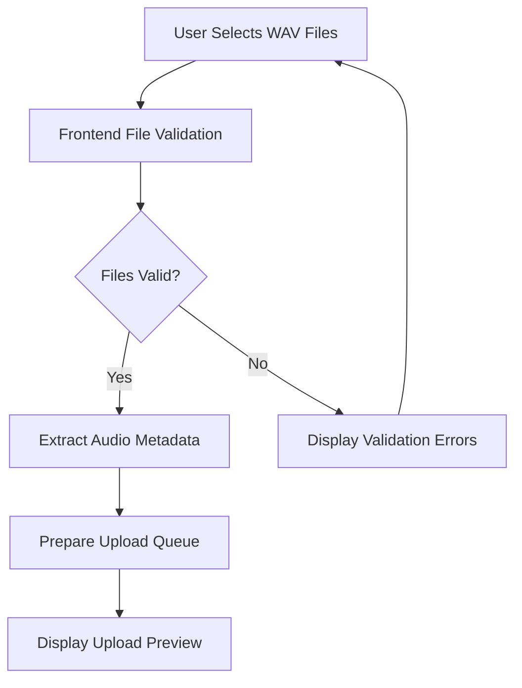
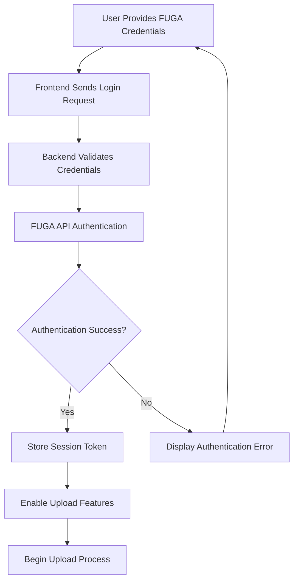
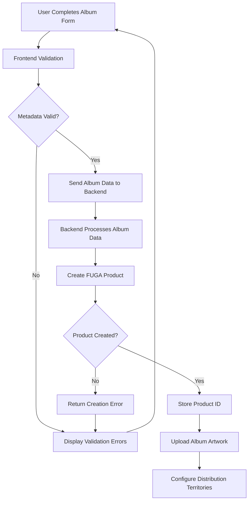
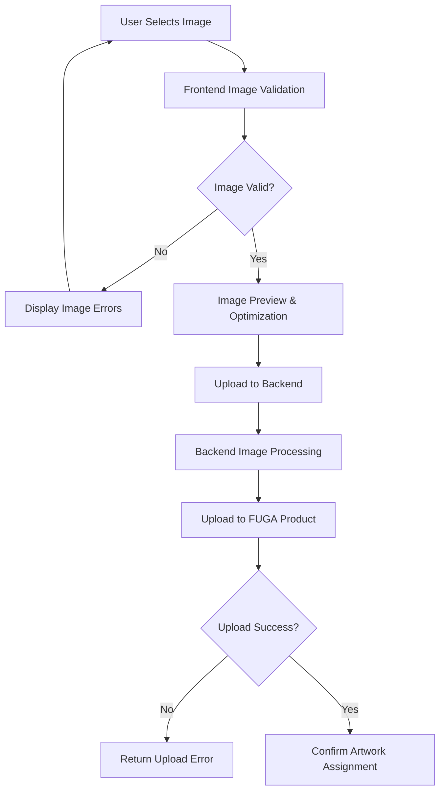
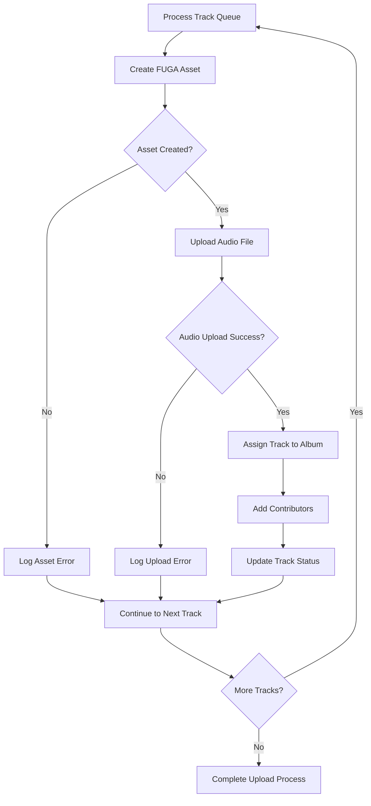
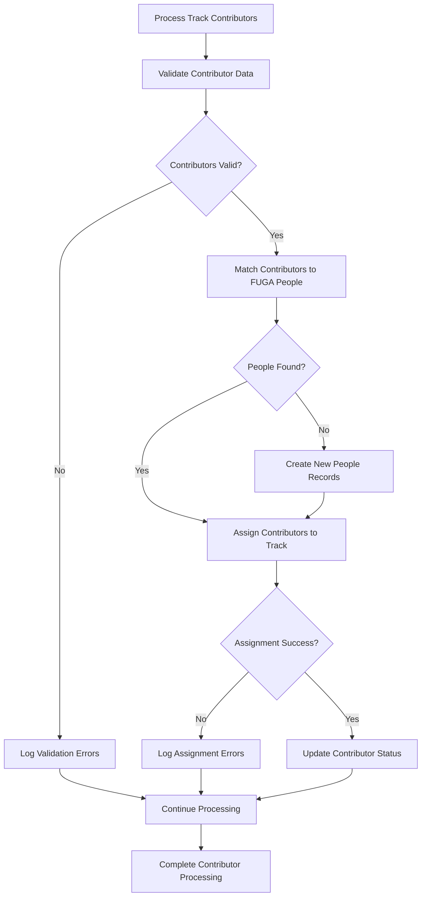
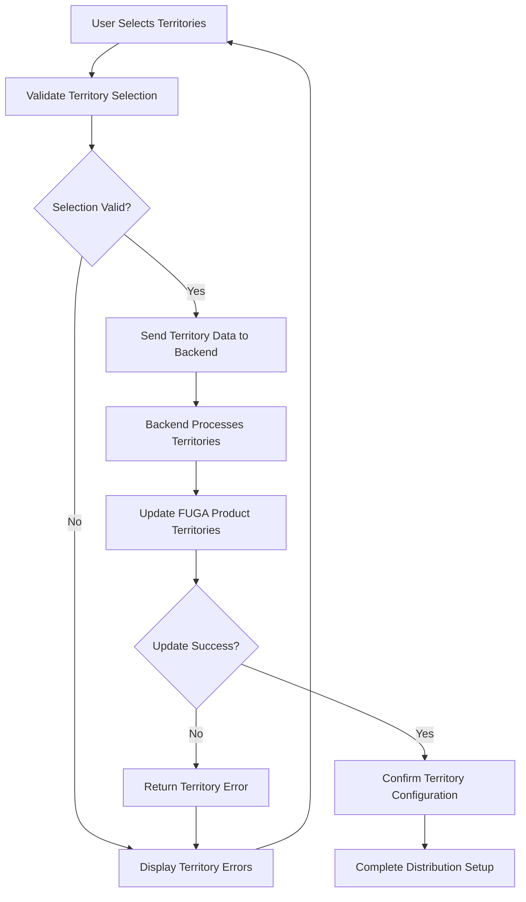
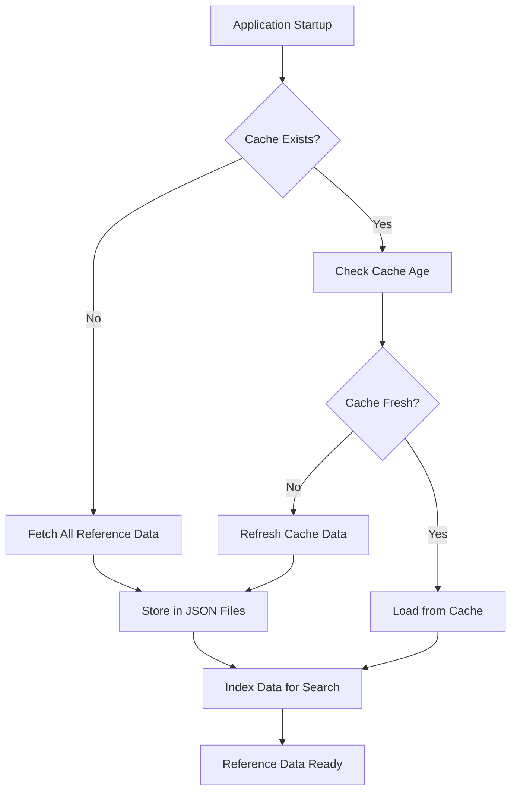
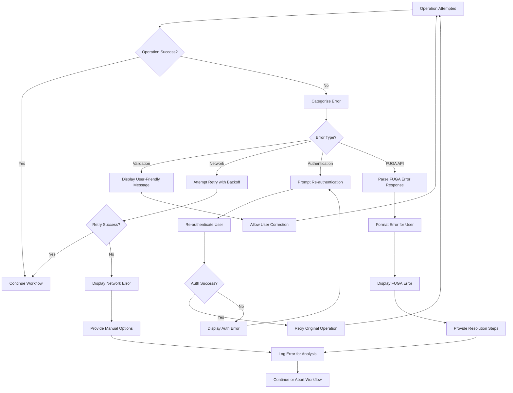

# FUGA WAV Uploader Data Flow Patterns

## Overview

The FUGA WAV Uploader implements a streamlined data flow architecture that efficiently processes WAV audio files and metadata through a direct integration with the FUGA music distribution platform. This document outlines the complete data flow patterns from initial file selection through final distribution configuration.

## Primary Data Flow Architecture

### High-Level Flow Overview
```
User Interface → File Validation → Direct FUGA Upload → Metadata Processing → Distribution Setup
```

The application follows a linear progression with built-in error handling and validation at each stage to ensure data integrity and user feedback throughout the process.

## Phase 1: File Selection and Initial Validation

### User File Selection Flow


#### Frontend Validation Process
1. **File Type Validation**
   - Accept only `.wav` file extensions
   - Validate MIME type for audio/wav
   - Reject non-audio files with user feedback

2. **Audio Format Detection**
   - Use `wavefile` library to extract metadata
   - Detect sample rate, bit depth, and channel configuration
   - Extract duration and audio codec information

3. **Floating Point WAV Detection**
   - Analyze audio codec for floating point format
   - Use ffmpeg probe to verify codec information
   - Provide clear error messages for unsupported formats

4. **Metadata Extraction**
   - Extract embedded audio metadata if present
   - Calculate precise duration in milliseconds
   - Detect channel configuration (mono/stereo)
   - Prepare metadata for form pre-population

### Data Validation Patterns
```typescript
// Frontend validation workflow
interface ValidationResult {
  isValid: boolean;
  errors: string[];
  metadata?: AudioMetadata;
}

const validateAudioFile = async (file: File): Promise<ValidationResult> => {
  // File type validation
  if (!file.name.toLowerCase().endsWith('.wav')) {
    return { isValid: false, errors: ['Only WAV files are supported'] };
  }
  
  // Audio format validation
  const audioData = await analyzeAudioFile(file);
  if (audioData.codec.includes('floating point')) {
    return { 
      isValid: false, 
      errors: ['Floating point WAV files are not supported. Please convert to PCM format.']
    };
  }
  
  return { isValid: true, errors: [], metadata: audioData };
};
```

## Phase 2: Authentication and Session Management

### FUGA Authentication Flow


#### Session Management Pattern
```python
# Backend session management
class FugaSessionManager:
    def authenticate(self, username: str, password: str) -> SessionResult:
        try:
            response = self.fuga_client.login(username, password)
            if response.success:
                session['fuga_token'] = response.token
                session['fuga_user'] = response.user_info
                return SessionResult(success=True, token=response.token)
            else:
                return SessionResult(success=False, error=response.error)
        except Exception as e:
            return SessionResult(success=False, error=str(e))
    
    def validate_session(self) -> bool:
        return 'fuga_token' in session and self.token_is_valid(session['fuga_token'])
```

## Phase 3: Album Creation and Metadata Processing

### Album-Level Data Flow


#### Album Data Processing Pattern
```python
# Backend album processing
def create_album_product(album_data: Dict) -> ProductResult:
    # Validate album metadata
    validation_result = validate_album_metadata(album_data)
    if not validation_result.is_valid:
        return ProductResult(success=False, errors=validation_result.errors)
    
    # Create FUGA product
    try:
        product_data = {
            'name': album_data['title'],
            'label': album_data['label'],
            'upc': album_data['upc'],
            'p_line_text': album_data['p_line_text'],
            'p_line_year': album_data['p_line_year'],
            'release_date': album_data['release_date'],
            'genre': album_data['genre'],
            'language': album_data['language']
        }
        
        fuga_response = fuga_client.create_product(product_data)
        if fuga_response.success:
            return ProductResult(
                success=True, 
                product_id=fuga_response.product_id,
                fuga_url=fuga_response.product_url
            )
        else:
            return ProductResult(success=False, errors=[fuga_response.error])
            
    except Exception as e:
        return ProductResult(success=False, errors=[str(e)])
```

### Album Artwork Upload Flow


## Phase 4: Track Asset Creation and Audio Upload

### Individual Track Processing Flow


#### Track Asset Creation Pattern
```python
# Backend track processing
def process_track_upload(track_data: Dict, audio_file: FileStorage, product_id: int) -> TrackResult:
    try:
        # Create FUGA asset
        asset_data = {
            'name': track_data['title'],
            'isrc': track_data['isrc'],
            'duration': track_data['duration'],
            'genre': track_data['genre'],
            'language': track_data['language'],
            'explicit': track_data['explicit']
        }
        
        asset_response = fuga_client.create_asset(asset_data)
        if not asset_response.success:
            return TrackResult(success=False, errors=[asset_response.error])
        
        asset_id = asset_response.asset_id
        
        # Upload audio file directly to FUGA
        audio_upload_result = upload_audio_to_fuga(asset_id, audio_file)
        if not audio_upload_result.success:
            return TrackResult(success=False, errors=[audio_upload_result.error])
        
        # Assign asset to product
        assignment_result = fuga_client.assign_asset_to_product(product_id, asset_id)
        if not assignment_result.success:
            return TrackResult(success=False, errors=[assignment_result.error])
        
        # Add contributors
        if track_data.get('contributors'):
            contributor_result = add_track_contributors(asset_id, track_data['contributors'])
            if not contributor_result.success:
                # Log warning but don't fail the entire upload
                logger.warning(f"Failed to add contributors to asset {asset_id}: {contributor_result.error}")
        
        return TrackResult(
            success=True,
            asset_id=asset_id,
            fuga_url=asset_response.asset_url
        )
        
    except Exception as e:
        return TrackResult(success=False, errors=[str(e)])
```

### Audio File Upload Pattern
```python
# Direct audio upload to FUGA
def upload_audio_to_fuga(asset_id: int, audio_file: FileStorage) -> UploadResult:
    try:
        # Validate audio format before upload
        validation_result = validate_audio_format(audio_file)
        if not validation_result.is_valid:
            return UploadResult(success=False, error=validation_result.error)
        
        # Stream file directly to FUGA API
        response = fuga_client.upload_audio_to_asset(
            asset_id=asset_id,
            audio_stream=audio_file.stream,
            filename=audio_file.filename,
            content_type='audio/wav'
        )
        
        if response.success:
            return UploadResult(
                success=True,
                upload_id=response.upload_id,
                file_url=response.file_url
            )
        else:
            return UploadResult(success=False, error=response.error)
            
    except Exception as e:
        return UploadResult(success=False, error=str(e))
```

## Phase 5: Contributor and Metadata Management

### Contributor Assignment Flow


#### Contributor Management Pattern
```python
# Contributor processing workflow
def process_track_contributors(asset_id: int, contributors: List[Dict]) -> ContributorResult:
    results = []
    
    for contributor in contributors:
        try:
            # Find or create person in FUGA system
            person_result = find_or_create_person(contributor['name'])
            if not person_result.success:
                results.append(ContributorResult(
                    success=False,
                    contributor_name=contributor['name'],
                    error=person_result.error
                ))
                continue
            
            # Assign person to asset with role
            assignment_data = {
                'person_id': person_result.person_id,
                'role': contributor['role'],
                'name': contributor['name']
            }
            
            assignment_result = fuga_client.add_contributor_to_asset(asset_id, assignment_data)
            results.append(ContributorResult(
                success=assignment_result.success,
                contributor_name=contributor['name'],
                person_id=person_result.person_id,
                role=contributor['role'],
                error=assignment_result.error if not assignment_result.success else None
            ))
            
        except Exception as e:
            results.append(ContributorResult(
                success=False,
                contributor_name=contributor['name'],
                error=str(e)
            ))
    
    return ContributorResults(results=results)
```

## Phase 6: Territory Configuration and Distribution Setup

### Territory Management Flow


#### Territory Configuration Pattern
```python
# Territory management
def configure_product_territories(product_id: int, territories: List[str]) -> TerritoryResult:
    try:
        # Validate territory codes
        valid_territories = validate_territory_codes(territories)
        if not valid_territories.is_valid:
            return TerritoryResult(success=False, errors=valid_territories.errors)
        
        # Format territories for FUGA API
        territory_data = [
            {'code': territory, 'enabled': True}
            for territory in valid_territories.codes
        ]
        
        # Update product territories in FUGA
        response = fuga_client.update_product_territories(product_id, territory_data)
        if response.success:
            return TerritoryResult(
                success=True,
                configured_territories=territories,
                total_territories=len(territories)
            )
        else:
            return TerritoryResult(success=False, errors=[response.error])
            
    except Exception as e:
        return TerritoryResult(success=False, errors=[str(e)])
```

## Data Synchronization Patterns

### Reference Data Caching Flow


#### Data Synchronization Pattern
```python
# Reference data management
class FugaDataSyncManager:
    def __init__(self):
        self.cache_duration = timedelta(hours=24)  # Default 24 hour cache
        self.data_files = {
            'artists': 'fuga_artists.json',
            'labels': 'fuga_labels.json',
            'people': 'fuga_people.json',
            'genres': 'fuga_genres.json'
        }
    
    def sync_all_data(self) -> SyncResult:
        results = {}
        
        for data_type, filename in self.data_files.items():
            try:
                # Check if refresh needed
                if self.needs_refresh(filename):
                    # Fetch fresh data from FUGA API
                    data = self.fetch_data_from_fuga(data_type)
                    
                    # Backup existing data
                    self.backup_data_file(filename)
                    
                    # Write new data
                    self.write_data_file(filename, data)
                    
                    results[data_type] = SyncResult(success=True, records_count=len(data))
                else:
                    # Load from existing cache
                    data = self.load_data_file(filename)
                    results[data_type] = SyncResult(success=True, records_count=len(data), from_cache=True)
                    
            except Exception as e:
                results[data_type] = SyncResult(success=False, error=str(e))
        
        return CombinedSyncResult(results=results)
    
    def needs_refresh(self, filename: str) -> bool:
        if not os.path.exists(filename):
            return True
        
        file_age = datetime.now() - datetime.fromtimestamp(os.path.getmtime(filename))
        return file_age > self.cache_duration
```

## Error Handling and Recovery Patterns

### Comprehensive Error Flow


### Error Recovery Implementation
```python
# Error handling with retry logic
class ErrorHandler:
    def __init__(self):
        self.max_retries = 3
        self.retry_delay = 1  # seconds
        
    def handle_operation_with_retry(self, operation: Callable, *args, **kwargs) -> OperationResult:
        for attempt in range(self.max_retries):
            try:
                result = operation(*args, **kwargs)
                if result.success:
                    return result
                else:
                    # Determine if error is retryable
                    if self.is_retryable_error(result.error):
                        if attempt < self.max_retries - 1:
                            time.sleep(self.retry_delay * (2 ** attempt))  # Exponential backoff
                            continue
                    
                    return result
                    
            except Exception as e:
                if attempt == self.max_retries - 1:
                    return OperationResult(success=False, error=str(e))
                time.sleep(self.retry_delay * (2 ** attempt))
        
        return OperationResult(success=False, error="Max retries exceeded")
    
    def is_retryable_error(self, error: str) -> bool:
        retryable_patterns = [
            'timeout',
            'connection',
            'network',
            'temporary',
            'rate limit'
        ]
        return any(pattern in error.lower() for pattern in retryable_patterns)
```

## Performance Optimization Patterns

### Concurrent Processing Flow
```python
# Optimized upload processing with concurrency
async def process_multiple_tracks_optimized(tracks: List[TrackData], product_id: int) -> BatchResult:
    semaphore = asyncio.Semaphore(3)  # Limit concurrent uploads
    
    async def process_single_track(track: TrackData) -> TrackResult:
        async with semaphore:
            return await process_track_upload_async(track, product_id)
    
    # Process tracks concurrently with limited concurrency
    tasks = [process_single_track(track) for track in tracks]
    results = await asyncio.gather(*tasks, return_exceptions=True)
    
    # Aggregate results
    successful_uploads = [r for r in results if isinstance(r, TrackResult) and r.success]
    failed_uploads = [r for r in results if isinstance(r, TrackResult) and not r.success]
    exceptions = [r for r in results if isinstance(r, Exception)]
    
    return BatchResult(
        successful_count=len(successful_uploads),
        failed_count=len(failed_uploads) + len(exceptions),
        results=results
    )
```

This comprehensive data flow documentation ensures efficient, reliable, and user-friendly processing of music distribution workflows through the FUGA WAV Uploader application.