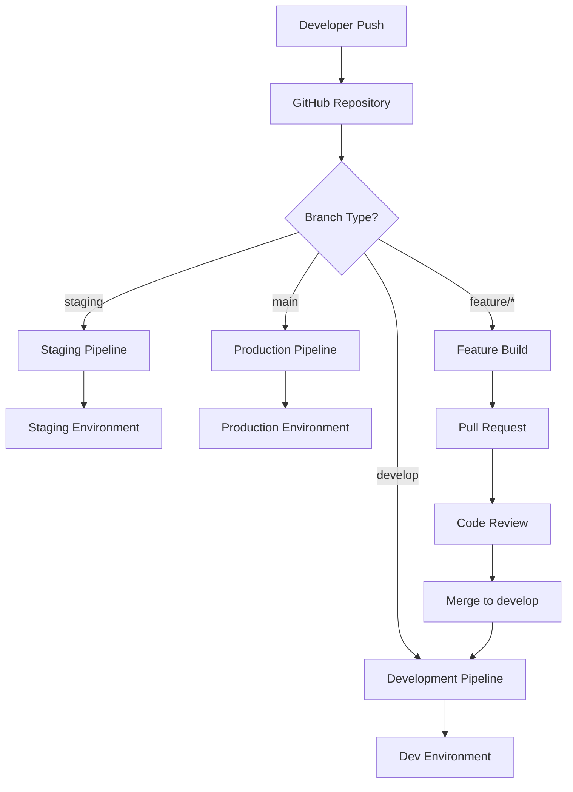

# CI/CD Pipeline Documentation

## Overview
This document provides comprehensive documentation for Distro Nation's Continuous Integration and Continuous Deployment (CI/CD) pipelines. The deployment architecture leverages AWS Amplify for frontend applications, AWS Lambda for serverless functions, and Infrastructure as Code for resource management across multiple environments.

## Executive Summary

### Pipeline Architecture
- **Frontend Deployments**: AWS Amplify with GitHub integration
- **Backend Deployments**: AWS Lambda with automated packaging
- **Infrastructure**: CloudFormation/CDK for Infrastructure as Code
- **Environments**: Development, Staging, Production deployment pipelines
- **Security**: Automated security scanning and approval workflows

### Deployment Statistics
```yaml
Current Deployment Frequency:
  Frontend: Multiple daily deployments via Amplify
  Backend: Weekly Lambda function updates
  Infrastructure: Monthly infrastructure changes
  
Average Deployment Time:
  Frontend: 5-10 minutes (Amplify build + deploy)
  Backend: 10-15 minutes (Lambda packaging + deployment)
  Infrastructure: 15-30 minutes (CloudFormation stack updates)
```

## 1. CI/CD Architecture Overview

### 1.1 Pipeline Components

#### Source Control Integration
```yaml
GitHub Repository:
  Organization: [To be documented - likely private organization]
  Branch Strategy:
    - main: Production deployments
    - staging: Staging environment deployments
    - develop: Development environment deployments
    - feature/*: Feature branch development
  
Integration:
  - GitHub Actions for CI/CD automation
  - AWS Amplify GitHub App integration
  - Webhook triggers for automated deployments
  - Branch protection rules and required reviews
```

#### Build and Test Infrastructure
```yaml
CI/CD Tools:
  Primary: AWS Amplify Console
  Secondary: GitHub Actions
  Testing: Jest, AWS SAM CLI
  Code Quality: ESLint, Prettier, AWS CodeGuru
  
Build Environment:
  Node.js Version: 18.x LTS
  Python Version: 3.9 (Lambda functions)
  Build Cache: Amplify build cache
  Dependencies: npm/yarn package management
```

### 1.2 Deployment Pipeline Flow



## 2. AWS Amplify Frontend Deployment

### 2.1 Amplify App Configuration

#### Primary Amplify Applications
```yaml
Frontend Applications:
  DistroFM Web App:
    App ID: [To be documented]
    Repository: GitHub integration
    Framework: React/Next.js
    Build Settings: Custom amplify.yml
    
  Artist Dashboard:
    App ID: [To be documented]
    Repository: GitHub integration
    Framework: React/Vue.js
    Build Settings: Standard build
    
  Analytics Dashboard:
    App ID: [To be documented]
    Repository: GitHub integration
    Framework: React with GraphQL
    Build Settings: Custom with AppSync integration
```

#### Amplify Build Configuration
```yaml
# amplify.yml
version: 1
applications:
  - appRoot: frontend
    frontend:
      phases:
        preBuild:
          commands:
            - npm install
            - npm run generate-api-types
        build:
          commands:
            - npm run build
            - npm run test:ci
      artifacts:
        baseDirectory: dist
        files:
          - '**/*'
      cache:
        paths:
          - node_modules/**/*
    backend:
      phases:
        build:
          commands:
            - amplifyPush --simple
```

### 2.2 Environment-Specific Builds

#### Production Build Configuration
```yaml
Production Environment:
  Branch: main
  Auto Deployment: Enabled
  Build Settings:
    Node Version: 18
    Environment Variables:
      - REACT_APP_API_ENDPOINT: https://cjed05n28l.execute-api.us-east-1.amazonaws.com
      - REACT_APP_GRAPHQL_ENDPOINT: https://jjxoyzwu4naxzpelrk6ncmoasi.appsync-api.us-east-1.amazonaws.com
      - REACT_APP_FIREBASE_PROJECT: [production-project-id]
      - NODE_ENV: production
    
  Performance Optimizations:
    - Bundle splitting enabled
    - Tree shaking and minification
    - Image optimization
    - CDN cache headers
    
  Security Settings:
    - Content Security Policy headers
    - HTTPS enforcement
    - Security headers injection
```

#### Staging Build Configuration
```yaml
Staging Environment:
  Branch: staging
  Auto Deployment: Enabled
  Build Settings:
    Node Version: 18
    Environment Variables:
      - REACT_APP_API_ENDPOINT: [staging-api-endpoint]
      - REACT_APP_GRAPHQL_ENDPOINT: [staging-graphql-endpoint]
      - REACT_APP_FIREBASE_PROJECT: [staging-project-id]
      - NODE_ENV: staging
      - REACT_APP_DEBUG_MODE: true
    
  Testing Integration:
    - End-to-end test suite
    - Visual regression testing
    - Performance testing
    - Accessibility testing
```

#### Development Build Configuration
```yaml
Development Environment:
  Branch: develop
  Auto Deployment: Enabled
  Build Settings:
    Environment Variables:
      - REACT_APP_API_ENDPOINT: [dev-api-endpoint]
      - REACT_APP_GRAPHQL_ENDPOINT: [dev-graphql-endpoint]
      - REACT_APP_FIREBASE_PROJECT: [dev-project-id]
      - NODE_ENV: development
      - REACT_APP_DEBUG_MODE: true
      - REACT_APP_MOCK_APIS: true
```

### 2.3 Build Process and Optimization

#### Build Phases
```yaml
Pre-Build Phase (2-3 minutes):
  - Dependency installation (npm install)
  - API type generation from GraphQL schemas
  - Environment variable validation
  - Cache restoration
  
Build Phase (3-5 minutes):
  - TypeScript compilation
  - Bundle creation and optimization
  - Asset processing and compression
  - Test execution (unit tests)
  - Code quality checks (ESLint, Prettier)
  
Post-Build Phase (1-2 minutes):
  - Build artifact creation
  - Cache update
  - Deploy preparation
  - CDN invalidation preparation
```

#### Performance Optimizations
```yaml
Bundle Optimization:
  - Code splitting by route and feature
  - Dynamic imports for large dependencies
  - Tree shaking for unused code elimination
  - Bundle analysis and size monitoring
  
Caching Strategy:
  - Build cache for faster subsequent builds
  - Node modules cache
  - Static asset fingerprinting
  - CDN cache optimization
  
Asset Optimization:
  - Image compression and WebP conversion
  - CSS minification and purging
  - JavaScript minification and obfuscation
  - Font optimization and preloading
```

### 2.4 Amplify Hosting and CDN

#### Hosting Configuration
```yaml
Production Hosting:
  Domain: [custom-domain.com]
  SSL Certificate: AWS Certificate Manager
  CDN: AWS CloudFront integration
  Redirects: SPA routing configuration
  Headers: Security headers injection
  
Performance Features:
  - Global CDN with edge locations
  - Automatic compression (gzip/brotli)
  - HTTP/2 support
  - Image optimization at edge
  - Caching strategies per file type
```

## 3. AWS Lambda Backend Deployment

### 3.1 Lambda Deployment Architecture

#### Deployment Methods
```yaml
Primary Method: AWS SAM (Serverless Application Model)
  - Template: template.yaml
  - Build Command: sam build
  - Deploy Command: sam deploy
  - Package Management: Automated dependency resolution
  
Alternative Method: Direct Lambda Console/CLI
  - Used for: Quick fixes and emergency deployments
  - Packaging: Manual ZIP creation
  - Deployment: AWS CLI or console upload
```

#### Lambda Function Organization
```yaml
Function Categories:
  API Functions (60+ functions):
    - Authentication handlers
    - CRUD operations
    - Business logic processors
    - External API integrations
    
  Event-Driven Functions (20+ functions):
    - S3 event processors
    - Database triggers
    - Scheduled tasks (CloudWatch Events)
    - Firebase integration handlers
    
  Utility Functions (10+ functions):
    - Data transformation
    - Notification services
    - Backup and maintenance
    - Analytics collection
```

### 3.2 SAM Template Configuration

#### Template Structure
```yaml
# template.yaml
AWSTemplateFormatVersion: '2010-09-09'
Transform: AWS::Serverless-2016-10-31

Globals:
  Function:
    Timeout: 30
    MemorySize: 512
    Runtime: nodejs18.x
    Environment:
      Variables:
        NODE_ENV: !Ref Environment
        DB_CLUSTER_ARN: !Ref DatabaseCluster
        
Parameters:
  Environment:
    Type: String
    AllowedValues: [dev, staging, prod]
    Default: dev
    
Resources:
  # API Gateway
  DistroNationApi:
    Type: AWS::Serverless::Api
    Properties:
      StageName: !Ref Environment
      Cors:
        AllowMethods: "'GET,POST,PUT,DELETE,OPTIONS'"
        AllowHeaders: "'*'"
        AllowOrigin: "'*'"
      Auth:
        DefaultAuthorizer: CustomAuthorizer
        
  # Lambda Functions
  AuthFunction:
    Type: AWS::Serverless::Function
    Properties:
      CodeUri: src/auth/
      Handler: index.handler
      Events:
        Api:
          Type: Api
          Properties:
            RestApiId: !Ref DistroNationApi
            Path: /auth/{proxy+}
            Method: ANY
```

### 3.3 Build and Deployment Process

#### Local Development Workflow
```yaml
Development Setup:
  1. Clone repository
  2. Install dependencies: npm install
  3. Install SAM CLI: pip install aws-sam-cli
  4. Configure AWS credentials
  5. Start local development: sam local start-api
  
Local Testing:
  - API Gateway simulation
  - Lambda function local execution
  - DynamoDB local (if applicable)
  - Hot reloading for development
```

#### Automated Deployment Pipeline
```yaml
GitHub Actions Workflow:
  name: Deploy Lambda Functions
  
  triggers:
    - push to main (production)
    - push to staging (staging)
    - push to develop (development)
    
  jobs:
    build-and-deploy:
      runs-on: ubuntu-latest
      steps:
        - name: Checkout code
          uses: actions/checkout@v3
          
        - name: Setup Node.js
          uses: actions/setup-node@v3
          with:
            node-version: '18'
            
        - name: Setup SAM CLI
          uses: aws-actions/setup-sam@v2
          
        - name: Configure AWS credentials
          uses: aws-actions/configure-aws-credentials@v2
          with:
            aws-access-key-id: ${{ secrets.AWS_ACCESS_KEY_ID }}
            aws-secret-access-key: ${{ secrets.AWS_SECRET_ACCESS_KEY }}
            aws-region: us-east-1
            
        - name: Build SAM application
          run: sam build
          
        - name: Run tests
          run: npm test
          
        - name: Deploy to environment
          run: |
            sam deploy \
              --stack-name distronation-${{ github.ref_name }} \
              --parameter-overrides Environment=${{ github.ref_name }} \
              --capabilities CAPABILITY_IAM \
              --no-confirm-changeset
```

### 3.4 Lambda Function Deployment Strategies

#### Blue-Green Deployment
```yaml
Configuration:
  Deployment Method: AWS CodeDeploy
  Traffic Shifting: Linear10PercentEvery2Minutes
  Rollback Triggers:
    - CloudWatch Alarms (error rate, duration)
    - Manual rollback capability
    - Automatic rollback on failure
    
Implementation:
  DeploymentPreference:
    Type: Linear10PercentEvery2Minutes
    Alarms:
      - AliasErrorMetricGreaterThanZeroAlarm
      - AliasLatestVersionErrorMetricGreaterThanZeroAlarm
    Hooks:
      PreTraffic: !Ref PreTrafficValidationFunction
      PostTraffic: !Ref PostTrafficValidationFunction
```

#### Environment-Specific Deployment
```yaml
Production Deployment:
  Approval Required: Yes (manual approval gate)
  Testing: Full regression test suite
  Monitoring: Enhanced monitoring enabled
  Rollback Plan: Automated rollback on errors
  
Staging Deployment:
  Approval Required: No (automatic)
  Testing: Integration test suite
  Monitoring: Standard monitoring
  Rollback Plan: Manual rollback available
  
Development Deployment:
  Approval Required: No (automatic)
  Testing: Unit tests only
  Monitoring: Basic monitoring
  Rollback Plan: Redeploy from source
```

## 4. Infrastructure as Code Deployment

### 4.1 CloudFormation Stack Management

#### Stack Organization
```yaml
Core Infrastructure Stack:
  Name: distronation-core-infrastructure
  Resources:
    - VPC and networking components
    - Aurora PostgreSQL cluster
    - S3 buckets for core storage
    - IAM roles and policies
    - Route53 hosted zones
    
Application Stack:
  Name: distronation-application-{environment}
  Resources:
    - API Gateway APIs
    - Lambda functions
    - AppSync GraphQL APIs
    - CloudFront distributions
    - Application-specific S3 buckets
    
Security Stack:
  Name: distronation-security
  Resources:
    - AWS WAF rules
    - Security groups
    - CloudTrail configuration
    - AWS Config rules
```

#### Deployment Parameters
```yaml
# parameters.json
{
  "Parameters": [
    {
      "ParameterKey": "Environment",
      "ParameterValue": "production"
    },
    {
      "ParameterKey": "DatabasePassword",
      "ParameterValue": "{{resolve:secretsmanager:prod/distronation/database:SecretString:password}}"
    },
    {
      "ParameterKey": "DomainName",
      "ParameterValue": "api.distronation.com"
    }
  ]
}
```

### 4.2 CDK (Cloud Development Kit) Implementation

#### CDK Application Structure
```typescript
// lib/distronation-stack.ts
import * as cdk from 'aws-cdk-lib';
import * as lambda from 'aws-cdk-lib/aws-lambda';
import * as apigateway from 'aws-cdk-lib/aws-apigateway';
import * as rds from 'aws-cdk-lib/aws-rds';

export class DistronationStack extends cdk.Stack {
  constructor(scope: Construct, id: string, props?: cdk.StackProps) {
    super(scope, id, props);

    // Aurora PostgreSQL Cluster
    const cluster = new rds.ServerlessCluster(this, 'Database', {
      engine: rds.DatabaseClusterEngine.auroraPostgres({
        version: rds.AuroraPostgresEngineVersion.VER_13_7,
      }),
      scaling: {
        autoPause: cdk.Duration.minutes(10),
        minCapacity: rds.AuroraCapacityUnit.ACU_2,
        maxCapacity: rds.AuroraCapacityUnit.ACU_16,
      },
    });

    // Lambda Functions
    const authFunction = new lambda.Function(this, 'AuthFunction', {
      runtime: lambda.Runtime.NODEJS_18_X,
      handler: 'index.handler',
      code: lambda.Code.fromAsset('src/auth'),
      environment: {
        DATABASE_URL: cluster.clusterEndpoint.socketAddress,
      },
    });

    // API Gateway
    const api = new apigateway.RestApi(this, 'DistronationApi', {
      restApiName: 'Distronation Service',
      description: 'Distronation REST API',
    });
  }
}
```

#### CDK Deployment Pipeline
```yaml
CDK Deployment Process:
  1. Source Code Changes
  2. CDK Synth (generate CloudFormation)
  3. CDK Diff (show changes)
  4. Manual Approval (production only)
  5. CDK Deploy (execute changes)
  6. Post-deployment Validation
  
Commands:
  Development: cdk deploy --context environment=dev
  Staging: cdk deploy --context environment=staging  
  Production: cdk deploy --context environment=prod --require-approval=never
```

### 4.3 Database Schema Deployment

#### Migration Strategy
```yaml
Database Migrations:
  Tool: Custom migration system
  Location: migrations/ directory
  Versioning: Sequential numbering (001_initial.sql, 002_add_users.sql)
  Execution: Lambda function trigger or manual
  
Migration Process:
  1. Create migration file
  2. Test in development environment
  3. Review and approve migration
  4. Execute in staging environment
  5. Validate results
  6. Execute in production environment
  7. Verify data integrity
```

#### Schema Version Control
```sql
-- migrations/001_initial_schema.sql
CREATE TABLE IF NOT EXISTS schema_migrations (
    version VARCHAR(255) PRIMARY KEY,
    executed_at TIMESTAMP DEFAULT CURRENT_TIMESTAMP
);

-- User tables
CREATE TABLE users (
    id UUID PRIMARY KEY DEFAULT gen_random_uuid(),
    email VARCHAR(255) UNIQUE NOT NULL,
    created_at TIMESTAMP DEFAULT CURRENT_TIMESTAMP,
    updated_at TIMESTAMP DEFAULT CURRENT_TIMESTAMP
);

-- Artist tables  
CREATE TABLE artists (
    id UUID PRIMARY KEY DEFAULT gen_random_uuid(),
    user_id UUID REFERENCES users(id),
    name VARCHAR(255) NOT NULL,
    created_at TIMESTAMP DEFAULT CURRENT_TIMESTAMP
);
```

## 5. Testing and Quality Assurance

### 5.1 Automated Testing Pipeline

#### Frontend Testing
```yaml
Test Types:
  Unit Tests: Jest + React Testing Library
  Integration Tests: Cypress
  End-to-End Tests: Playwright
  Visual Regression: Percy or Chromatic
  Performance Tests: Lighthouse CI
  
Test Execution:
  Pre-commit: Unit tests + linting
  Pull Request: Full test suite
  Staging Deploy: E2E tests
  Production Deploy: Smoke tests
  
Coverage Requirements:
  Unit Tests: >80% code coverage
  Integration Tests: Critical user flows
  E2E Tests: Happy path scenarios
```

#### Backend Testing
```yaml
Test Types:
  Unit Tests: Jest for Lambda functions
  Integration Tests: AWS SAM local testing
  API Tests: Postman/Newman collections
  Load Tests: Artillery or K6
  Security Tests: OWASP ZAP integration
  
Test Data Management:
  Development: Synthetic test data
  Staging: Sanitized production data copy
  Production: Read-only test accounts
  
Test Environments:
  Local: SAM local + DynamoDB local
  CI/CD: Temporary test stack
  Staging: Persistent staging environment
```

### 5.2 Code Quality Gates

#### Pre-commit Checks
```yaml
Git Hooks:
  - ESLint (JavaScript/TypeScript)
  - Prettier (code formatting)
  - Husky (Git hook management)
  - lint-staged (staged file processing)
  
Quality Checks:
  - Code style enforcement
  - Import sorting
  - Unused code detection
  - Security vulnerability scanning
```

#### Pull Request Requirements
```yaml
Required Checks:
  - All tests passing
  - Code coverage above threshold
  - No ESLint errors or warnings
  - Security scan passed
  - Peer review approval
  
Optional Checks:
  - Performance impact assessment
  - Bundle size analysis
  - Accessibility testing
  - Documentation updates
```

### 5.3 Performance Testing

#### Load Testing Strategy
```yaml
Test Scenarios:
  Normal Load: Expected traffic patterns
  Peak Load: Maximum expected traffic
  Stress Test: Beyond capacity limits
  Spike Test: Sudden traffic increases
  Soak Test: Extended duration testing
  
Metrics Monitored:
  - Response time (p50, p95, p99)
  - Throughput (requests per second)
  - Error rate percentage
  - Resource utilization
  - Database performance
```

## 6. Security and Compliance Integration

### 6.1 Security Scanning Integration

#### Automated Security Checks
```yaml
SAST (Static Application Security Testing):
  Tools: ESLint security plugins, Bandit, SonarQube
  Integration: Pre-commit hooks, CI/CD pipeline
  Coverage: Code vulnerabilities, secrets detection
  
DAST (Dynamic Application Security Testing):
  Tools: OWASP ZAP, AWS Inspector
  Integration: Staging deployment pipeline
  Coverage: Runtime vulnerabilities, API security
  
Dependency Scanning:
  Tools: npm audit, Snyk, GitHub Security Advisories
  Integration: Daily scheduled scans
  Coverage: Known vulnerabilities in dependencies
```

#### Compliance Validation
```yaml
Infrastructure Compliance:
  Tools: AWS Config, CloudFormation Guard
  Rules: CIS benchmarks, SOC 2 requirements
  Frequency: Every deployment + daily scans
  
Data Protection Compliance:
  GDPR: Data encryption, retention policies
  CCPA: Data access controls, deletion procedures
  SOC 2: Audit logging, access management
  
Remediation Process:
  1. Automated issue detection
  2. Severity classification
  3. Notification to responsible team
  4. Tracking until resolution
  5. Compliance reporting
```

### 6.2 Secrets Management

#### Secrets Rotation
```yaml
Rotation Schedule:
  Database Passwords: 90 days
  API Keys: 180 days
  JWT Signing Keys: 365 days
  SSL Certificates: Auto-renewal
  
Rotation Process:
  1. Generate new secret
  2. Update AWS Secrets Manager
  3. Deploy applications with new secret
  4. Validate connectivity
  5. Deactivate old secret
  6. Monitor for issues
```

## 7. Monitoring and Observability

### 7.1 Build and Deployment Monitoring

#### Amplify Metrics
```yaml
Build Metrics:
  - Build success/failure rate
  - Build duration trends
  - Build size and performance impact
  - Deployment frequency
  
Application Metrics:
  - Page load times
  - Core Web Vitals
  - JavaScript error rates
  - User session analytics
```

#### Lambda Deployment Metrics
```yaml
Deployment Metrics:
  - Deployment success rate
  - Deployment duration
  - Rollback frequency
  - Code deployment frequency
  
Runtime Metrics:
  - Function invocation count
  - Duration and timeout rates
  - Error rates and types
  - Cold start frequency
```

### 7.2 Application Performance Monitoring

#### Real-time Monitoring
```yaml
CloudWatch Dashboards:
  API Performance:
    - Response times by endpoint
    - Error rates (4xx, 5xx)
    - Request volume trends
    - Database query performance
    
Infrastructure Health:
    - Lambda function metrics
    - Aurora PostgreSQL metrics
    - S3 storage and transfer metrics
    - CloudFront cache hit rates
```

#### Alerting Configuration
```yaml
Critical Alerts:
  - API error rate > 5%
  - Database connection failures
  - Lambda function timeouts
  - Build/deployment failures
  
Warning Alerts:
  - Response time > 2 seconds
  - High Lambda concurrency
  - Database slow queries
  - Build time increasing
  
Notification Channels:
  - Slack integration
  - Email notifications
  - PagerDuty (for critical alerts)
  - SMS for emergency situations
```

## 8. Rollback and Recovery Procedures

### 8.1 Frontend Rollback

#### Amplify Rollback Process
```yaml
Rollback Triggers:
  - High error rates in monitoring
  - User-reported critical issues
  - Failed deployment validation
  - Security vulnerability discovery
  
Rollback Methods:
  1. Amplify Console: Manual rollback to previous build
  2. Git Revert: Revert commit and trigger rebuild
  3. Branch Switch: Deploy from known good branch
  4. Manual Deploy: Upload previous build artifacts
  
Rollback Time: 5-10 minutes for frontend applications
```

### 8.2 Backend Rollback

#### Lambda Function Rollback
```yaml
Version Management:
  - All Lambda functions maintain version history
  - Aliases point to current production version
  - Previous versions retained for rollback
  
Rollback Process:
  1. Identify problematic deployment
  2. Update alias to previous version
  3. Validate functionality
  4. Monitor for stability
  5. Investigate and fix root cause
  
Rollback Time: 2-5 minutes for Lambda functions
```

### 8.3 Database Rollback

#### Aurora PostgreSQL Recovery
```yaml
Point-in-Time Recovery:
  - Automated backups every 5 minutes
  - Retention period: 30 days
  - Recovery to any point within retention
  
Migration Rollback:
  - Maintain rollback scripts for all migrations
  - Test rollback procedures in staging
  - Database snapshot before major changes
  
Recovery Time: 15-30 minutes depending on data size
```

## 9. Cost Optimization

### 9.1 Build and Deployment Costs

#### Amplify Costs
```yaml
Monthly Costs (Estimated):
  Build Minutes: $20-50 (depending on frequency)
  Hosting: $15-30 (traffic dependent)
  Data Transfer: $10-25 (global distribution)
  Total Amplify: $45-105/month
  
Optimization Strategies:
  - Build caching to reduce build times
  - Efficient asset bundling
  - CDN optimization for reduced data transfer
  - Environment-specific build configurations
```

#### Lambda Deployment Costs
```yaml
Deployment-Related Costs:
  CodeDeploy: Free (for Lambda)
  S3 Storage (artifacts): $5-15/month
  CloudWatch Logs: $10-30/month
  Build/Test Compute: $20-40/month
  
Optimization Strategies:
  - Efficient packaging to reduce deployment size
  - Log retention policies
  - Staged deployments to reduce risk
  - Resource cleanup for temporary resources
```

### 9.2 Performance Optimization

#### Build Performance
```yaml
Optimization Techniques:
  Frontend Builds:
    - Incremental builds when possible
    - Parallel processing of assets
    - Efficient dependency caching
    - Code splitting and lazy loading
    
  Backend Deployments:
    - Layer caching for Lambda dependencies
    - Efficient packaging scripts
    - Parallel function deployments
    - Incremental CloudFormation updates
```

## 10. Distro Nation Integration Recommendations

### 10.1 Migration Strategy

#### Phase 1: Documentation and Assessment (Month 1)
```yaml
Tasks:
  - Complete CI/CD pipeline documentation
  - Audit current deployment practices
  - Identify integration opportunities
  - Assess Distro Nation's deployment standards
  
Deliverables:
  - Current state assessment
  - Gap analysis report
  - Integration roadmap
  - Risk assessment
```

#### Phase 2: Standardization (Months 2-3)
```yaml
Tasks:
  - Align deployment processes with Distro Nation standards
  - Implement enhanced monitoring and alerting
  - Establish security scanning integration
  - Improve testing coverage and automation
  
Benefits:
  - Consistent deployment practices
  - Enhanced security posture
  - Improved reliability and monitoring
  - Better compliance alignment
```

#### Phase 3: Optimization (Months 4-6)
```yaml
Tasks:
  - Consolidate deployment tools and platforms
  - Implement advanced deployment strategies
  - Optimize costs and performance
  - Enhance automation and self-service capabilities
  
Outcomes:
  - Reduced deployment complexity
  - Lower operational costs
  - Faster deployment cycles
  - Improved developer productivity
```

### 10.2 Integration Considerations

#### Technical Alignment
```yaml
Considerations:
  - Distro Nation's preferred CI/CD tools and platforms
  - Security and compliance requirements
  - Monitoring and observability standards
  - Cost management and optimization practices
  
Recommendations:
  - Maintain current Amplify setup for frontend (proven and efficient)
  - Consider migration to Distro Nation's preferred backend deployment tools
  - Integrate with Distro Nation's monitoring and security infrastructure
  - Align with Distro Nation's cost optimization strategies
```

#### Process Integration
```yaml
Workflow Alignment:
  - Adoption of Distro Nation's code review processes
  - Integration with Distro Nation's incident response procedures
  - Alignment with Distro Nation's security and compliance workflows
  - Standardization of deployment approval processes
  
Training and Knowledge Transfer:
  - Distro Nation team training on current deployment processes
  - Documentation of tribal knowledge and best practices
  - Cross-training on troubleshooting and recovery procedures
  - Establishment of escalation procedures
```

## Related Documents
- [Environment Specifications](./environments.md)
- [Rollback Procedures](./rollback.md)
- [Configuration Management](./configuration.md)
- [Security Policies](../security/security-policies.md)
- [Vulnerability Assessment](../security/vulnerability-assessment.md)
- [Architecture Documentation](../architecture/unified-architecture.md)

---

**Document Version**: 1.0  
**Last Updated**: July 24, 2025  
**Next Review**: October 24, 2025  
**Owner**: Adrian Green, Head of Engineering  
**Approved By**: [Pending Distro Nation Distribution Engineering Team Review]

*This document contains sensitive deployment and infrastructure information. Distribution is restricted to authorized personnel with appropriate access levels.*