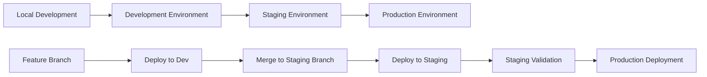

# Environment Specifications

## Overview
This document provides comprehensive specifications for all Distro Nation environments, including development, staging, and production configurations. It serves as the authoritative reference for environment-specific configurations, resource allocations, and deployment procedures across the hybrid AWS-Firebase architecture.

## Executive Summary

### Environment Architecture
- **Production (main)**: Live production environment serving end users
- **Staging**: Pre-production environment for final testing and validation  
- **Development (dev)**: Development environment for feature development and testing
- **Local**: Developer local environments for initial development

### Environment Distribution
```yaml
Production Environment:
  AWS Account: 867653852961
  Primary Region: us-east-1
  Users: Live traffic 
  Availability: 99.9% target SLA
  
Staging Environment:
  AWS Account: Same (isolated by naming/tagging)
  Primary Region: us-east-1  
  Users: Internal testing team
  Availability: 95% target (best effort)
  
Development Environment:
  AWS Account: Same (isolated by naming/tagging)
  Primary Region: us-east-1
  Users: Development team only
  Availability: 90% target (best effort)
```

## 1. Environment Overview

### 1.1 Environment Purpose and Usage

#### Production Environment (main)
```yaml
Purpose: Live production services for end users
Primary Users: 
  - End users (artists, content creators)
  - External API consumers
  - Production support team
  
Key Characteristics:
  - High availability and performance requirements
  - Strict change control and approval processes
  - Comprehensive monitoring and alerting
  - Automated backup and disaster recovery
  - Production-grade security controls
  
Business Hours: 24/7 operation
Maintenance Windows: Sunday 2-4 AM EST (planned maintenance)
```

#### Staging Environment
```yaml
Purpose: Pre-production testing and validation
Primary Users:
  - QA testing team
  - Product managers
  - Development team (integration testing)
  - Stakeholders (demo and review)
  
Key Characteristics:
  - Production-like configuration with reduced scale
  - Automated testing integration
  - Safe environment for breaking changes
  - Integration with external APIs (test endpoints)
  - Performance testing capabilities
  
Business Hours: 8 AM - 8 PM EST
Maintenance Windows: Flexible, as needed
```

#### Development Environment (dev)
```yaml
Purpose: Feature development and unit testing
Primary Users:
  - Development team
  - Individual developers
  - Automated CI/CD pipelines
  
Key Characteristics:
  - Rapid iteration and deployment
  - Relaxed security controls for development speed
  - Mock services and test data
  - Development tools and debugging enabled
  - Cost-optimized configuration
  
Business Hours: 8 AM - 10 PM EST
Maintenance Windows: Any time, with team notification
```

### 1.2 Environment Promotion Workflow



#### Promotion Criteria
| Environment | Promotion Trigger | Approval Required | Testing Requirements |
|-------------|------------------|-------------------|---------------------|
| **Local → Dev** | Code commit to feature branch | ❌ No | Unit tests pass |
| **Dev → Staging** | Merge to staging branch | ✅ Team lead approval | Integration tests pass |
| **Staging → Production** | Release approval | ✅ Product manager + Engineering lead | Full regression testing |

## 2. AWS Infrastructure Configuration

### 2.1 Compute Resources

#### Lambda Functions
```yaml
Production Configuration:
  Memory Allocation: 512MB - 1024MB (optimized per function)
  Timeout: 30 seconds (API functions), 15 minutes (background tasks)
  Concurrency: Reserved concurrency for critical functions
  Dead Letter Queues: Enabled for all async functions
  VPC Configuration: Private subnets for database access
  
Staging Configuration:
  Memory Allocation: 256MB - 512MB (cost optimized)
  Timeout: Same as production
  Concurrency: Shared concurrency pool
  Dead Letter Queues: Enabled
  VPC Configuration: Same network as production
  
Development Configuration:
  Memory Allocation: 128MB - 256MB (minimal cost)
  Timeout: Reduced timeouts for faster feedback
  Concurrency: No reserved concurrency
  Dead Letter Queues: Optional
  VPC Configuration: Simplified networking
```

#### EC2 Instances
```yaml
Production Instances:
  Primary Instance: i-0063537094eb961dd (t3.micro, running)
  Purpose: Shazampy-env service
  Auto Scaling: Manual scaling currently
  Monitoring: CloudWatch detailed monitoring
  Backup Strategy: Daily EBS snapshots
  
Staging Instances:
  Configuration: Smaller instance types (t2.micro)
  Purpose: Testing and validation services
  Auto Scaling: Not configured
  Monitoring: Basic CloudWatch monitoring
  
Development Instances:
  Configuration: Spot instances where possible
  Purpose: Development tools and services
  Auto Scaling: Not required
  Monitoring: Basic monitoring only
```

### 2.2 Database Configuration

#### Aurora PostgreSQL Cluster
```yaml
Production Database:
  Cluster: database-2-cluster
  Engine: Aurora PostgreSQL Serverless v1
  Min ACU: 2 (automatically scales)
  Max ACU: 16 (cost control)
  Backup Retention: 30 days
  Multi-AZ: Enabled
  Encryption: Enabled with AWS KMS
  
Staging Database:
  Cluster: [Staging cluster name - to be documented]
  Engine: Aurora PostgreSQL Serverless v1
  Min ACU: 0.5 (cost optimized)
  Max ACU: 4 (limited scale)
  Backup Retention: 7 days
  Multi-AZ: Disabled (cost savings)
  Encryption: Enabled
  
Development Database:
  Cluster: [Dev cluster name - to be documented]
  Engine: Aurora PostgreSQL Serverless v1
  Min ACU: 0.5 (cost optimized)
  Max ACU: 2 (limited scale)
  Backup Retention: 1 day
  Multi-AZ: Disabled
  Encryption: Enabled
```

#### Database Access Patterns
```yaml
Production Access:
  Direct Access: Prohibited (RDS Data API only)
  Connection Pooling: Built into Serverless
  Read Replicas: Automatic with Aurora Serverless
  Monitoring: Performance Insights enabled
  
Staging Access:
  Direct Access: Limited to senior developers
  Connection Pooling: RDS Data API preferred
  Read Replicas: Not configured
  Monitoring: Basic monitoring
  
Development Access:
  Direct Access: Allowed for development team
  Connection Pooling: RDS Data API or direct connections
  Read Replicas: Not required
  Monitoring: Basic monitoring
```

### 2.3 Storage Configuration

#### S3 Buckets by Environment
```yaml
Production S3 Buckets:
  Content Storage:
    - distrofmb1ec38f05cba40828e65a98e039c6de4db8f9-main
    - amplify-distrofm-main-[various suffixes]
  Configuration:
    - Versioning: Enabled
    - Encryption: AES-256 (SSE-S3)
    - Lifecycle Policies: Intelligent tiering
    - Cross-Region Replication: Enabled for critical data
    - Public Access: Blocked by default
    
Staging S3 Buckets:
  Content Storage:
    - [Staging bucket names - to be documented]
  Configuration:
    - Versioning: Enabled
    - Encryption: AES-256 (SSE-S3)
    - Lifecycle Policies: 30-day deletion after transition
    - Cross-Region Replication: Disabled
    - Public Access: Blocked by default
    
Development S3 Buckets:
  Content Storage:
    - [Dev bucket names - to be documented]
  Configuration:
    - Versioning: Optional
    - Encryption: AES-256 (SSE-S3)
    - Lifecycle Policies: 7-day deletion
    - Cross-Region Replication: Disabled
    - Public Access: Allowed for testing (controlled)
```

### 2.4 Network Configuration

#### VPC and Networking
```yaml
Production Network:
  VPC: [VPC ID - to be documented]
  Subnets:
    - Public Subnets: 2 AZs for load balancers
    - Private Subnets: 2 AZs for Lambda/RDS
  Security Groups:
    - Web tier: HTTP/HTTPS from internet
    - App tier: Internal communication only
    - Database tier: Database ports from app tier only
  NAT Gateways: 2 (one per AZ for high availability)
  
Staging Network:
  VPC: Shared with production (isolated by security groups)
  Subnets: Same subnet structure
  Security Groups: Staging-specific rules
  NAT Gateways: Shared with production
  
Development Network:
  VPC: Shared or separate (cost consideration)
  Subnets: Simplified structure
  Security Groups: More permissive for development
  NAT Gateways: Single NAT Gateway (cost savings)
```

#### DNS and Domain Management
```yaml
Production Domains:
  Primary: [Production domain - to be documented]
  Route53 Hosted Zone: Z0969604XDAUQX7C50JF
  SSL Certificates: AWS Certificate Manager
  CDN: CloudFront distributions (5 active)
  
Staging Domains:
  Primary: [Staging subdomain - to be documented]
  Route53: Same hosted zone with staging records
  SSL Certificates: Wildcard or staging-specific certs
  CDN: Shared CloudFront or staging-specific
  
Development Domains:
  Primary: [Dev subdomain - to be documented]
  Route53: Same hosted zone with dev records
  SSL Certificates: Development certificates
  CDN: Optional (direct access common)
```

## 3. Firebase Configuration

### 3.1 Firebase Projects by Environment

#### Production Firebase Project
```yaml
Project Configuration:
  Project ID: [Production project ID - to be documented]
  Project Name: Distro Nation Production
  Billing Account: [Production billing account]
  Region: us-central1 (Firebase default)
  
Authentication:
  Providers: Email/Password, Google OAuth
  Security Rules: Production-hardened rules
  Custom Claims: Role-based access control
  Session Duration: 24 hours
  
Realtime Database:
  Rules: Strict read/write permissions
  Indexing: Optimized for production queries
  Backup: Daily exports to Google Cloud Storage
  
Cloud Storage:
  Rules: User-based access control
  Retention: Long-term retention for user content
  CDN: Firebase CDN enabled
```

#### Staging Firebase Project
```yaml
Project Configuration:
  Project ID: [Staging project ID - to be documented]
  Project Name: Distro Nation Staging
  Billing Account: Same as production
  Region: us-central1
  
Authentication:
  Providers: Same as production
  Security Rules: Relaxed for testing
  Custom Claims: Mirror production structure
  Session Duration: 24 hours
  
Realtime Database:
  Rules: More permissive for testing
  Indexing: Similar to production
  Backup: Weekly exports
  
Cloud Storage:
  Rules: Relaxed for testing uploads
  Retention: 30-day cleanup policy
  CDN: Firebase CDN enabled
```

#### Development Firebase Project
```yaml
Project Configuration:
  Project ID: [Dev project ID - to be documented]
  Project Name: Distro Nation Development
  Billing Account: Development/testing account
  Region: us-central1
  
Authentication:
  Providers: Email/Password (simplified)
  Security Rules: Permissive for development
  Custom Claims: Basic role structure
  Session Duration: 7 days (development convenience)
  
Realtime Database:
  Rules: Open for development (secure sensitive data)
  Indexing: Minimal indexing
  Backup: Not configured (test data)
  
Cloud Storage:
  Rules: Permissive for testing
  Retention: 7-day cleanup policy
  CDN: Optional
```

### 3.2 Firebase Security Rules by Environment

#### Production Security Rules
```javascript
// Realtime Database Rules (Production)
{
  "rules": {
    "users": {
      "$uid": {
        ".read": "$uid === auth.uid",
        ".write": "$uid === auth.uid && auth.token.email_verified === true"
      }
    },
    "artists": {
      ".read": "auth != null",
      "$artistId": {
        ".write": "auth.uid == resource.data.ownerId || auth.token.admin === true"
      }
    },
    "public": {
      ".read": true,
      ".write": "auth != null && auth.token.admin === true"
    }
  }
}

// Storage Rules (Production)
rules_version = '2';
service firebase.storage {
  match /b/{bucket}/o {
    match /users/{userId}/{allPaths=**} {
      allow read, write: if request.auth != null && request.auth.uid == userId;
    }
    match /public/{allPaths=**} {
      allow read: if true;
      allow write: if request.auth != null && request.auth.token.admin == true;
    }
  }
}
```

#### Development Security Rules
```javascript
// Realtime Database Rules (Development)
{
  "rules": {
    ".read": "auth != null",
    ".write": "auth != null"
  }
}

// Storage Rules (Development)  
rules_version = '2';
service firebase.storage {
  match /b/{bucket}/o {
    match /{allPaths=**} {
      allow read, write: if request.auth != null;
    }
  }
}
```

## 4. API Gateway Configuration

### 4.1 API Gateway Environments

#### Production API Configuration
```yaml
dn-api (Production):
  API ID: cjed05n28l.execute-api.us-east-1.amazonaws.com
  Stage: staging (note: naming inconsistency)
  Throttling:
    Burst Limit: 5000 requests
    Rate Limit: 10000 requests/second
  Logging: CloudWatch logs enabled
  Caching: Enabled for GET requests (300 second TTL)
  
distronationfmGeneralAccess (Production):
  API ID: hmuujzief2.execute-api.us-east-1.amazonaws.com
  Stage: main
  Authentication: AWS IAM required
  Throttling:
    Burst Limit: 5000 requests  
    Rate Limit: 10000 requests/second
  Logging: CloudWatch logs enabled
```

#### Staging API Configuration
```yaml
API Configuration:
  Stages: staging (separate stage deployment)
  Throttling: Reduced limits (1000 burst, 2000/second)
  Logging: Enhanced logging for debugging
  Caching: Disabled or short TTL (60 seconds)
  Authentication: Same as production
  
Testing Features:
  - Request/Response logging enabled
  - X-Ray tracing enabled
  - Mock integrations for external APIs
```

#### Development API Configuration
```yaml
API Configuration:
  Stages: dev (separate stage deployment)
  Throttling: Minimal limits (100 burst, 200/second)
  Logging: Full request/response logging
  Caching: Disabled
  Authentication: Relaxed for development
  
Development Features:
  - API Gateway console testing enabled
  - CORS configured for local development
  - Mock responses for rapid development
```

### 4.2 AppSync GraphQL API Configuration

#### Production AppSync APIs
```yaml
distrofmgraphql-main:
  API ID: jjxoyzwu4naxzpelrk6ncmoasi
  Authentication: AWS IAM
  Schema: Production data model
  Resolvers: Optimized for performance
  Caching: Enabled (TTL varies by resolver)
  Logging: Error logging only
  
Video Management APIs:
  - dnbackendfunctionnew-dev: bqgx7vc6ubf57pg2qewyx5ti2u
  - dnbackendfunctions-dev: yajg2ikl3bgf3gzpw5cg5r6ql4
  Note: Despite "dev" naming, these may serve production traffic
```

#### Development AppSync Configuration
```yaml
Schema Management:
  - Separate development schemas for testing
  - Schema versioning and migration testing
  - Local schema development with Amplify CLI
  
Testing Features:
  - GraphQL playground enabled
  - Detailed resolver logging
  - Performance tracing enabled
```

## 5. Environment-Specific Configuration Management

### 5.1 Environment Variables and Secrets

#### Configuration Hierarchy
```yaml
Configuration Precedence (highest to lowest):
  1. Runtime environment variables
  2. AWS Secrets Manager values
  3. AWS Systems Manager Parameter Store
  4. Default configuration values
  
Environment Variable Naming Convention:
  Production: PROD_[SERVICE]_[SETTING]
  Staging: STAGING_[SERVICE]_[SETTING]  
  Development: DEV_[SERVICE]_[SETTING]
```

#### Secrets Management Strategy
```yaml
AWS Secrets Manager:
  Production Secrets:
    - prod/distronation/database-credentials
    - prod/distronation/youtube-api-keys
    - prod/distronation/spotify-credentials
    - prod/distronation/firebase-admin-key
    
  Staging Secrets:
    - staging/distronation/database-credentials
    - staging/distronation/youtube-api-keys-test
    - staging/distronation/spotify-credentials-test
    
  Development Secrets:
    - dev/distronation/database-credentials
    - dev/distronation/mock-api-keys
    - dev/distronation/test-credentials
```

#### External API Configuration
```yaml
Production APIs:
  YouTube Data API:
    Base URL: https://www.googleapis.com/youtube/v3
    Quota: 10,000 units/day
    Authentication: OAuth 2.0 + API Key
    
  Spotify Web API:
    Base URL: https://api.spotify.com/v1
    Rate Limit: 100 requests/second
    Authentication: Client Credentials
    
Staging APIs:
  Configuration: Test/sandbox endpoints where available
  Quota: Reduced quotas for cost control
  Authentication: Test credentials
  
Development APIs:
  Configuration: Mock services or shared test endpoints
  Quota: Minimal quotas
  Authentication: Mock credentials or shared test keys
```

### 5.2 Feature Flag Management

#### Feature Flag Strategy
```yaml
Implementation: Environment-based feature flags
Storage: AWS Systems Manager Parameter Store
Naming Convention: /[environment]/features/[feature-name]

Production Flags:
  /prod/features/new-upload-flow: false
  /prod/features/enhanced-analytics: true
  /prod/features/beta-api-endpoints: false
  
Staging Flags:
  /staging/features/new-upload-flow: true
  /staging/features/enhanced-analytics: true
  /staging/features/beta-api-endpoints: true
  
Development Flags:
  /dev/features/new-upload-flow: true
  /dev/features/enhanced-analytics: true
  /dev/features/experimental-features: true
```

## 6. Monitoring and Observability

### 6.1 Environment-Specific Monitoring

#### Production Monitoring
```yaml
CloudWatch Metrics:
  - Lambda function metrics (duration, errors, throttles)
  - API Gateway metrics (latency, 4xx/5xx errors)
  - RDS metrics (CPU, connections, read/write latency)
  - Custom business metrics
  
Alarms and Notifications:
  - Error rate > 1%: Immediate alert
  - Response time > 3 seconds: Warning alert
  - Database connections > 80%: Warning alert
  - Lambda throttling: Immediate alert
  
Log Retention:
  - Application logs: 30 days
  - Access logs: 90 days
  - Audit logs: 1 year
```

#### Staging/Development Monitoring
```yaml
CloudWatch Metrics:
  - Essential metrics only (cost optimization)
  - Performance testing metrics during load tests
  - Development debugging metrics
  
Alarms and Notifications:
  - Critical errors only
  - Resource utilization warnings
  - Cost threshold alerts
  
Log Retention:
  - Application logs: 7 days
  - Access logs: 30 days
  - Debug logs: 3 days
```

### 6.2 Performance Baselines

#### Production Performance Targets
| Metric | Target | Measurement | Alert Threshold |
|--------|--------|-------------|-----------------|
| **API Response Time** | < 500ms (95th percentile) | CloudWatch | > 1000ms |
| **Database Query Time** | < 100ms (average) | RDS Performance Insights | > 500ms |
| **Lambda Cold Start** | < 2 seconds | CloudWatch | > 5 seconds |
| **Error Rate** | < 0.5% | CloudWatch | > 1% |
| **Availability** | > 99.9% | Uptime monitoring | < 99.5% |

## 7. Cost Management

### 7.1 Cost Allocation by Environment

#### Production Costs (Estimated Monthly)
```yaml
AWS Services:
  Lambda Functions: $200-400
  Aurora PostgreSQL: $150-300
  S3 Storage: $50-150
  API Gateway: $50-100
  CloudFront: $20-50
  Other Services: $30-100
  Total AWS: $500-1,100
  
Firebase Services:
  Authentication: $20-50
  Realtime Database: $30-100
  Cloud Storage: $10-30
  Cloud Functions: $10-50
  Total Firebase: $70-230
  
Total Production: $570-1,330/month
```

#### Staging Costs (Estimated Monthly)
```yaml
AWS Services: $150-300 (30-40% of production)
Firebase Services: $20-50 (25-30% of production)
Total Staging: $170-350/month
```

#### Development Costs (Estimated Monthly)
```yaml
AWS Services: $50-150 (10-20% of production)
Firebase Services: $10-30 (15-20% of production)
Total Development: $60-180/month
```

### 7.2 Cost Optimization Strategies

#### Production Optimizations
- **Reserved Capacity**: Consider reserved concurrency for predictable Lambda workloads
- **Aurora Serverless**: Optimize min/max ACU based on actual usage patterns
- **S3 Intelligent Tiering**: Automatic cost optimization for infrequently accessed data
- **CloudFront**: Optimize cache behaviors and geographic distribution

#### Non-Production Optimizations
- **Spot Instances**: Use spot instances for non-critical workloads
- **Scheduled Scaling**: Shut down non-production resources during off-hours
- **Data Lifecycle**: Aggressive cleanup policies for temporary data
- **Resource Sharing**: Share non-production resources where possible

## 8. Security Configuration

### 8.1 Environment-Specific Security Controls

#### Production Security
```yaml
Access Controls:
  - MFA required for all human access
  - Service accounts with least privilege
  - No direct database access
  - VPC endpoints for AWS service access
  
Network Security:
  - Private subnets for all compute resources
  - WAF rules for public endpoints
  - Security groups with minimal required access
  - Network ACLs for additional protection
  
Data Protection:
  - Encryption at rest for all data stores
  - TLS 1.2+ for all data in transit
  - Regular security scanning
  - Audit logging for all access
```

#### Development Security
```yaml
Access Controls:
  - Relaxed access for development productivity
  - Shared development accounts (where appropriate)
  - Direct database access for debugging
  - Simplified authentication for testing
  
Network Security:
  - Simplified network configuration
  - More permissive security groups
  - Optional VPC endpoints
  - Basic network protection
  
Data Protection:
  - Encryption enabled but not enforced
  - Test data only (no production data)
  - Regular cleanup of sensitive test data
  - Basic audit logging
```

## 9. Environment Maintenance

### 9.1 Maintenance Schedules

#### Production Maintenance
```yaml
Scheduled Maintenance:
  Window: Sunday 2:00-4:00 AM EST
  Frequency: Monthly (first Sunday)
  Activities:
    - Security patch deployment
    - Configuration updates
    - Performance optimization
    - Database maintenance
  
Emergency Maintenance:
  Authorization: Engineering lead + On-call approval
  Notification: 1 hour advance notice (minimum)
  Rollback Plan: Required for all changes
```

#### Non-Production Maintenance
```yaml
Staging Maintenance:
  Window: Any time with team notification
  Frequency: Weekly or as needed
  Activities: Testing new deployments and configurations
  
Development Maintenance:
  Window: Any time
  Frequency: Daily or as needed
  Activities: Rapid iteration and testing
```

### 9.2 Environment Refresh Procedures

#### Data Refresh Strategy
```yaml
Staging Data Refresh:
  Source: Production database (sanitized)
  Frequency: Weekly
  Sanitization: PII removal/masking
  Process: Automated with manual validation
  
Development Data Refresh:
  Source: Synthetic test data
  Frequency: Daily or on-demand
  Content: Realistic but fake data
  Process: Fully automated
```

## 10. Disaster Recovery

### 10.1 Environment-Specific DR Procedures

#### Production Disaster Recovery
```yaml
RTO (Recovery Time Objective): 4 hours
RPO (Recovery Point Objective): 1 hour
Backup Strategy:
  - Aurora: Automated backups (30 days)
  - S3: Cross-region replication
  - Lambda: Infrastructure as Code redeployment
  - Configuration: Parameter Store backup
  
Failover Procedures:
  1. Assess impact and activate DR team
  2. Restore database from latest backup
  3. Redeploy Lambda functions and API Gateway
  4. Update DNS records for traffic routing
  5. Validate all services and integrations
```

#### Non-Production Recovery
```yaml
RTO: 8-24 hours (best effort)
RPO: 24 hours
Strategy: Rebuild from Infrastructure as Code
Process: Simplified recovery process focused on getting environments operational
```

## 11. Environment Migration Strategy

### 11.1 Empire Integration Recommendations

#### Short-term Actions (Month 1)
1. **Environment Audit**: Complete inventory of all environment-specific configurations
2. **Documentation Update**: Document all missing environment details identified in this document
3. **Access Management**: Ensure Empire team has appropriate access to all environments
4. **Monitoring Integration**: Integrate Empire monitoring tools with existing environment monitoring

#### Medium-term Actions (Months 2-6)
1. **Standardization**: Align environment configurations with Empire standards
2. **Cost Optimization**: Implement Empire cost management practices
3. **Security Hardening**: Apply Empire security policies across all environments
4. **Tool Integration**: Integrate with Empire deployment and monitoring tools

#### Long-term Strategy (Months 6-12)
1. **Platform Consolidation**: Evaluate consolidating to single cloud provider
2. **Multi-region Deployment**: Implement geographic redundancy
3. **Advanced Automation**: Implement Empire's advanced deployment automation
4. **Performance Optimization**: Optimize environments for Empire's scale requirements

### 11.2 Risk Mitigation

#### Environment Dependencies
- **Cross-environment Communication**: Document and minimize dependencies
- **Data Consistency**: Ensure data synchronization between environments
- **Service Dependencies**: Map all inter-service dependencies
- **External Integrations**: Validate external service configurations per environment

#### Migration Risks
- **Configuration Drift**: Regular configuration validation and correction
- **Data Loss**: Comprehensive backup and validation procedures
- **Service Disruption**: Gradual migration with rollback capabilities
- **Cost Overruns**: Careful cost monitoring during migration

## Related Documents
- [CI/CD Pipeline Documentation](./ci-cd.md)
- [Rollback Procedures](./rollback.md)
- [Configuration Management](./configuration.md)
- [Security Policies](../security/security-policies.md)
- [Architecture Documentation](../architecture/unified-architecture.md)

---

**Document Version**: 1.0  
**Last Updated**: July 24, 2025  
**Next Review**: October 24, 2025  
**Owner**: Adrian Green, Head of Engineering  
**Approved By**: [Pending Empire Distribution Engineering Team Review]

*This document contains sensitive infrastructure information. Distribution is restricted to authorized personnel with appropriate access levels.*
