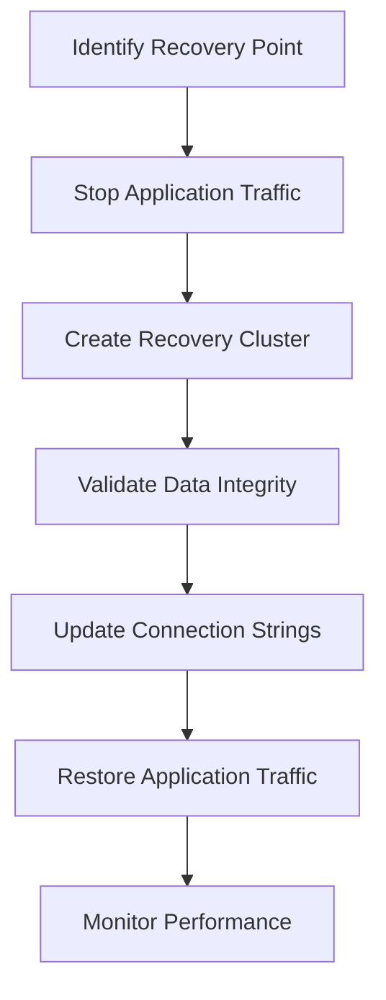

# Database Backup and Recovery Procedures

## Overview
This document provides comprehensive procedures for backing up and recovering Aurora PostgreSQL and DocumentDB databases in Distro Nation's infrastructure. These procedures ensure data protection and enable rapid recovery in disaster scenarios.

## Executive Summary

### Backup Coverage
- **Aurora PostgreSQL**: Automated point-in-time recovery with 7-day retention
- **DocumentDB**: Automated daily backups with cross-region replication
- **Recovery Time Objective (RTO)**: 30-60 minutes for database restoration
- **Recovery Point Objective (RPO)**: Maximum 5 minutes data loss

### Current Backup Status
```yaml
Aurora PostgreSQL (database-2-instance-1):
  Backup Retention: 7 days
  Point-in-Time Recovery: Enabled
  Backup Window: 04:00-05:00 UTC
  Cross-Region Backup: Not configured
  
DocumentDB:
  Backup Storage: 1,630 GB (current)
  Retention Period: 30 days (estimated)
  Backup Window: 03:00-04:00 UTC
  Cross-Region Backup: Not configured
```

## 1. Aurora PostgreSQL Backup Procedures

### 1.1 Automated Backup Configuration

#### Current Backup Settings
```yaml
Database Identifier: database-2-instance-1
Engine: aurora-postgresql (serverless v2)
Backup Configuration:
  Automated Backups: Enabled
  Backup Retention: 7 days
  Backup Window: 04:00-05:00 UTC
  Point-in-Time Recovery: Enabled
  Continuous Backup: 5-minute intervals
```

#### Backup Enhancement Recommendations
```bash
# Extend backup retention for compliance
aws rds modify-db-cluster \
  --db-cluster-identifier database-2 \
  --backup-retention-period 30 \
  --preferred-backup-window "03:00-04:00" \
  --apply-immediately

# Enable cross-region automated backups
aws rds put-backup-vault-policy \
  --backup-vault-name default \
  --policy '{
    "Version": "2012-10-17",
    "Statement": [
      {
        "Effect": "Allow",
        "Principal": {
          "Service": "backup.amazonaws.com"
        },
        "Action": "backup:CopyFromBackupVault",
        "Resource": "*"
      }
    ]
  }'
```

### 1.2 Manual Backup Procedures

#### Creating Manual Snapshots
```bash
# Create manual cluster snapshot
TIMESTAMP=$(date +%Y%m%d-%H%M%S)
aws rds create-db-cluster-snapshot \
  --db-cluster-identifier database-2 \
  --db-cluster-snapshot-identifier "manual-backup-${TIMESTAMP}" \
  --tags Key=Purpose,Value=Manual-Backup \
         Key=CreatedBy,Value=DisasterRecovery \
         Key=Environment,Value=Production

# Verify snapshot creation
aws rds describe-db-cluster-snapshots \
  --db-cluster-snapshot-identifier "manual-backup-${TIMESTAMP}" \
  --query 'DBClusterSnapshots[0].{Status:Status,Progress:PercentProgress,Created:SnapshotCreateTime}'
```

#### Pre-Maintenance Backup Script
```bash
#!/bin/bash
# pre-maintenance-backup.sh
# Usage: ./pre-maintenance-backup.sh [maintenance-description]

MAINTENANCE_DESC=${1:-"scheduled-maintenance"}
TIMESTAMP=$(date +%Y%m%d-%H%M%S)
SNAPSHOT_ID="pre-maintenance-${MAINTENANCE_DESC}-${TIMESTAMP}"

echo "Creating pre-maintenance backup: ${SNAPSHOT_ID}"

# Create cluster snapshot
aws rds create-db-cluster-snapshot \
  --db-cluster-identifier database-2 \
  --db-cluster-snapshot-identifier "${SNAPSHOT_ID}" \
  --tags Key=Purpose,Value=Pre-Maintenance \
         Key=MaintenanceType,Value="${MAINTENANCE_DESC}" \
         Key=CreatedBy,Value=Operations \
         Key=Environment,Value=Production

# Wait for completion
aws rds wait db-cluster-snapshot-completed \
  --db-cluster-snapshot-identifier "${SNAPSHOT_ID}"

if [ $? -eq 0 ]; then
  echo "Backup completed successfully: ${SNAPSHOT_ID}"
  echo "Backup available for recovery for 30+ days"
else
  echo "ERROR: Backup failed!"
  exit 1
fi
```

### 1.3 Point-in-Time Recovery Procedures

#### Recovery Process Overview


#### Step-by-Step Recovery Process

**Step 1: Determine Recovery Point**
```bash
# List available recovery time range
aws rds describe-db-clusters \
  --db-cluster-identifier database-2 \
  --query 'DBClusters[0].{EarliestRestorableTime:EarliestRestorableTime,LatestRestorableTime:LatestRestorableTime}'

# Example output:
# {
#   "EarliestRestorableTime": "2025-07-18T04:15:22.000Z",
#   "LatestRestorableTime": "2025-07-25T14:30:00.000Z"
# }
```

**Step 2: Create Recovery Cluster**
```bash
# Restore cluster to specific point in time
RECOVERY_TIME="2025-07-25T14:00:00.000Z"  # Adjust as needed
RECOVERY_CLUSTER_ID="database-2-recovery-$(date +%Y%m%d-%H%M%S)"

aws rds restore-db-cluster-to-point-in-time \
  --db-cluster-identifier "${RECOVERY_CLUSTER_ID}" \
  --source-db-cluster-identifier database-2 \
  --restore-to-time "${RECOVERY_TIME}" \
  --engine aurora-postgresql \
  --engine-mode serverless \
  --serverless-v2-scaling-configuration MinCapacity=0.5,MaxCapacity=16 \
  --tags Key=Purpose,Value=DisasterRecovery \
         Key=RecoveryTime,Value="${RECOVERY_TIME}" \
         Key=CreatedBy,Value=Operations

# Create cluster instance
aws rds create-db-instance \
  --db-instance-identifier "${RECOVERY_CLUSTER_ID}-instance-1" \
  --db-cluster-identifier "${RECOVERY_CLUSTER_ID}" \
  --db-instance-class db.serverless \
  --engine aurora-postgresql
```

**Step 3: Validate Recovery**
```bash
# Wait for cluster to be available
aws rds wait db-cluster-available \
  --db-cluster-identifier "${RECOVERY_CLUSTER_ID}"

# Get connection endpoint
RECOVERY_ENDPOINT=$(aws rds describe-db-clusters \
  --db-cluster-identifier "${RECOVERY_CLUSTER_ID}" \
  --query 'DBClusters[0].Endpoint' \
  --output text)

echo "Recovery cluster available at: ${RECOVERY_ENDPOINT}"
```

**Step 4: Data Integrity Validation**
```sql
-- Connect to recovery cluster and validate
-- Replace with actual connection details
\c postgresql://username:password@${RECOVERY_ENDPOINT}:5432/dbname

-- Check table counts
SELECT 
  schemaname,
  tablename,
  n_tup_ins - n_tup_del as row_count
FROM pg_stat_user_tables
ORDER BY schemaname, tablename;

-- Validate critical business data
SELECT COUNT(*) as user_count FROM users;
SELECT COUNT(*) as payout_count FROM payouts WHERE created_at > NOW() - INTERVAL '7 days';
SELECT MAX(created_at) as latest_record FROM audit_log;

-- Check data consistency
SELECT 
  constraint_name,
  table_name,
  constraint_type
FROM information_schema.table_constraints 
WHERE constraint_type = 'FOREIGN KEY' 
  AND constraint_schema = 'public';
```

### 1.4 Disaster Recovery Scenarios

#### Scenario 1: Database Corruption
```yaml
Situation: Data corruption detected in production database
Recovery Steps:
  1. Immediately stop all write operations to database
  2. Identify last known good point-in-time (before corruption)
  3. Create recovery cluster from point-in-time
  4. Validate data integrity in recovery cluster
  5. Update application to use recovery cluster
  6. Monitor application performance and data consistency
  
Estimated Recovery Time: 45-60 minutes
Data Loss: 5-30 minutes depending on detection time
```

#### Scenario 2: Complete Database Failure
```yaml
Situation: Aurora cluster completely unavailable
Recovery Steps:
  1. Attempt cluster restart and failover
  2. If restart fails, create new cluster from latest automated backup
  3. Restore from most recent snapshot if point-in-time fails
  4. Validate cluster health and performance
  5. Update DNS/connection strings
  6. Restore application services
  
Estimated Recovery Time: 30-45 minutes
Data Loss: Maximum 5 minutes (continuous backup)
```

#### Scenario 3: Region-Wide Failure
```yaml
Situation: AWS us-east-1 region unavailable
Current Limitation: No cross-region backups configured
Recovery Steps:
  1. Activate manual cross-region backup restoration
  2. Create new cluster in us-west-2 from latest manual backup
  3. Update application configuration for new region
  4. Redirect traffic to new region
  5. Monitor performance and adjust scaling
  
Estimated Recovery Time: 2-4 hours
Data Loss: Up to 24 hours (depends on manual backup frequency)
Recommendation: Implement automated cross-region backup
```

## 2. DocumentDB Backup Procedures

### 2.1 Current DocumentDB Backup Analysis

#### Backup Storage Assessment
```yaml
Current Backup Usage: 1,630 GB
Estimated Database Size: 500-800 GB
Backup-to-Database Ratio: 2-3x (indicating multiple snapshots)
Monthly Backup Cost: $34.25
Retention Estimate: 30+ days
```

#### Backup Optimization Recommendations
```bash
# Review current backup retention
aws docdb describe-db-clusters \
  --query 'DBClusters[*].{ClusterId:DBClusterIdentifier,BackupRetention:BackupRetentionPeriod,PreferredBackupWindow:PreferredBackupWindow}'

# Optimize backup retention (example - adjust based on compliance needs)
aws docdb modify-db-cluster \
  --db-cluster-identifier your-docdb-cluster \
  --backup-retention-period 14 \
  --preferred-backup-window "02:00-03:00" \
  --apply-immediately
```

### 2.2 DocumentDB Recovery Procedures

#### Point-in-Time Recovery
```bash
# Create new cluster from point-in-time
RECOVERY_TIME="2025-07-25T14:00:00.000Z"
DOCDB_RECOVERY_ID="docdb-recovery-$(date +%Y%m%d-%H%M%S)"

aws docdb restore-db-cluster-to-point-in-time \
  --db-cluster-identifier "${DOCDB_RECOVERY_ID}" \
  --source-db-cluster-identifier your-source-cluster \
  --restore-to-time "${RECOVERY_TIME}" \
  --tags Key=Purpose,Value=DisasterRecovery \
         Key=RecoveryTime,Value="${RECOVERY_TIME}"

# Create instances in the recovered cluster
aws docdb create-db-instance \
  --db-instance-identifier "${DOCDB_RECOVERY_ID}-instance-1" \
  --db-cluster-identifier "${DOCDB_RECOVERY_ID}" \
  --db-instance-class db.t3.medium \
  --engine docdb
```

#### Data Validation for DocumentDB
```javascript
// Connect to DocumentDB recovery cluster and validate
// Example validation queries for DocumentDB

// Check collection counts
db.runCommand({listCollections: 1}).cursor.firstBatch.forEach(
  function(collection) {
    print(collection.name + ": " + db[collection.name].count());
  }
);

// Validate recent data
db.users.find().sort({createdAt: -1}).limit(10);
db.payouts.find({createdAt: {$gte: new Date(Date.now() - 7*24*60*60*1000)}}).count();

// Check indexes
db.users.getIndexes();
db.payouts.getIndexes();
```

## 3. Backup Monitoring and Alerting

### 3.1 CloudWatch Metrics and Alarms

#### Aurora Backup Monitoring
```bash
# Create CloudWatch alarm for backup failures
aws cloudwatch put-metric-alarm \
  --alarm-name "Aurora-Backup-Failure" \
  --alarm-description "Alert when Aurora backup fails" \
  --metric-name "DatabaseConnections" \
  --namespace "AWS/RDS" \
  --statistic "Average" \
  --period 300 \
  --threshold 0 \
  --comparison-operator "LessThanThreshold" \
  --evaluation-periods 2 \
  --alarm-actions "arn:aws:sns:us-east-1:867653852961:backup-alerts"

# Monitor backup storage growth
aws cloudwatch put-metric-alarm \
  --alarm-name "Backup-Storage-Growth" \
  --alarm-description "Alert when backup storage grows unexpectedly" \
  --metric-name "TotalBackupStorageBilled" \
  --namespace "AWS/RDS" \
  --statistic "Average" \
  --period 86400 \
  --threshold 2000 \
  --comparison-operator "GreaterThanThreshold" \
  --evaluation-periods 1 \
  --alarm-actions "arn:aws:sns:us-east-1:867653852961:backup-alerts"
```

### 3.2 Automated Backup Testing

#### Weekly Backup Validation Script
```bash
#!/bin/bash
# weekly-backup-test.sh
# Automated backup validation and testing

LOG_FILE="/var/log/backup-validation-$(date +%Y%m%d).log"
NOTIFICATION_TOPIC="arn:aws:sns:us-east-1:867653852961:backup-alerts"

echo "Starting weekly backup validation - $(date)" >> $LOG_FILE

# Test Aurora point-in-time recovery capability
RECOVERY_TIME=$(date -d '1 hour ago' -u +%Y-%m-%dT%H:%M:%S.000Z)
TEST_CLUSTER_ID="backup-test-$(date +%Y%m%d-%H%M%S)"

echo "Testing recovery to: $RECOVERY_TIME" >> $LOG_FILE

# Create test recovery cluster
aws rds restore-db-cluster-to-point-in-time \
  --db-cluster-identifier "$TEST_CLUSTER_ID" \
  --source-db-cluster-identifier database-2 \
  --restore-to-time "$RECOVERY_TIME" \
  --engine aurora-postgresql \
  --engine-mode serverless \
  --serverless-v2-scaling-configuration MinCapacity=0.5,MaxCapacity=1 \
  --tags Key=Purpose,Value=BackupTest \
         Key=AutoDelete,Value=24hours

if [ $? -eq 0 ]; then
  echo "SUCCESS: Backup test cluster created" >> $LOG_FILE
  
  # Wait for cluster to be available
  aws rds wait db-cluster-available --db-cluster-identifier "$TEST_CLUSTER_ID"
  
  # Cleanup test cluster
  aws rds delete-db-cluster \
    --db-cluster-identifier "$TEST_CLUSTER_ID" \
    --skip-final-snapshot
    
  echo "SUCCESS: Backup validation completed successfully" >> $LOG_FILE
  
  # Send success notification
  aws sns publish \
    --topic-arn "$NOTIFICATION_TOPIC" \
    --message "Weekly backup validation PASSED for $(date +%Y-%m-%d)" \
    --subject "Backup Validation Success"
else
  echo "ERROR: Backup validation failed" >> $LOG_FILE
  
  # Send failure notification
  aws sns publish \
    --topic-arn "$NOTIFICATION_TOPIC" \
    --message "Weekly backup validation FAILED for $(date +%Y-%m-%d). Check logs at $LOG_FILE" \
    --subject "ALERT: Backup Validation Failure"
fi
```

## 4. Cross-Region Backup Strategy

### 4.1 Implementation Plan

#### Phase 1: Manual Cross-Region Backups
```bash
# Create cross-region snapshot copy
SOURCE_SNAPSHOT="manual-backup-20250725-140000"
TARGET_REGION="us-west-2"

aws rds copy-db-cluster-snapshot \
  --source-db-cluster-snapshot-identifier "arn:aws:rds:us-east-1:867653852961:cluster-snapshot:$SOURCE_SNAPSHOT" \
  --target-db-cluster-snapshot-identifier "$SOURCE_SNAPSHOT-west-2" \
  --source-region us-east-1 \
  --region $TARGET_REGION \
  --tags Key=Purpose,Value=CrossRegionBackup \
         Key=SourceRegion,Value=us-east-1
```

#### Phase 2: Automated Cross-Region Replication
```yaml
Implementation Plan:
  Week 1: Set up AWS Backup service for Aurora
  Week 2: Configure cross-region backup vault in us-west-2
  Week 3: Implement automated daily cross-region backups
  Week 4: Test cross-region recovery procedures
  
Cost Impact: +$20-30/month for cross-region storage
Recovery Benefit: Reduces region failure RTO from 4+ hours to 1-2 hours
```

## 5. Recovery Time Optimization

### 5.1 Fast Recovery Procedures

#### Parallel Recovery Strategy
```bash
#!/bin/bash
# parallel-recovery.sh
# Optimized recovery with parallel operations

RECOVERY_TIME="$1"
if [ -z "$RECOVERY_TIME" ]; then
  echo "Usage: $0 <recovery-time-iso8601>"
  exit 1
fi

# Start recovery cluster creation in background
echo "Starting Aurora recovery..."
(
  aws rds restore-db-cluster-to-point-in-time \
    --db-cluster-identifier "emergency-recovery-$(date +%Y%m%d-%H%M%S)" \
    --source-db-cluster-identifier database-2 \
    --restore-to-time "$RECOVERY_TIME" \
    --engine aurora-postgresql \
    --engine-mode serverless \
    --serverless-v2-scaling-configuration MinCapacity=2,MaxCapacity=8
) &
AURORA_PID=$!

# Prepare application configuration in parallel
echo "Preparing application configuration..."
(
  # Update Lambda environment variables
  # Update API Gateway configurations
  # Prepare DNS updates
  echo "Application configuration prepared"
) &
CONFIG_PID=$!

# Wait for both operations
wait $AURORA_PID
wait $CONFIG_PID

echo "Recovery operations completed"
```

### 5.2 Recovery Validation Checklist

#### Database Recovery Validation
```yaml
Critical Validation Steps:
  □ Cluster status: Available
  □ Instance status: Available  
  □ Connection test: Successful
  □ Table counts match baseline
  □ Foreign key constraints valid
  □ Recent transaction log review
  □ Performance metrics within normal range
  □ Backup jobs resuming normally
  
Business Validation:
  □ User authentication working
  □ Payment processing functional
  □ API endpoints responding
  □ Data consistency checks passed
  □ External integrations connected
```

## 6. Documentation and Training

### 6.1 Recovery Runbooks

#### Quick Reference Cards
```yaml
Emergency Contacts:
  Primary DBA: Adrian Green (Head of Engineering)
  AWS Support: Enterprise Support Case
  Empire Distribution: [Emergency escalation contact]
  
Critical Information:
  Aurora Cluster: database-2
  Region: us-east-1
  Account: 867653852961
  Backup Retention: 7 days (expandable to 35 days)
  Point-in-Time Recovery: 5-minute granularity
```

### 6.2 Regular Training Schedule

#### Team Training Plan
```yaml
Monthly: Database recovery drill simulation
Quarterly: Cross-region failover testing
Semi-annually: Complete disaster recovery exercise
Annually: Recovery procedure documentation review
```

## Next Steps

### Immediate Actions (Week 1)
1. ✅ Document current backup procedures and capabilities
2. ⏳ Implement backup monitoring and alerting
3. ⏳ Create manual backup testing scripts
4. ⏳ Establish recovery validation procedures

### Short-term Goals (Month 1)
1. ⏳ Implement automated cross-region backups
2. ⏳ Optimize DocumentDB backup retention
3. ⏳ Create emergency recovery runbooks
4. ⏳ Establish backup testing schedule

### Long-term Goals (Months 2-3)
1. ⏳ Implement automated recovery testing
2. ⏳ Create self-healing backup systems
3. ⏳ Integrate with Empire backup standards
4. ⏳ Establish comprehensive SLAs

---

**Document Version**: 1.0  
**Last Updated**: July 25, 2025  
**Next Review**: October 25, 2025  
**Owner**: Adrian Green, Head of Engineering  
**Status**: Phase 1 Implementation

*This document contains critical recovery procedures. Ensure all team members have access and are trained on these procedures.*