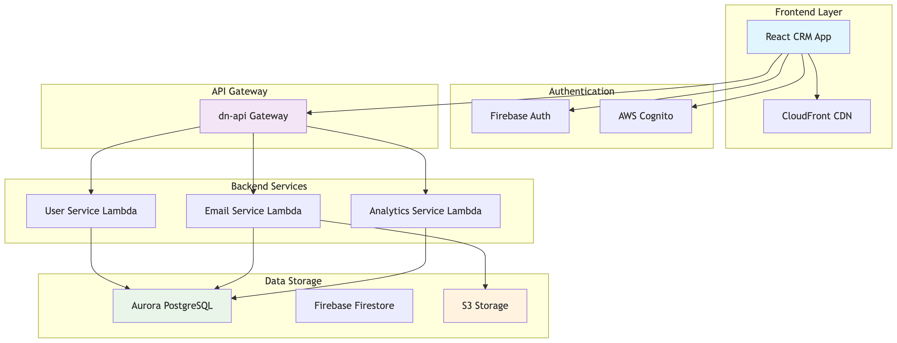
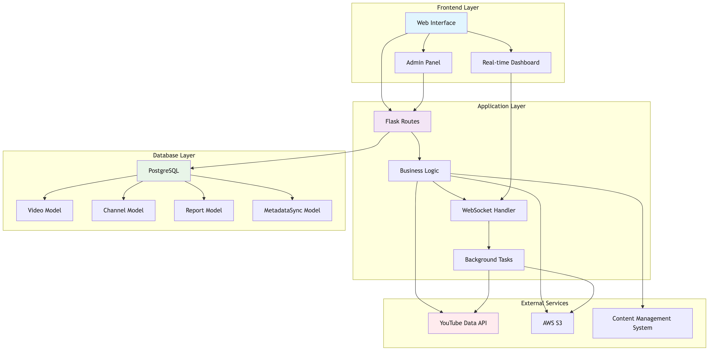

Empire Distribution Infrastructure Documentation
================================================

This repository contains comprehensive technical documentation of the Distro Nation Environment for Empire Distribution's acquisition due diligence and integration planning.

.. toctree::
   :maxdepth: 2
   :caption: Architecture & Design

   ../architecture/unified-architecture.md
   ../architecture/disaster-recovery.md
   ../architecture/backup-strategies.md

.. toctree::
   :maxdepth: 2
   :caption: API Documentation

   ../api/dn-api-specification.md

.. toctree::
   :maxdepth: 2
   :caption: Applications

   ../applications/crm/architecture-overview.md
   ../applications/crm/component-catalog.md
   ../applications/crm/api-integrations.md
   ../applications/crm/development-setup.md
   ../applications/crm/data-flow-patterns.md
   ../applications/youtube-cms/architecture-overview.md
   ../applications/youtube-cms/component-catalog.md
   ../applications/youtube-cms/api-integrations.md
   ../applications/youtube-cms/development-setup.md
   ../applications/youtube-cms/data-flow-patterns.md

.. toctree::
   :maxdepth: 2
   :caption: Deployment & Operations

   ../deployment/deployment-strategy.md
   ../deployment/environment-configuration.md
   ../deployment/ci-cd-pipeline.md
   ../monitoring/monitoring-strategy.md
   ../monitoring/alerting-configuration.md
   ../monitoring/performance-metrics.md

.. toctree::
   :maxdepth: 2
   :caption: Security & Compliance

   ../security/security-policies.md
   ../security/access-controls.md
   ../security/compliance-certifications.md
   ../security/vulnerability-management.md
   ../security/incident-response.md

.. toctree::
   :maxdepth: 2
   :caption: Networking & Infrastructure

   ../networking/network-topology.md
   ../networking/firewall-configuration.md
   ../networking/load-balancer-setup.md

.. toctree::
   :maxdepth: 2
   :caption: Operations & Maintenance

   ../runbooks/troubleshooting-guide.md
   ../runbooks/maintenance-procedures.md
   ../runbooks/emergency-procedures.md

.. toctree::
   :maxdepth: 2
   :caption: Planning & Roadmap

   ../technical-roadmap.md

Application Architecture Diagrams
=================================

CRM Application Architecture
----------------------------

.. image:: ../applications/crm/diagrams/crm-authentication-flow.png
   :alt: CRM Authentication Flow
   :width: 100%

.. image:: ../applications/crm/diagrams/crm-data-flow.png
   :alt: CRM Data Flow
   :width: 100%

.. image:: ../applications/crm/diagrams/crm-component-hierarchy.png
   :alt: CRM Component Hierarchy
   :width: 100%

.. image:: ../applications/crm/diagrams/crm-database-schema.png
   :alt: CRM Database Schema
   :width: 100%

YouTube CMS Tool Architecture
-----------------------------

.. image:: ../applications/youtube-cms/diagrams/youtube-cms-data-flow.png
   :alt: YouTube CMS Data Flow
   :width: 100%

.. image:: ../applications/youtube-cms/diagrams/youtube-cms-database-schema.png
   :alt: YouTube CMS Database Schema
   :width: 100%

.. image:: ../applications/youtube-cms/diagrams/youtube-cms-api-integration.png
   :alt: YouTube CMS API Integration
   :width: 100%

.. image:: ../applications/youtube-cms/diagrams/youtube-cms-component-structure.png
   :alt: YouTube CMS Component Structure
   :width: 100%

Quick Start
===========

Getting Started with the Documentation
---------------------------------------

This documentation is organized into several key areas:

* **Architecture & Design**: High-level system architecture and design patterns
* **API Documentation**: Comprehensive API specifications and integration guides
* **Applications**: Detailed documentation for CRM and YouTube CMS applications
* **Deployment & Operations**: Deployment strategies, monitoring, and operational procedures
* **Security & Compliance**: Security policies, access controls, and compliance information
* **Planning & Roadmap**: Technical roadmap and integration planning

Navigation Tips
---------------

* Use the sidebar navigation to browse sections
* Each application has its own complete documentation set
* Architecture diagrams are embedded throughout the documentation
* Search functionality is available in the top navigation

Contact Information
===================

For questions about this documentation or the systems it describes, please contact:

* **Technical Lead**: Adrian Green
* **Repository**: https://github.com/agreen757/empire-distribution-docs

Indices and tables
==================

* :ref:`genindex`
* :ref:`modindex`
* :ref:`search`