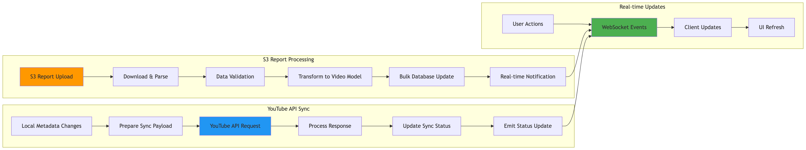

Distro Nation Infrastructure Documentation
================================================

This repository contains comprehensive technical documentation of the Distro Nation infrastructure environment and technical roadmap.

.. toctree::
   :maxdepth: 2
   :caption: Architecture & Design

   architecture/unified-architecture.md
   architecture/technical-summary.md
   architecture/aws-infrastructure-inventory.md
   architecture/firebase-architecture.md

.. toctree::
   :maxdepth: 2
   :caption: API Documentation

   api/dn-api-specification.md

.. toctree::
   :maxdepth: 2
   :caption: Applications

   applications/crm/architecture-overview.md
   applications/crm/component-catalog.md
   applications/crm/api-integrations.md
   applications/crm/development-setup.md
   applications/crm/data-flow-patterns.md
   applications/youtube-cms/architecture-overview.md
   applications/youtube-cms/component-catalog.md
   applications/youtube-cms/api-integrations.md
   applications/youtube-cms/development-setup.md
   applications/youtube-cms/data-flow-patterns.md

.. toctree::
   :maxdepth: 2
   :caption: Deployment & Operations

   deployment/ci-cd.md
   deployment/configuration.md
   deployment/environments.md
   deployment/rollback.md
   monitoring/alerting-configuration.md
   monitoring/cloudwatch-metrics.md
   operations/maintenance-tasks.md
   operations/eventbridge-schedules.md

.. toctree::
   :maxdepth: 2
   :caption: Security & Compliance

   security/security-policies.md
   security/access-control-matrix.md
   security/compliance-assessment.md
   security/vulnerability-assessment.md
   security/data-protection-policies.md
   security/dn-api-security-remediation.md

.. toctree::
   :maxdepth: 2
   :caption: Networking & Infrastructure

   networking/vpc-topology.md
   networking/security-groups.md
   networking/load-balancers.md
   networking/cdn-configuration.md
   networking/dns-configuration.md
   networking/connectivity-patterns.md

.. toctree::
   :maxdepth: 2
   :caption: Cost Management

   costs/cost-analysis.md
   costs/budget-management.md
   costs/cost-optimization.md

.. toctree::
   :maxdepth: 2
   :caption: Planning & Roadmap

   technical-roadmap.md

Application Architecture Diagrams
=================================

CRM Application Architecture
----------------------------

YouTube CMS Tool Architecture
-----------------------------

.. image:: _static/images/youtube-cms/youtube-cms-architecture.png
   :alt: YouTube CMS Architecture Overview
   :width: 100%

Quick Start
===========

Getting Started with the Documentation
---------------------------------------

This documentation is organized into several key areas:

* **Architecture & Design**: High-level system architecture and design patterns
* **API Documentation**: Comprehensive API specifications and integration guides
* **Applications**: Detailed documentation for CRM and YouTube CMS applications
* **Deployment & Operations**: Deployment strategies, monitoring, and operational procedures
* **Security & Compliance**: Security policies, access controls, and compliance information
* **Planning & Roadmap**: Technical roadmap and integration planning

Navigation Tips
---------------

* Use the sidebar navigation to browse sections
* Each application has its own complete documentation set
* Architecture diagrams are embedded throughout the documentation
* Search functionality is available in the top navigation

Contact Information
===================

For questions about this documentation or the systems it describes, please contact:

* **Technical Lead**: Adrian Green
* **Repository**: https://github.com/agreen757/distro-nation-infrastructure-docs

Indices and tables
==================

* :ref:`genindex`
* :ref:`search`
