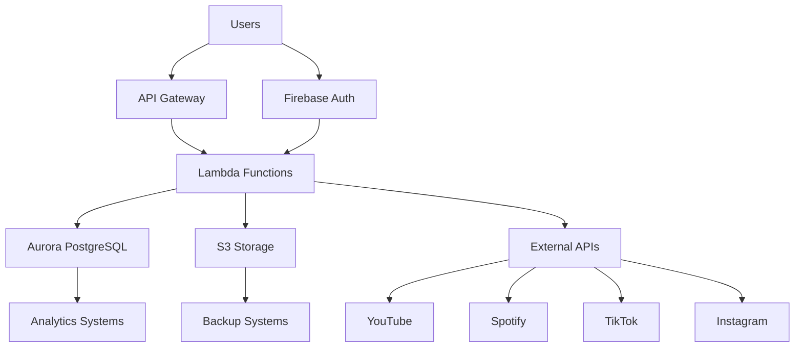

# Data Protection Policies

## Overview
This document establishes comprehensive data protection and privacy policies for Distro Nation's handling of personal information and sensitive data. These policies ensure compliance with GDPR, CCPA, and other applicable privacy regulations while supporting the business operations and user experience.

## Executive Summary

### Policy Scope
These data protection policies apply to all:
- **Personal Data**: Any information relating to identified or identifiable individuals
- **Sensitive Data**: Business confidential, financial, and regulated information
- **Systems**: All AWS, Firebase, and integrated third-party platforms
- **Personnel**: Employees, contractors, and service providers with data access

### Privacy Principles
- **Data Minimization**: Collect and process only necessary data
- **Purpose Limitation**: Use data only for specified, legitimate purposes  
- **Transparency**: Provide clear information about data processing
- **Security**: Implement appropriate technical and organizational measures
- **Accountability**: Demonstrate compliance with data protection requirements

## 1. Data Classification and Inventory

### 1.1 Data Classification Framework

#### Personal Data Categories

**Category 1: Basic Personal Data**
- **Definition**: Standard personal identifiers and contact information
- **Examples**: Names, email addresses, phone numbers, user IDs
- **Legal Basis**: Contract performance, legitimate interest
- **Retention**: Account active + 2 years
- **Security Level**: Standard encryption and access controls

**Category 2: Profile and Behavioral Data**
- **Definition**: User preferences, usage patterns, and analytics data
- **Examples**: Listen history, playlists, device information, IP addresses
- **Legal Basis**: Legitimate interest, consent (where required)
- **Retention**: Account active + 1 year
- **Security Level**: Standard encryption and access controls

**Category 3: Authentication and Security Data**
- **Definition**: Data required for account security and access control
- **Examples**: Password hashes, MFA tokens, session data, security logs
- **Legal Basis**: Contract performance, legitimate interest
- **Retention**: Account active + 90 days (logs: 1 year)
- **Security Level**: Enhanced encryption and restricted access

**Category 4: Financial and Payment Data**
- **Definition**: Payment-related information for artist payouts
- **Examples**: Bank account details, tax information, payment history
- **Legal Basis**: Contract performance, legal obligation
- **Retention**: 7 years (tax/legal requirements)
- **Security Level**: Highest encryption and audit logging

**Category 5: Content and Creative Data**
- **Definition**: User-generated content and creative works
- **Examples**: Music files, metadata, artwork, descriptions
- **Legal Basis**: Contract performance, legitimate interest
- **Retention**: Account active + indefinite (with consent)
- **Security Level**: Standard encryption with backup protections

### 1.2 Data Processing Inventory

#### Core Processing Activities

```yaml
User Account Management:
  Purpose: Provide platform services and account access
  Data Categories: Basic personal data, authentication data
  Legal Basis: Contract performance (Article 6(1)(b) GDPR)
  Recipients: Internal systems only
  Retention: Account active + 2 years
  International Transfers: Firebase (Google) with adequacy decision
  
Music Distribution Services:
  Purpose: Distribute music content to streaming platforms
  Data Categories: Profile data, content data, basic personal data
  Legal Basis: Contract performance
  Recipients: YouTube, Spotify, TikTok, Instagram APIs
  Retention: Account active + indefinite (content licensing)
  International Transfers: Various platforms with SCCs
  
Analytics and Insights:
  Purpose: Service improvement and user experience optimization
  Data Categories: Behavioral data, aggregated usage statistics
  Legal Basis: Legitimate interest (with balancing test)
  Recipients: Internal analytics systems
  Retention: 3 years from collection
  International Transfers: AWS services with SCCs
  
Artist Payments:
  Purpose: Process royalty payments to artists
  Data Categories: Financial data, tax information
  Legal Basis: Contract performance, legal obligation
  Recipients: Payment processors, tax authorities
  Retention: 7 years (legal requirement)
  International Transfers: Payment processors with SCCs
```

### 1.3 Data Flow Mapping

#### High-Level Data Architecture


#### Data Processing Flows

**User Registration Flow**
1. User provides basic personal data via web/mobile interface
2. Firebase Authentication processes credentials
3. Lambda function validates and stores profile data in Aurora
4. Confirmation email sent with privacy notice link
5. Account activation creates audit log entry

**Content Upload Flow**
1. Artist uploads music content and metadata
2. S3 stores content files with encryption
3. Lambda processes metadata and stores in Aurora
4. External API calls distribute content to platforms
5. Usage analytics collected for reporting

## 2. Privacy Rights Management

### 2.1 Data Subject Rights Framework

#### GDPR Data Subject Rights Implementation

**Right to Information (Articles 13-14)**
- **Implementation**: Comprehensive privacy notice on website and in applications
- **Content**: Processing purposes, legal basis, retention periods, recipient categories
- **Updates**: Privacy notice updated within 30 days of processing changes
- **Accessibility**: Available in multiple languages, easy-to-understand format

**Right of Access (Article 15)**
```javascript
// Data export structure for subject access requests
const dataExportFormat = {
  personalData: {
    basicInfo: {
      userId: "user123",
      email: "user@example.com",
      displayName: "Artist Name",
      registrationDate: "2024-01-15"
    },
    profileData: {
      preferences: {...},
      analyticsData: {...},
      contentLibrary: [...]
    }
  },
  processingInfo: {
    purposes: ["Service provision", "Analytics"],
    legalBasis: ["Contract", "Legitimate interest"],
    recipients: ["YouTube API", "Spotify API"]
  },
  retentionInfo: {
    accountData: "Active + 2 years",
    contentData: "Indefinite with consent",
    analyticsData: "3 years"
  }
};
```

**Right to Rectification (Article 16)**
- **Implementation**: User profile management interface for self-service corrections
- **Process**: Identity verification → data validation → system updates → confirmation
- **Timeline**: Immediate for user-correctable data, 30 days for verified corrections
- **Notification**: Downstream systems and recipients notified of corrections

**Right to Erasure (Article 17)**
```yaml
Deletion Scenarios:
  Account Closure:
    - User-initiated account deletion
    - Immediate authentication data deletion
    - 30-day grace period for content recovery
    - Permanent deletion after grace period
    
  Legal Obligation:
    - GDPR erasure request verification
    - Technical feasibility assessment
    - Exception analysis (legal obligations, freedom of expression)
    - Implementation within 30 days
    
  Data Retention Expiry:
    - Automated deletion based on retention schedules
    - Annual review of expired data
    - Secure deletion procedures
```

**Right to Data Portability (Article 20)**
- **Implementation**: Structured data export in JSON/CSV formats
- **Scope**: Data provided by user and data generated through platform use
- **Process**: Identity verification → data compilation → secure delivery
- **Format**: Machine-readable, commonly used formats

#### CCPA Consumer Rights Implementation

**Right to Know**
- **Categories**: Detailed categories of personal information collected
- **Sources**: Direct collection, third-party APIs, analytics providers
- **Purposes**: Service provision, analytics, marketing, legal compliance
- **Recipients**: Service providers, business partners, legal authorities

**Right to Delete**
- **Process**: Aligned with GDPR erasure procedures
- **Exceptions**: Legal obligations, fraud prevention, security purposes
- **Verification**: Identity verification required for deletion requests
- **Timeline**: 45 days for processing, 90 days with extension notice

**Right to Opt-Out**
- **Implementation**: Cookie consent management and preference center
- **Scope**: Third-party analytics, marketing cookies, data sharing
- **Process**: One-click opt-out mechanism on website
- **Respect**: Immediate cessation of opted-out processing

### 2.2 Privacy Rights Request Management

#### Request Processing Workflow
```yaml
Step 1 - Request Receipt:
  Channels: Email, web form, postal mail
  Verification: Identity verification required
  Acknowledgment: 48-hour response with reference number
  
Step 2 - Request Assessment:
  Validity: Check request legitimacy and scope
  Complexity: Simple (automated) vs complex (manual review)
  Timeline: Set processing timeline (30 days GDPR, 45 days CCPA)
  
Step 3 - Request Processing:
  Data Compilation: Gather relevant personal data
  Legal Review: Assess exceptions and limitations
  Technical Implementation: Execute deletion/correction/export
  
Step 4 - Response Delivery:
  Format: Secure delivery method
  Content: Requested data or confirmation of action
  Follow-up: Verify completion and user satisfaction
```

#### Request Tracking System
| Request Type | Current Volume | Processing Time | Automation Level |
|--------------|----------------|-----------------|------------------|
| Access | 0 (system not implemented) | Manual (5-10 days) | 0% |
| Rectification | Low (via support) | Manual (1-3 days) | 25% |
| Erasure | Low (account deletion) | Manual (1-7 days) | 50% |
| Portability | 0 (not implemented) | N/A | 0% |
| Opt-out | 0 (not implemented) | N/A | 0% |

## 3. Data Retention and Lifecycle Management

### 3.1 Retention Schedule Framework

#### Retention Periods by Data Category

| Data Category | Business Need | Legal Requirement | Retention Period | Disposal Method |
|---------------|---------------|-------------------|------------------|-----------------|
| **User Account Data** | Service provision | Contract basis | Active + 2 years | Secure deletion |
| **Authentication Logs** | Security monitoring | Legitimate interest | 1 year | Automated deletion |
| **Payment Information** | Financial reconciliation | Tax law (7 years) | 7 years | Secure deletion |
| **Content Metadata** | Content distribution | Contract/Copyright | Indefinite* | User-controlled |
| **Analytics Data** | Service improvement | Legitimate interest | 3 years | Anonymization |
| **Support Communications** | Customer service | Legitimate interest | 2 years | Secure deletion |
| **Marketing Data** | User engagement | Consent basis | Consent + 1 year | Secure deletion |

*Subject to user consent and platform requirements

### 3.2 Automated Retention Management

#### Retention Policy Implementation
```javascript
// Example retention policy configuration
const retentionPolicies = {
  userAccounts: {
    triggerEvent: 'account_closure',
    retentionPeriod: '2_years',
    reviewPeriod: 'quarterly',
    disposalMethod: 'secure_deletion'
  },
  analyticsData: {
    triggerEvent: 'data_creation',
    retentionPeriod: '3_years',
    reviewPeriod: 'annual',
    disposalMethod: 'anonymization'
  },
  auditLogs: {
    triggerEvent: 'log_creation',
    retentionPeriod: '7_years',
    reviewPeriod: 'none',
    disposalMethod: 'secure_deletion'
  }
};
```

#### Lifecycle Management Process
1. **Data Creation**: Automatic retention metadata assignment
2. **Active Use**: Regular access and processing during retention period
3. **Retention Review**: Periodic assessment of continued business need
4. **Pre-Disposal Notice**: 30-day notice before automated disposal
5. **Secure Disposal**: Cryptographic deletion or secure overwriting
6. **Disposal Confirmation**: Audit log entry confirming successful disposal

### 3.3 Data Minimization Controls

#### Collection Minimization
- **Purpose Testing**: Data collection justified by specific business purpose
- **Necessity Assessment**: Regular review of data fields for continued necessity
- **Progressive Disclosure**: Collect additional data only when needed
- **User Control**: Allow users to opt-out of non-essential data collection

#### Processing Minimization
```yaml
Minimization Controls:
  Query Optimization:
    - Limit data retrieval to required fields
    - Implement field-level access controls
    - Use data proxies for sensitive operations
    
  Analytics Anonymization:
    - Aggregate data at collection point
    - Remove direct identifiers
    - Apply differential privacy techniques
    
  Third-party Sharing:
    - Share only necessary data fields
    - Implement data usage restrictions
    - Monitor recipient data handling
```

## 4. Data Security and Encryption

### 4.1 Encryption Standards

#### Data at Rest Encryption

**AWS S3 Encryption**
```yaml
S3 Bucket Configuration:
  Default Encryption: AES-256 (SSE-S3)
  Sensitive Data Buckets: AWS KMS (SSE-KMS)
  Key Management: Customer-managed keys for financial data
  Access Logging: CloudTrail integration for all key usage
```

**Aurora PostgreSQL Encryption**
```yaml
Database Encryption:
  Method: AES-256 encryption at rest
  Key Management: AWS KMS with customer-managed keys
  Backup Encryption: Automatic encryption of backups
  Log Encryption: CloudWatch logs encrypted
```

**Firebase Storage Encryption**
- **Default**: Google Cloud Platform encryption at rest
- **Key Management**: Google-managed encryption keys
- **Access Control**: Firebase Security Rules and IAM
- **Compliance**: SOC 2 Type II certified infrastructure

#### Data in Transit Encryption

**API Communications**
- **Minimum Standard**: TLS 1.2 for all external communications
- **Preferred Standard**: TLS 1.3 where supported
- **Certificate Management**: Automated certificate renewal
- **HSTS**: HTTP Strict Transport Security enforced

**Internal Communications**
```yaml
Service-to-Service:
  Lambda to RDS: TLS 1.2 with certificate validation  
  Lambda to S3: HTTPS with AWS signature
  API Gateway to Lambda: AWS native encryption
  AppSync to Data Sources: TLS encryption enforced
```

### 4.2 Access Controls and Authorization

#### Data Access Matrix

| Data Category | Developers | Operations | Support | Analytics |
|---------------|------------|------------|---------|-----------|
| **User Account Data** | 🟡 Limited | ✅ Full | ✅ Full | ❌ None |
| **Payment Data** | ❌ None | 🟡 Limited | ❌ None | ❌ None |
| **Content Data** | ✅ Full | ✅ Full | 🟡 Limited | 🟡 Aggregated |
| **Analytics Data** | 🟡 Aggregated | ✅ Full | ❌ None | ✅ Full |
| **Authentication Data** | ❌ None | 🟡 Limited | ❌ None | ❌ None |

#### Technical Access Controls
```javascript
// Example field-level access control
const accessControl = {
  userProfile: {
    publicFields: ['displayName', 'publicBio'],
    userFields: ['email', 'preferences'],
    adminFields: ['internalNotes', 'flaggedContent'],
    restrictedFields: ['paymentInfo', 'taxData']
  },
  enforcement: {
    method: 'GraphQL field resolvers',
    authentication: 'Firebase JWT',
    authorization: 'Custom claims + IAM'
  }
};
```

### 4.3 Data Loss Prevention

#### Technical Controls
- **Database Backups**: Automated daily backups with 30-day retention
- **Cross-region Replication**: Critical data replicated across regions
- **Versioning**: Object versioning enabled for content storage
- **Access Monitoring**: Real-time monitoring of data access patterns

#### Organizational Controls
- **Data Handling Training**: Annual training for all data handlers
- **Incident Response**: Defined procedures for data loss incidents
- **Vendor Management**: Data protection clauses in all vendor contracts
- **Regular Audits**: Quarterly data protection audits

## 5. Privacy by Design Implementation

### 5.1 Privacy Engineering Principles

#### Proactive vs Reactive
- **Design Phase**: Privacy impact assessments for all new features
- **Development**: Privacy-friendly default configurations
- **Deployment**: Automated privacy compliance checking
- **Operations**: Continuous privacy monitoring

#### Privacy as the Default
```yaml
Default Settings:
  Analytics Tracking: Opt-in required
  Marketing Communications: Opt-in required  
  Data Sharing: Minimal sharing by default
  Retention Periods: Shortest business-justified period
  Access Permissions: Least privilege principle
```

#### Full Functionality
- **User Experience**: Privacy controls don't impede core functionality
- **Performance**: Privacy measures optimized for minimal latency impact
- **Scalability**: Privacy controls scale with system growth
- **Usability**: Privacy settings are user-friendly and accessible

### 5.2 Privacy Impact Assessment Process

#### PIA Trigger Events
- New data processing activities
- Significant changes to existing processing
- New third-party integrations
- Changes in legal or regulatory requirements
- High-risk processing identification

#### Assessment Framework
```yaml
PIA Components:
  1. Processing Description:
     - Purpose and necessity
     - Data categories and sources
     - Recipients and transfers
     - Retention periods
     
  2. Risk Assessment:
     - Rights and freedoms impact
     - Data subject vulnerability
     - Technical and organizational risks
     - Compliance risks
     
  3. Mitigation Measures:
     - Technical safeguards
     - Organizational measures
     - Monitoring and review
     - Incident response
```

## 6. International Data Transfers

### 6.1 Transfer Mechanisms

#### Adequacy Decisions
| Country/Region | Service | Data Types | Status |
|----------------|---------|------------|--------|
| **Google Cloud Platform** | Firebase services | Authentication, storage | ✅ Adequacy decision |
| **United Kingdom** | Potential future expansion | All categories | ✅ UK adequacy decision |

#### Standard Contractual Clauses (SCCs)
```yaml
SCC Implementation:
  AWS Services:
    Coverage: All AWS data processing
    Version: 2021 SCCs (Module 1 & 2)
    Supplementary Measures: Technical (encryption, access controls)
    Review Schedule: Annual compliance review
    
  Third-party APIs:
    YouTube: Google's data processing terms
    Spotify: EU-US Privacy Framework/SCCs
    TikTok: Requires SCC implementation
    Instagram/Meta: EU-US Privacy Framework
```

### 6.2 Transfer Risk Assessment

#### Risk Factors Analysis
| Factor | YouTube | Spotify | TikTok | Instagram | Airtable |
|--------|---------|---------|--------|-----------|----------|
| **Government Access Laws** | Medium | Medium | High | Medium | Medium |
| **Data Subject Rights** | Strong | Strong | Limited | Strong | Strong |
| **Local Storage** | Possible | Possible | Unknown | Possible | Possible |
| **Encryption** | Strong | Strong | Unknown | Strong | Strong |
| **Overall Risk** | Low | Low | Medium | Low | Low |

#### Supplementary Measures
- **Technical**: End-to-end encryption where possible
- **Organizational**: Contractual restrictions on data use
- **Legal**: Regular review of destination country laws
- **Monitoring**: Audit third-party compliance annually

## 7. Vendor and Third-Party Management

### 7.1 Data Processor Assessment

#### Due Diligence Framework
```yaml
Assessment Categories:
  Technical Security:
    - Encryption implementation
    - Access controls
    - Incident response capabilities
    - Business continuity planning
    
  Organizational Security:
    - Staff training programs
    - Background check procedures
    - Confidentiality agreements
    - Subprocessor management
    
  Compliance:
    - Certification status (SOC 2, ISO 27001)
    - Regulatory compliance
    - Audit rights and transparency
    - Data subject rights support
```

#### Processor Agreements
**Required Contractual Terms**
- Processing instructions and limitations
- Data security measures and encryption
- Subprocessor authorization and notification
- Data subject rights assistance
- Incident notification procedures
- Return or deletion of data
- Audit rights and compliance monitoring

### 7.2 Current Vendor Status

| Vendor | Service | Data Categories | Agreement Status | Last Review |
|--------|---------|----------------|------------------|-------------|
| **Google (Firebase)** | Authentication, Storage | All categories | ✅ Standard terms | 2025-01-01 |
| **AWS** | Infrastructure | All categories | ✅ Data Processing Agreement | 2025-01-01 |
| **YouTube** | Content distribution | Content metadata | 🟡 API terms only | Never |
| **Spotify** | Content distribution | Content metadata | 🟡 API terms only | Never |
| **TikTok** | Content distribution | Content metadata | ❌ No agreement | Never |
| **Instagram** | Content distribution | Content metadata | 🟡 API terms only | Never |
| **Airtable** | Data synchronization | Business data | ❌ No agreement | Never |

## 8. Incident Response and Breach Management

### 8.1 Data Breach Response Plan

#### Incident Classification
```yaml
Severity Levels:
  Critical (Level 1):
    - Large-scale personal data exposure
    - Financial/payment data compromise
    - Authentication system breach
    Response Time: Immediate (within 1 hour)
    
  High (Level 2):
    - Limited personal data exposure
    - System compromise without data access
    - Significant service disruption
    Response Time: Within 4 hours
    
  Medium (Level 3):
    - Potential data exposure
    - Minor security incidents
    - Configuration errors
    Response Time: Within 24 hours
```

#### Response Procedures
1. **Detection and Assessment** (0-2 hours)
   - Incident identification and initial assessment
   - Severity classification and escalation
   - Response team activation
   - Evidence preservation

2. **Containment and Investigation** (2-24 hours)
   - Immediate containment measures
   - Forensic analysis and impact assessment
   - Root cause investigation
   - Documentation of findings

3. **Notification and Communication** (24-72 hours)
   - Regulatory notification (72 hours for GDPR)
   - Data subject notification (if high risk)
   - Stakeholder communication
   - Public disclosure (if required)

4. **Recovery and Lessons Learned** (Ongoing)
   - System restoration and monitoring
   - Post-incident review
   - Policy and procedure updates
   - Prevention measure implementation

### 8.2 Breach Notification Requirements

#### GDPR Notification
```yaml
Supervisory Authority (72 hours):
  Required Information:
    - Nature of breach and data categories
    - Approximate number of affected individuals
    - Likely consequences of breach
    - Measures taken or proposed
    
Data Subject Notification (Without undue delay):
  Trigger: High risk to rights and freedoms
  Content: Clear and plain language description
  Method: Direct communication preferred
  Exceptions: Technical protection measures implemented
```

#### CCPA Notification
- **Timeline**: "Without unreasonable delay"
- **Scope**: Unauthorized access to unencrypted personal information
- **Content**: Information about breach and protective measures
- **Method**: Website notice and direct notification

## 9. Training and Awareness

### 9.1 Privacy Training Program

#### Training Requirements
| Role | Training Frequency | Content Focus | Certification |
|------|-------------------|---------------|---------------|
| **All Employees** | Annual | Basic privacy awareness | ✅ Required |
| **Developers** | Semi-annual | Privacy by design, data minimization | ✅ Required |
| **Support Staff** | Quarterly | Data subject rights, incident handling | ✅ Required |
| **Management** | Annual | Privacy governance, risk management | ✅ Required |

#### Training Content
```yaml
Basic Privacy Awareness:
  - Privacy principles and regulations
  - Data classification and handling
  - Incident recognition and reporting
  - Personal responsibilities
  
Technical Privacy Training:
  - Secure coding practices
  - Data minimization techniques
  - Privacy impact assessments
  - Technical safeguard implementation
```

### 9.2 Awareness Campaigns

#### Communication Channels
- Monthly privacy newsletters
- Quarterly team presentations
- Annual Privacy Day events
- Ongoing intranet updates
- Incident-based communications

#### Performance Metrics
| Metric | Target | Measurement | Frequency |
|--------|--------|-------------|-----------|
| Training Completion | 100% | LMS tracking | Quarterly |
| Privacy Incident Reports | Increase 20% | Incident system | Monthly |
| Privacy Knowledge Tests | 85% pass rate | Online assessments | Semi-annual |
| Policy Acknowledgment | 100% | Document signatures | Annual |

## 10. Monitoring and Auditing

### 10.1 Privacy Monitoring Framework

#### Automated Monitoring
```yaml
Data Processing Monitoring:
  Metrics:
    - Volume of personal data processed
    - Retention period compliance
    - Access pattern analysis
    - Cross-border transfer tracking
    
  Alerts:
    - Unusual data access patterns
    - Retention period violations
    - Failed privacy rights requests
    - Third-party compliance issues
```

#### Manual Review Processes
- **Monthly**: Privacy rights request review
- **Quarterly**: Vendor compliance assessment
- **Semi-annually**: Data inventory validation
- **Annually**: Complete privacy program audit

### 10.2 Privacy Audit Schedule

#### Internal Audits
| Audit Area | Frequency | Scope | Responsible Team |
|------------|-----------|-------|------------------|
| **Data Processing Activities** | Quarterly | All processing operations | Privacy Team |
| **Technical Controls** | Monthly | Access controls, encryption | Security Team |
| **Vendor Compliance** | Quarterly | All data processors | Legal Team |
| **Training Effectiveness** | Semi-annual | All personnel | HR Team |

#### External Audits
- **Privacy Certification**: Annual ISO 27701 assessment (planned)
- **Regulatory Compliance**: Biennial GDPR compliance audit
- **Third-party Assessment**: Annual vendor security assessments
- **Penetration Testing**: Biannual security and privacy testing

## Implementation Roadmap

### Phase 1: Foundation (Months 1-3)
- Implement comprehensive privacy notices
- Deploy data subject rights request system
- Establish data retention automation
- Complete staff privacy training

### Phase 2: Enhancement (Months 4-6)
- Deploy advanced consent management
- Implement privacy monitoring dashboard
- Complete vendor data processing agreements
- Establish privacy impact assessment process

### Phase 3: Optimization (Months 7-12)
- Achieve privacy certification readiness
- Implement advanced anonymization techniques
- Deploy automated compliance monitoring
- Establish continuous privacy improvement program

## Related Documents
- [Security Policies Framework](./security-policies.md)
- [Access Control Matrix](./access-control-matrix.md)
- [Compliance Assessment](./compliance-assessment.md)
- [Vulnerability Assessment](./vulnerability-assessment.md)

---

**Document Version**: 1.0  
**Effective Date**: July 24, 2025  
**Next Review**: January 24, 2026  
**Policy Owner**: Adrian Green, Head of Engineering  
**Approved By**: [Pending Empire Distribution Privacy Team Review]

*This document contains confidential and proprietary information. Distribution is restricted to authorized personnel only.*