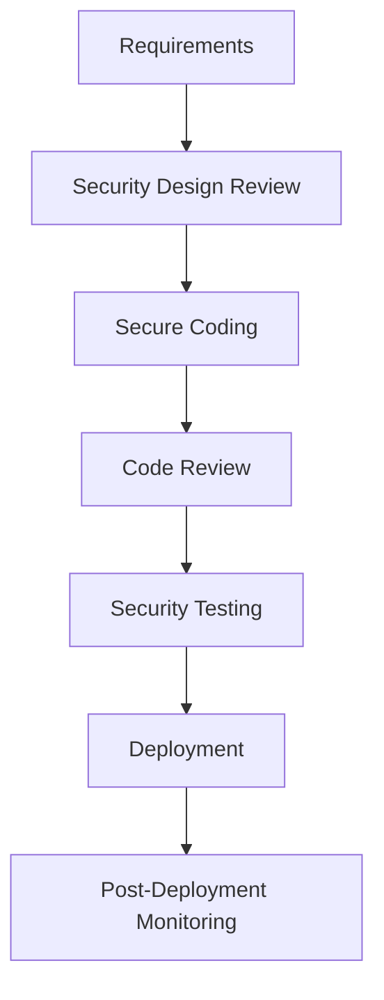

# Security Policies Framework

## Overview
This document establishes the comprehensive security policies framework for Distro Nation's infrastructure and operations. These policies provide the foundational security standards that govern how the organization protects its information assets, systems, and data throughout the technology stack.

## Executive Summary

### Policy Scope
These security policies apply to all:
- **Personnel**: Employees, contractors, and third-party service providers
- **Systems**: AWS infrastructure, Firebase services, and integrated platforms
- **Data**: Customer information, business data, and intellectual property
- **Networks**: Internal systems, external integrations, and communication channels

### Compliance Framework
- **Industry Standards**: ISO 27001, NIST Cybersecurity Framework
- **Regulatory Requirements**: GDPR, CCPA, SOC 2 Type II
- **Platform Standards**: AWS Well-Architected Security Pillar, Firebase Security Rules

## 1. Information Security Policy

### 1.1 Policy Statement
Distro Nation is committed to protecting the confidentiality, integrity, and availability of all information assets. This policy establishes the security governance framework and assigns responsibilities for maintaining a secure operating environment.

### 1.2 Information Security Governance

#### Security Organization Structure
```
Chief Executive
└── Head of Engineering (Adrian Green) - CISO Responsibilities
    ├── Security Team (Technical Implementation)
    ├── Development Team (Secure Development)
    └── Operations Team (Infrastructure Security)
```

#### Roles and Responsibilities

**Head of Engineering (Security Officer)**
- Overall security strategy and policy development
- Security incident response coordination
- Compliance oversight and risk management
- Security awareness training program

**Development Team**
- Secure coding practices implementation
- Code review for security vulnerabilities
- API security and authentication mechanisms
- Security testing integration

**Operations Team**  
- Infrastructure security configuration
- Access control implementation
- Monitoring and incident detection
- Security patch management

### 1.3 Security Objectives

#### Confidentiality
- Protect sensitive information from unauthorized disclosure
- Implement need-to-know access principles
- Encrypt data in transit and at rest
- Secure API endpoints and data transmission

#### Integrity
- Prevent unauthorized modification of data and systems
- Implement version control and change management
- Maintain audit trails for all modifications
- Ensure data consistency across hybrid cloud architecture

#### Availability
- Maintain system uptime and service availability
- Implement redundancy and disaster recovery
- Protect against denial-of-service attacks
- Ensure business continuity during incidents

### 1.4 Policy Compliance

#### Compliance Monitoring
- Quarterly security assessments and audits
- Continuous compliance monitoring through automated tools
- Annual third-party security evaluations
- Regular policy review and updates

#### Non-Compliance Consequences
| Violation Level | Examples | Consequences |
|----------------|----------|--------------|
| **Minor** | Policy awareness gaps | Additional training required |
| **Moderate** | Configuration errors | Corrective action plan |
| **Major** | Security incident caused by negligence | Performance review, additional oversight |
| **Critical** | Data breach, willful policy violation | Disciplinary action, potential termination |

## 2. Data Classification and Handling Policy

### 2.1 Data Classification Framework

#### Classification Levels

**PUBLIC**
- Definition: Information intended for public consumption
- Examples: Marketing materials, public API documentation, blog content
- Security Controls: Basic integrity protection
- Retention: Until no longer needed for business purposes

**INTERNAL**
- Definition: Information for internal business use
- Examples: Internal documentation, system architecture, operational procedures  
- Security Controls: Access control, encryption in transit
- Retention: 7 years or per business requirements

**CONFIDENTIAL**
- Definition: Sensitive business information requiring protection
- Examples: User analytics, business strategies, financial reports
- Security Controls: Strong access controls, encryption, audit logging
- Retention: 7 years with secure disposal

**RESTRICTED**
- Definition: Highly sensitive information with legal/regulatory requirements
- Examples: PII, payment data, authentication credentials
- Security Controls: Multi-factor authentication, encryption, data loss prevention
- Retention: Per regulatory requirements (GDPR: varies, financial: 7 years)

### 2.2 Data Handling Requirements

#### Data Collection
```javascript
// Example data collection with classification
const dataCollection = {
  userEmail: {
    classification: 'RESTRICTED',
    purpose: 'Account authentication',
    lawfulBasis: 'Contract performance',
    retention: '2 years after account closure'
  },
  analyticsData: {
    classification: 'CONFIDENTIAL', 
    purpose: 'Service improvement',
    lawfulBasis: 'Legitimate interest',
    retention: '3 years'
  }
};
```

#### Data Processing
- **Principle of Data Minimization**: Collect only necessary data
- **Purpose Limitation**: Use data only for stated purposes
- **Accuracy**: Maintain data quality and accuracy
- **Storage Limitation**: Delete data when no longer needed

#### Data Sharing
| Data Type | Internal Sharing | External Sharing | Approval Required |
|-----------|-----------------|------------------|-------------------|
| PUBLIC | ✅ Allowed | ✅ Allowed | ❌ No |
| INTERNAL | ✅ Allowed | ❌ Prohibited | ❌ No |
| CONFIDENTIAL | 🟡 Role-based | ❌ Prohibited | ✅ Security Team |
| RESTRICTED | 🟡 Need-to-know | 🟡 Contract/Legal basis | ✅ Management + Legal |

### 2.3 Data Storage and Protection

#### Encryption Requirements
```yaml
Data at Rest:
  - AWS S3: AES-256 encryption enabled
  - Aurora PostgreSQL: Encryption at rest with AWS KMS
  - Firebase Storage: Google Cloud default encryption
  
Data in Transit:
  - API Communications: TLS 1.2+ required
  - Database Connections: SSL/TLS encryption mandatory
  - Internal Services: mTLS where possible
  
Key Management:
  - AWS KMS: Customer managed keys for sensitive data
  - Key Rotation: Automatic annual rotation
  - Access Control: Least privilege key access
```

#### Backup and Recovery
- **Frequency**: Daily automated backups for all critical data
- **Retention**: 30-day backup retention with quarterly archival
- **Testing**: Monthly recovery testing procedures
- **Security**: Encrypted backups with separate access controls

## 3. Password and Authentication Policy

### 3.1 Password Requirements

#### Minimum Standards
- **Length**: Minimum 12 characters for user accounts, 20+ for administrative accounts
- **Complexity**: Must include uppercase, lowercase, numbers, and special characters
- **History**: Cannot reuse last 12 passwords
- **Expiration**: 90 days for standard accounts, 60 days for privileged accounts
- **Account Lockout**: 5 failed attempts trigger 15-minute lockout

#### Administrative Accounts
```javascript
// Password policy enforcement example
const passwordPolicy = {
  minLength: 20,
  requireUppercase: true,
  requireLowercase: true,
  requireNumbers: true,
  requireSpecialChars: true,
  maxAge: 60, // days
  history: 12,
  lockoutThreshold: 3,
  lockoutDuration: 30 // minutes
};
```

### 3.2 Multi-Factor Authentication (MFA)

#### MFA Requirements
| Account Type | MFA Requirement | Acceptable Methods |
|--------------|----------------|-------------------|
| Administrative Access | ✅ Mandatory | Hardware token, SMS, Authenticator app |
| Developer Access | ✅ Mandatory | SMS, Authenticator app |
| API Access | 🟡 Recommended | Client certificates, signed requests |
| End User Access | 🟡 Optional | SMS, Authenticator app |

#### Implementation Standards
- **AWS Accounts**: MFA required for all IAM users with console access
- **Firebase Admin**: MFA required for all project administrators
- **GitHub/Development**: MFA required for all code repository access
- **Third-party Services**: MFA enabled where supported

### 3.3 Authentication Mechanisms

#### Current Authentication Methods
```javascript
// Authentication hierarchy by security level
const authMethods = {
  'AWS IAM Roles': {
    securityLevel: 'High',
    implementation: 'Service-to-service authentication',
    scope: 'Lambda, API Gateway, RDS'
  },
  'Firebase Auth': {
    securityLevel: 'High', 
    implementation: 'User authentication with custom claims',
    scope: 'Mobile apps, web applications'
  },
  'API Keys': {
    securityLevel: 'Medium',
    implementation: 'Simple key-based authentication',
    scope: 'External API access'
  },
  'Open Endpoints': {
    securityLevel: 'None',
    implementation: 'No authentication required',
    scope: 'dn-api (SECURITY GAP)'
  }
};
```

## 4. Network Security Policy

### 4.1 Network Architecture Security

#### Network Segmentation
```
Internet
├── CloudFront CDN (Public content delivery)
├── API Gateway (Public API endpoints)
│   └── Lambda Functions (Application logic)
│       └── Private Subnets
│           ├── Aurora PostgreSQL (Database)
│           └── Internal Services
└── Firebase Services (Authentication & Storage)
```

#### Security Controls by Layer
| Layer | Security Controls | Implementation |
|-------|------------------|----------------|
| **Edge** | DDoS protection, WAF rules | CloudFront, AWS Shield |
| **API Gateway** | Rate limiting, authentication | Throttling, IAM authorization |
| **Application** | Input validation, authorization | Lambda function logic |
| **Database** | Network isolation, encryption | Private subnets, SSL/TLS |

### 4.2 External Connectivity

#### Approved External Services
| Service | Purpose | Security Requirements | Data Classification |
|---------|---------|---------------------|-------------------|
| YouTube API | Content management | OAuth 2.0, rate limiting | CONFIDENTIAL |
| Spotify API | Music metadata | Client credentials | INTERNAL |
| TikTok API | Social media posting | OAuth 2.0 | INTERNAL |
| Instagram API | Social media posting | OAuth 2.0 | INTERNAL |
| Airtable API | Data synchronization | API key authentication | CONFIDENTIAL |

#### External Connection Security
- **TLS Requirements**: TLS 1.2+ for all external connections
- **Certificate Validation**: Full certificate chain validation required
- **API Rate Limiting**: Implement rate limiting for all external API calls
- **Error Handling**: Secure error handling without information leakage

### 4.3 Internal Network Security

#### Service-to-Service Communication
```javascript
// Example secure service communication
const serviceAuth = {
  'Lambda to RDS': {
    method: 'IAM Database Authentication',
    encryption: 'TLS encryption',
    authorization: 'IAM role-based'
  },
  'Lambda to S3': {
    method: 'IAM role-based access',
    encryption: 'HTTPS/TLS',
    authorization: 'Bucket policies + IAM'
  },
  'AppSync to Lambda': {
    method: 'IAM authorization',
    encryption: 'HTTPS/TLS',
    authorization: 'Resolver-level permissions'
  }
};
```

## 5. Third-Party Integration Security Policy

### 5.1 Vendor Risk Assessment

#### Security Assessment Framework
| Assessment Area | Requirements | Documentation |
|----------------|--------------|---------------|
| **Data Security** | Encryption, access controls | Security questionnaire |
| **Compliance** | SOC 2, ISO 27001 certifications | Compliance certificates |
| **Incident Response** | 24/7 response capability | SLA documentation |
| **Business Continuity** | Disaster recovery plans | BCP documentation |

#### Approved Third-Party Services
```yaml
YouTube Data API:
  Risk Level: Medium
  Data Shared: Video metadata, channel information
  Security Controls: OAuth 2.0, rate limiting, audit logging
  Review Date: 2025-10-01

Spotify Web API:
  Risk Level: Low
  Data Shared: Track metadata only
  Security Controls: Client credentials, rate limiting
  Review Date: 2025-10-01

Firebase Services:
  Risk Level: Medium
  Data Shared: User authentication, file storage
  Security Controls: Security rules, IAM integration
  Review Date: 2025-07-01
```

### 5.2 API Security Standards

#### External API Integration Requirements
- **Authentication**: Strong authentication required (OAuth 2.0 preferred)
- **Authorization**: Principle of least privilege access
- **Rate Limiting**: Implement client-side rate limiting
- **Error Handling**: Secure error handling without data leakage
- **Logging**: Comprehensive audit logging for all API calls
- **Monitoring**: Real-time monitoring for anomalous activity

## 6. Change Management Security Policy

### 6.1 Secure Development Lifecycle

#### Development Process Security


#### Security Checkpoints
| Phase | Security Activities | Approval Required |
|-------|-------------------|-------------------|
| **Design** | Threat modeling, architecture review | ✅ Security Team |
| **Development** | Secure coding practices, dependency scanning | ❌ Automated |
| **Testing** | Security testing, vulnerability scanning | ❌ Automated |
| **Deployment** | Configuration review, access validation | ✅ Operations Team |

### 6.2 Infrastructure Changes

#### Change Categories
**Low Risk Changes**
- Documentation updates
- Configuration parameter adjustments
- Non-security code changes
- Approval: Automated deployment pipeline

**Medium Risk Changes**  
- New feature deployments
- Database schema updates
- API endpoint modifications
- Approval: Development team lead

**High Risk Changes**
- Security configuration changes
- Infrastructure architecture modifications
- Access control updates
- Approval: Security team + Management

#### Emergency Changes
- **Process**: Expedited approval for critical security fixes
- **Documentation**: Post-change documentation required within 24 hours
- **Review**: Emergency changes reviewed in next scheduled meeting

## 7. Business Continuity and Disaster Recovery Policy

### 7.1 Business Impact Analysis

#### Critical Systems Classification
| System | RTO* | RPO** | Business Impact | Recovery Priority |
|--------|------|-------|----------------|------------------|
| User Authentication | 1 hour | 15 minutes | High - User access blocked | 1 |
| API Services | 2 hours | 30 minutes | High - Service disruption | 1 |
| Content Delivery | 4 hours | 1 hour | Medium - User experience | 2 |
| Analytics/Reporting | 24 hours | 4 hours | Low - Delayed insights | 3 |

*RTO: Recovery Time Objective  
**RPO: Recovery Point Objective

### 7.2 Disaster Recovery Procedures

#### AWS Infrastructure Recovery
```yaml
Database Recovery:
  - Primary: Aurora PostgreSQL with automated backups
  - Recovery: Point-in-time recovery within 5 minutes of any time
  - Testing: Monthly recovery testing to separate environment

Lambda Functions:
  - Deployment: Infrastructure as Code (CDK/CloudFormation)
  - Recovery: Automated redeployment from version control
  - Testing: Deployment pipeline validation

S3 Storage:
  - Replication: Cross-region replication for critical buckets
  - Versioning: Object versioning enabled
  - Recovery: Object restoration from versions/backups
```

#### Firebase Services Recovery
- **Authentication**: Multi-region Firebase project configuration
- **Database**: Daily exports to Google Cloud Storage
- **Storage**: Automatic redundancy across Google's infrastructure
- **Recovery Testing**: Quarterly disaster recovery exercises

### 7.3 Incident Response Integration
- **Communication Plan**: Stakeholder notification within 1 hour
- **Technical Response**: Automated failover where possible
- **Business Continuity**: Alternative workflow procedures documented
- **Post-Incident**: Root cause analysis and policy updates

## Implementation Guidelines

### Phase 1: Immediate Actions (Week 1-2)
1. **Policy Distribution**: Share policies with all team members
2. **Training Schedule**: Mandatory security awareness training
3. **Gap Assessment**: Identify current policy compliance gaps
4. **Quick Wins**: Implement MFA and password policy enforcement

### Phase 2: Short-term Implementation (Month 1-2)
1. **Process Integration**: Integrate policies into existing workflows
2. **Tool Implementation**: Deploy policy enforcement tools
3. **Monitoring Setup**: Implement policy compliance monitoring
4. **Documentation Updates**: Update operational procedures

### Phase 3: Long-term Maturity (Month 3-6)
1. **Automation**: Automate policy compliance checking
2. **Advanced Controls**: Implement advanced security controls
3. **Regular Reviews**: Establish regular policy review cycles
4. **Continuous Improvement**: Policy refinement based on lessons learned

## Monitoring and Enforcement

### Policy Compliance Metrics
| Metric | Target | Measurement Method | Reporting Frequency |
|--------|--------|-------------------|-------------------|
| MFA Adoption | 100% for admin accounts | IAM/Firebase audit | Weekly |
| Password Compliance | 95% compliance rate | Automated policy checks | Monthly |
| Security Training | 100% completion | Training system reports | Quarterly |
| Incident Response Time | <1 hour notification | Incident tracking system | Per incident |

### Audit and Review Schedule
- **Monthly**: Technical security controls review
- **Quarterly**: Policy compliance assessment
- **Semi-annually**: Third-party risk assessment review
- **Annually**: Complete policy framework review and update

## Related Documents
- [Access Control Matrix](./access-control-matrix.md)
- [Compliance Assessment](./compliance-assessment.md)
- [Data Protection Policies](./data-protection-policies.md)
- [Vulnerability Assessment](./vulnerability-assessment.md)
- [Authentication Guide](../api/authentication-guide.md)

## Approval and Maintenance

**Policy Owner**: Adrian Green, Head of Engineering  
**Approved By**: [Pending Empire Distribution Security Review]  
**Effective Date**: July 24, 2025  
**Next Review Date**: January 24, 2026  
**Version**: 1.0

### Change Log
| Date | Version | Change Description | Author |
|------|---------|-------------------|---------|
| 2025-07-24 | 1.0 | Initial policy creation | Adrian Green |

---

*This document contains confidential and proprietary information. Distribution is restricted to authorized personnel only.*